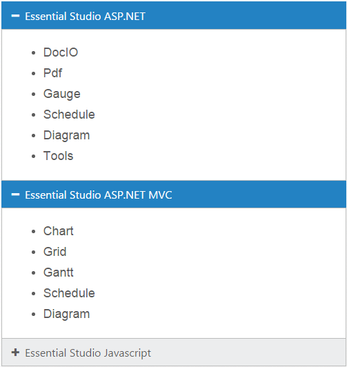
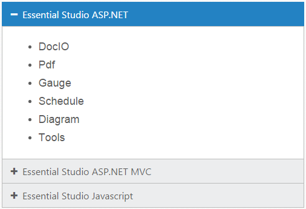
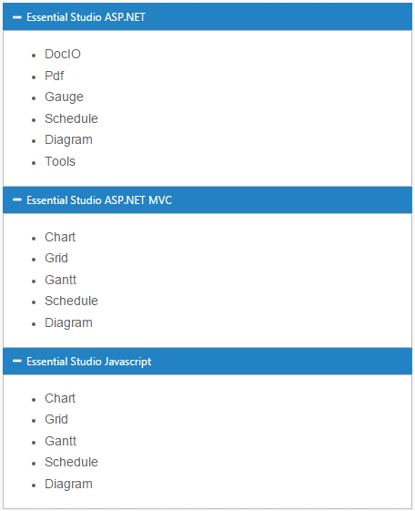
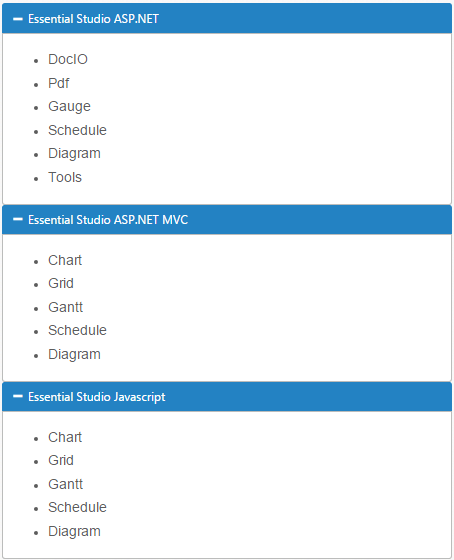
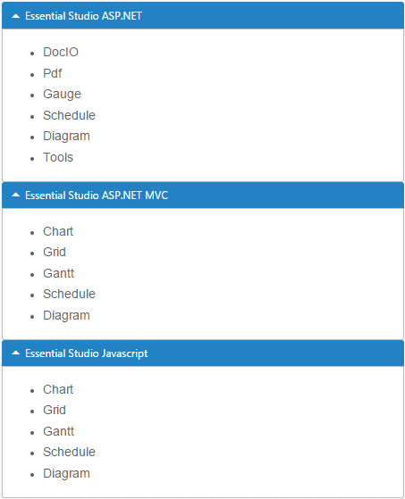

# Getting Started

This section explains briefly about how to create an **Accordion** in your application with **React JS**.

## Configure Accordion

This section encompasses the details on how you can configure the **Accordion** control in your application and customize it with various properties such as multiple open, rounded corner and icons for the **Accordion** header according to your requirement.

The following screenshot illustrates you the usage of **Accordion** control in listing the controls under the Essential Studio products. 

 

The usage of **Accordion** control is described in the following sections.

## Create a Simple Accordion in React JS

You can create a React application and add necessary scripts and styles with the help of the given [React Getting Started Documentation.](https://help.syncfusion.com/reactjs/overview)

Create a JSX file for rendering Accordion component using &lt;EJ.Accordion&gt; syntax. Add required properties to it in &lt;EJ.Accordion&gt; tag element



"use strict";

ReactDOM.render(
    <EJ.Accordion>
        <h3>
            <a href="#">Essential Studio ASP.NET</a>
        </h3> 
        
 
        <ul>
            <li>
                <h4>DocIO</h4>
            </li>
            <li>
                <h4>Pdf  </h4>
            </li>
            <li>
                <h4>Gauge  </h4>
            </li>
            <li>
                <h4>Schedule  </h4>
            </li>
            <li>
                <h4>Diagram  </h4>
            </li>
            <li>
                <h4>Tools </h4>
            </li>
        </ul>
      

        <h3>
            <a href="#">Essential Studio ASP.NET MVC</a>
        </h3> 
        
 
        <ul>
            <li>
                <h4>Chart </h4>
            </li>
            <li>
                <h4>Grid  </h4>
            </li>
            <li>
                <h4>Gantt  </h4>
            </li>
            <li>
                <h4>Schedule  </h4>
            </li>
            <li>
                <h4>Diagram  </h4>
            </li>
        </ul>
     

        <h3>
            <a href="#">Essential Studio Javascript</a>
        </h3> 
        
 
        <ul>
            <li>
                <h4>Chart </h4>
            </li>
            <li>
                <h4>Grid  </h4>
            </li>
            <li>
                <h4>Gantt  </h4>
            </li>
            <li>
                <h4>Schedule  </h4>
            </li>
            <li>
                <h4>Diagram  </h4>
            </li>
        </ul>
    

    </EJ.Accordion>,
		  document.getElementById('accordion-default')
);



Define an HTML element for adding Accordion in the application and refer the JSX file.




 
You can execute the above code example to display the Accordion control with simple control list.

 

You can customize the Accordion control using various properties. The Accordion control properties and its default values are described in the following section.

## Configure Multiple Open

You can have multiple **Accordion** tabs opened to view all products at a time. To achieve this set the **enableMultipleOpen** property of the **Accordion** control to true.

N> enableMultipleOpen property is false by default.

You can also open all the panels during initialization using the **selectedItems** property of the **Accordion** control. The following code sample illustrates the opening of multiple tabs by passing the tab index values of tab.







"use strict";

ReactDOM.render(
    <EJ.Accordion enableMultipleOpen={true}>
        <h3>
            <a href="#">Essential Studio ASP.NET</a>
        </h3> 
        
 
        <ul>
            <li>
                <h4>DocIO</h4>
            </li>
            <li>
                <h4>Pdf  </h4>
            </li>
            <li>
                <h4>Gauge  </h4>
            </li>
            <li>
                <h4>Schedule  </h4>
            </li>
            <li>
                <h4>Diagram  </h4>
            </li>
            <li>
                <h4>Tools </h4>
            </li>
        </ul>
      

        <h3>
            <a href="#">Essential Studio ASP.NET MVC</a>
        </h3> 
        
 
        <ul>
            <li>
                <h4>Chart </h4>
            </li>
            <li>
                <h4>Grid  </h4>
            </li>
            <li>
                <h4>Gantt  </h4>
            </li>
            <li>
                <h4>Schedule  </h4>
            </li>
            <li>
                <h4>Diagram  </h4>
            </li>
        </ul>
     

        <h3>
            <a href="#">Essential Studio Javascript</a>
        </h3> 
        
 
        <ul>
            <li>
                <h4>Chart </h4>
            </li>
            <li>
                <h4>Grid  </h4>
            </li>
            <li>
                <h4>Gantt  </h4>
            </li>
            <li>
                <h4>Schedule  </h4>
            </li>
            <li>
                <h4>Diagram  </h4>
            </li>
        </ul>
    

    </EJ.Accordion>,
		  document.getElementById('accordion-default')
);



**Accordion** control with **enableMultipleOpen** property is illustrated in the following screen shot.

 

### Setting rounded corner

**Accordion** control, by default, is rendered in a regular rectangle. You can modify the regular rectangles with rounded corners by setting the **showRoundedCorner** property to **True**.

N> showRoundedCorner property is False by default.



"use strict";

ReactDOM.render(
    <EJ.Accordion enableMultipleOpen={true} showRoundedCorner={true}>
        <h3>
            <a href="#">Essential Studio ASP.NET</a>
        </h3> 
        
 
        <ul>
            <li>
                <h4>DocIO</h4>
            </li>
            <li>
                <h4>Pdf  </h4>
            </li>
            <li>
                <h4>Gauge  </h4>
            </li>
            <li>
                <h4>Schedule  </h4>
            </li>
            <li>
                <h4>Diagram  </h4>
            </li>
            <li>
                <h4>Tools </h4>
            </li>
        </ul>
      

        <h3>
            <a href="#">Essential Studio ASP.NET MVC</a>
        </h3> 
        
 
        <ul>
            <li>
                <h4>Chart </h4>
            </li>
            <li>
                <h4>Grid  </h4>
            </li>
            <li>
                <h4>Gantt  </h4>
            </li>
            <li>
                <h4>Schedule  </h4>
            </li>
            <li>
                <h4>Diagram  </h4>
            </li>
        </ul>
     

        <h3>
            <a href="#">Essential Studio Javascript</a>
        </h3> 
        
 
        <ul>
            <li>
                <h4>Chart </h4>
            </li>
            <li>
                <h4>Grid  </h4>
            </li>
            <li>
                <h4>Gantt  </h4>
            </li>
            <li>
                <h4>Schedule  </h4>
            </li>
            <li>
                <h4>Diagram  </h4>
            </li>
        </ul>
    

    </EJ.Accordion>,
		  document.getElementById('accordion-default')
);
	 


The following screenshot illustrates the **Accordion** control with rounded corners.

 

## Customize Icon

You can customize the **Header** icon using **customIcon** property. This property has two features such as **header** and **selectedHeader**. By default, the classes of **header** and **selectedHeader** are **e-collapse** and **e-expand** respectively**.**

You can change the + and - symbols in the **Accordion** header, that are the default icons with Up or Down arrow icons. 

Up or Down arrow icons are available in **e-arrowheadup** and **e-arrowheaddown** classes respectively in the ej.widgets.core.min.css stylesheets from the sample. 

You can set the Up or Down arrow icon to **Accordion** header, by adding **e-arrowheadup** and **e-arrowheaddown** class to **selectedHeader** and **header** properties respectively.



"use strict";

ReactDOM.render(
    <EJ.Accordion enableMultipleOpen={true} showRoundedCorner={true} customIcon-header="header-close" customIcon-selectedHeader="header-expand">
        <h3>
            <a href="#">Essential Studio ASP.NET</a>
        </h3> 
        
 
        <ul>
            <li>
                <h4>DocIO</h4>
            </li>
            <li>
                <h4>Pdf  </h4>
            </li>
            <li>
                <h4>Gauge  </h4>
            </li>
            <li>
                <h4>Schedule  </h4>
            </li>
            <li>
                <h4>Diagram  </h4>
            </li>
            <li>
                <h4>Tools </h4>
            </li>
        </ul>
      

        <h3>
            <a href="#">Essential Studio ASP.NET MVC</a>
        </h3> 
        
 
        <ul>
            <li>
                <h4>Chart </h4>
            </li>
            <li>
                <h4>Grid  </h4>
            </li>
            <li>
                <h4>Gantt  </h4>
            </li>
            <li>
                <h4>Schedule  </h4>
            </li>
            <li>
                <h4>Diagram  </h4>
            </li>
        </ul>
     

        <h3>
            <a href="#">Essential Studio Javascript</a>
        </h3> 
        
 
        <ul>
            <li>
                <h4>Chart </h4>
            </li>
            <li>
                <h4>Grid  </h4>
            </li>
            <li>
                <h4>Gantt  </h4>
            </li>
            <li>
                <h4>Schedule  </h4>
            </li>
            <li>
                <h4>Diagram  </h4>
            </li>
        </ul>
    

    </EJ.Accordion>,
		  document.getElementById('accordion-default')
);



The following screenshot illustrates the customization of **selectedHeader** and **header** of the **Accordion** control.

 

