# ChartTypes

## Line Chart

To render a Line Chart, set the series [`type`](../api/ejchart.html#members:series-type) as **"line"** in the chart series. To change the line segment color, you can use the [`fill`](../api/ejchart.html#members:series-fill) property of the series.



"use strict";
        // ...
        var series= [{
            //Change type and color of the series.
             type: 'line',         
             fill: "#E94649",
           // ...         
        }];
        // ...
		ReactDOM.render(
			<EJ.Chart id="default_chart_sample_0"
			series={series}
			>        
            
			</EJ.Chart>,
				document.getElementById('chart')
		);



[Click](http://js.syncfusion.com/demos/web/#!/azure/chart/line) here to view the Line Chart online demo sample.

### Change the line width

To change the width of the line segment, you can use the [`width`](../api/ejchart.html#members:series-width) property in the series.



"use strict";
        // ...
        var series= [{
            //Change the width of line series
            width: 3,         
            // ... 
        }];
        // ...
		ReactDOM.render(
			<EJ.Chart id="default_chart_sample_0"
			series={series}
			>        
            
			</EJ.Chart>,
				document.getElementById('chart')
		);



### Dashed lines

To render the line series with dotted lines, you can use the [`dashArray`](../api/ejchart.html#members:series-dasharray) option of the series.



"use strict";
        // ...
        var series= [{
            //Change dash array to display dotted or dashed lines
            dashArray: '5,5',         
            // ...   
        }];
        // ...
		ReactDOM.render(
			<EJ.Chart id="default_chart_sample_0"
			series={series}
			>        
            
			</EJ.Chart>,
				document.getElementById('chart')
		);



### Changing the line cap

For customizing the start and end caps of the line segment, you can use the [`lineCap`](../api/ejchart.html#members:series-linecap) property.  



"use strict";
        // ...
        var series= [{
            //Change line cap
            lineCap: 'square',         
            // ...     
        }];
        // ...
		ReactDOM.render(
			<EJ.Chart id="default_chart_sample_0"
			series={series}
			>        
            
			</EJ.Chart>,
				document.getElementById('chart')
		);



### Changing the line join

You can use the [`lineJoin`](../api/ejchart.html#members:series-linejoin) property to specify how two intersecting line segments should be joined.



"use strict";
        // ...
        var series= [{
            //Change line join
            lineJoin: 'round',         
            //...    
        }];
        // ...
		ReactDOM.render(
			<EJ.Chart id="default_chart_sample_0"
			series={series}
			>        
            
			</EJ.Chart>,
				document.getElementById('chart')
		);



### MultiColor Line

You can change the color of the line segments by using the [`fill`](../api/ejchart.html#members:series-points-fill) property of the each [`points`](../api/ejchart.html#members:series-points) in the series.



"use strict";
        // ...
        var series= [{
            //  Change the color of a line 
             points:[{ fill: 'red' },
                    //  ...         
             ],
            //  ...  
        }];
        // ...
		ReactDOM.render(
			<EJ.Chart id="default_chart_sample_0"
			series={series}
			>        
            
			</EJ.Chart>,
				document.getElementById('chart')
		);



[Click](http://js.syncfusion.com/demos/web/#%21/azure/chart/chartcustomization/multicolorline) here to view the MultiColor Line Chart online demo sample.

 
## Step Line Chart

To render a Step Line Chart, set the series [`type`](../api/ejchart.html#members:series-type) as **"stepline"** in the chart series. To change the StepLine segment color, you can use the [`fill`](../api/ejchart.html#members:series-fill) property of the series.



"use strict";
        // ...
        var series= [{
            //Change type and color of the series.
              type: 'stepline',         
              fill: "#E94649",
            // ...         
        }];
        // ...
		ReactDOM.render(
			<EJ.Chart id="default_chart_sample_0"
			series={series}
			>        
            
			</EJ.Chart>,
				document.getElementById('chart')
		);



[Click](http://js.syncfusion.com/demos/web/#!/azure/chart/stepline) here to view the Step Line Chart online demo sample.

### Changing the line width

To change the line width, you can use the **width** property.  



"use strict";
        // ...
        var series= [{
             //Change the width of step line series
              width: 3,         
            // ...   
        }];
        // ...
		ReactDOM.render(
			<EJ.Chart id="default_chart_sample_0"
			series={series}
			>        
            
			</EJ.Chart>,
				document.getElementById('chart')
		);



### Dashed lines

To render the step line series with dotted lines, you can use the [`dashArray`](../api/ejchart.html#members:series-dasharray) option of the series.



"use strict";
        // ...
        var series= [{
            //Change dash array to display dotted or dashed lines
            dashArray: '5,5',         
            // ... 
        }];
        // ...
		ReactDOM.render(
			<EJ.Chart id="default_chart_sample_0"
			series={series}
			>        
            
			</EJ.Chart>,
				document.getElementById('chart')
		);



### Changing the line cap

For customizing the start and end caps of the line segment, you can use the [`lineCap`](../api/ejchart.html#members:series-linecap) property.  



"use strict";
        // ...
        var series= [{
            //Change line cap
            lineCap: 'square'         
            // ... 
        }];
        // ...
		ReactDOM.render(
			<EJ.Chart id="default_chart_sample_0"
			series={series}
			>        
            
			</EJ.Chart>,
				document.getElementById('chart')
		);



### Changing the line join

You can use the [`lineJoin`](../api/ejchart.html#members:series-linejoin) property to specify how two intersecting line segments should be joined.



"use strict";
        // ...
        var series= [{
            //Change line join
            lineJoin: 'round'         
            // ... 
        }];
        // ...
		ReactDOM.render(
			<EJ.Chart id="default_chart_sample_0"
			series={series}
			>        
            
			</EJ.Chart>,
				document.getElementById('chart')
		);



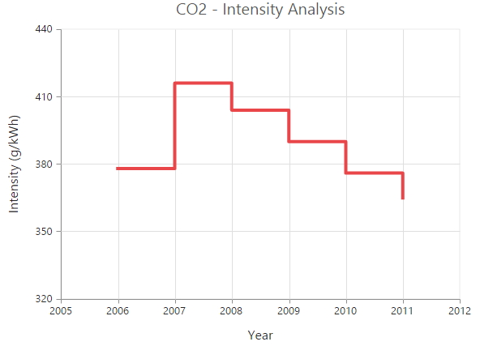

## Area Chart

To render an Area chart, you can specify the series [`type`](../api/ejchart.html#members:series-type) as **"area"** in the chart series. To change the Area color, you can use the [`fill`](../api/ejchart.html#members:series-fill) property of the series.



"use strict";
        // ...
        var series= [{
            // Change the series type and fill color
            type: 'area',         
            fill: '#69D2E7'
            // ...        
        }];
        // ...
		ReactDOM.render(
			<EJ.Chart id="default_chart_sample_0"
			series={series}
			>        
            
			</EJ.Chart>,
				document.getElementById('chart')
		);



[Click](http://js.syncfusion.com/demos/web/#!/azure/chart/area) here to view the Area Chart online demo.

## Range Area Chart

To render a Range Area Chart, set the [`type`](../api/ejchart.html#members:series-type) as **"rangeArea"** in the chart series. To change the RangeArea color, you can use the [`fill`](../api/ejchart.html#members:series-fill) property of the series.

Since the RangeArea series requires two y values for a point, you have to add the [`high`](../api/ejchart.html#members:series-high) and [`low`](../api/ejchart.html#members:series-low) value. High and Low value specifies the maximum and minimum range of the points.

* When you are using the [`points`](../api/ejchart.html#members:series-points) option, specify the high and low values by using the [`high`](../api/ejchart.html#members:series-points-high) and [`low`](../api/ejchart.html#members:series-points-low) option of the point.

* When you are using the [`dataSource`](../api/ejchart.html#members:series-datasource) option to assign the data, map the fields from the dataSource that contain high and low values by using the [`series.high`](../api/ejchart.html#members:series-high) and [`series.low`](../api/ejchart.html#members:series-low) options. 



"use strict";
        // ...
        var series= [{
            //Change the series type and fill color
            type: 'rangeArea', 
            fill: "Indigo",
            
            //Use high and low values instead of y
            points:[{ x: 1935, high:80, low:70 },
                //  ...
            ],
            //  ...             
        }];
        // ...
		ReactDOM.render(
			<EJ.Chart id="default_chart_sample_0"
			series={series}
			>        
            
			</EJ.Chart>,
				document.getElementById('chart')
		);



[Click](http://js.syncfusion.com/demos/web/#!/azure/chart/rangearea) here to view our Range Area Chart online demo.

## Step Area Chart

To render a Step Area Chart, set the [`type`](../api/ejchart.html#members:series-type) as **"stepArea"** in the chart series. To change the StepArea color, you can use the [`fill`](../api/ejchart.html#members:series-fill) property of the series.



"use strict";
        // ...
        var series= [{
            // Change the series type and fill color
            type: 'stepArea',      
            fill: " #69D2E7",   
            //  ...            
        }];
        // ...
		ReactDOM.render(
			<EJ.Chart id="default_chart_sample_0"
			series={series}
			>        
            
			</EJ.Chart>,
				document.getElementById('chart')
		);



[Click](http://js.syncfusion.com/demos/web/#!/azure/chart/steparea) here to view our Step Area Chart online demo.

## Spline Area Chart

To render a Spline Area Chart, set the [`type`](../api/ejchart.html#members:series-type) as **"splineArea"** in the chart series. To change the SplineArea color, you can use the [`fill`](../api/ejchart.html#members:series-fill) property of the series.



 "use strict";
        // ...
        var series= [{
            // Change the series type and fill color
            type: 'splineArea',         
            fill: "#C4C24A",   
            //  ...         
        }];
        // ...
		ReactDOM.render(
			<EJ.Chart id="default_chart_sample_0"
			series={series}
			>        
            
			</EJ.Chart>,
				document.getElementById('chart')
		);



[Click](http://js.syncfusion.com/demos/web/#!/azure/chart/splinearea) here to view our Spline Area Chart online demo.

## Stacked Area Chart

To render a Stacked Area Chart, set the [`type`](../api/ejchart.html#members:series-type) as **"stackingArea"** in the chart series. To change the StackingArea color, you can use the [`fill`](../api/ejchart.html#members:series-fill) property of the series.



"use strict";
        // ...
        var series= [{
            // Change the series type and fill color
            type: 'stackingArea',         
            fill: "#69D2E7",   
            //  ...         
        }];
        // ...
		ReactDOM.render(
			<EJ.Chart id="default_chart_sample_0"
			series={series}
			>        
            
			</EJ.Chart>,
				document.getElementById('chart')
		);



[Click](http://js.syncfusion.com/demos/web/#!/azure/chart/stackedarea) here to view our Stacked Area Chart online demo.

## 100% Stacked Area Chart  

To render a 100% Stacked Area Chart, set the [`type`](../api/ejchart.html#members:series-type) as **"stackingArea100"** in the chart series. To change the StackingArea100 color, you can use the [`fill`](../api/ejchart.html#members:series-fill) property of the series.   



"use strict";
        // ...
        var series= [{
            // Change the series type and fill color
            type: 'stackingArea100',         
            fill: "#C4C24A",   
            //  ...         
        }];
        // ...
		ReactDOM.render(
			<EJ.Chart id="default_chart_sample_0"
			series={series}
			>        
            
			</EJ.Chart>,
				document.getElementById('chart')
		);



[Click](http://js.syncfusion.com/demos/web/#!/azure/chart/100%stackedarea) here to view our 100% Stacked Area Chart online demo.

## Stacked Spline Area Chart

To render a Stacked Spline Area Chart, set the [`type`](../api/ejchart.html#members:series-type) as **"stackingSplineArea"** in the chart series. 



"use strict";
        // ...
        var series= [{
            // Change the series type 
            type: 'stackingSplineArea',                      
            //  ...         
        }];
        // ...
		ReactDOM.render(
			<EJ.Chart id="default_chart_sample_0"
			series={series}
			>        
            
			</EJ.Chart>,
				document.getElementById('chart')
		);



## 100% Stacked Spline Area Chart  

To render a 100% Stacked Spline Area Chart, set the [`type`](../api/ejchart.html#members:series-type) as **"stackingSplineArea100"** in the chart series. 



"use strict";
        // ...
        var series= [{
            // Change the series type 
            type: 'stackingSplineArea100',                      
            //  ...         
        }];
        // ...
		ReactDOM.render(
			<EJ.Chart id="default_chart_sample_0"
			series={series}
			>        
            
			</EJ.Chart>,
				document.getElementById('chart')
		);



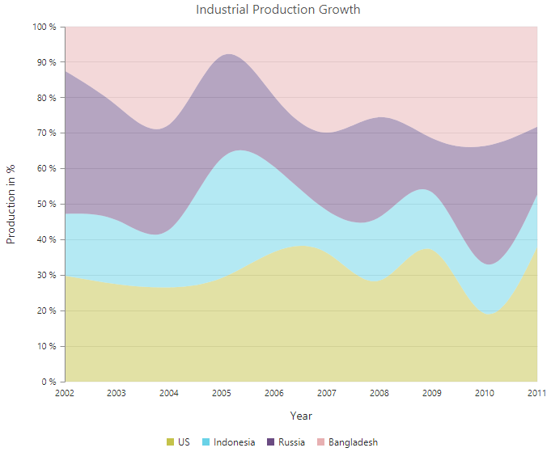

## Column Chart

To render a Column Chart, set the [`type`](../api/ejchart.html#members:series-type) as **"column"** in the chart series. To change the color of the column series, you can use the [`fill`](../api/ejchart.html#members:series-fill) property.  



"use strict";
        // ...
        var series= [{
            // Change the series type and fill color
            type: 'column',         
            fill: "#E94649",   
            //  ...         
        }];
        // ...
		ReactDOM.render(
			<EJ.Chart id="default_chart_sample_0"
			series={series}
			>        
            
			</EJ.Chart>,
				document.getElementById('chart')
		);



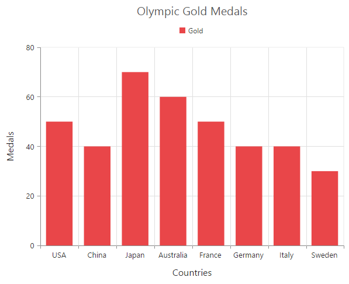

[Click](http://js.syncfusion.com/demos/web/#!/azure/chart/column) here to view our Column Chart demo.

### Change a point color

You can change the color of a column by using the [`fill`](../api/ejchart.html#members:series-points-fill) property of the point.



"use strict";
        // ...
        var series= [{
            //  Change the color of a column
             points:[{ fill: 'skyblue' },
                    //  ...         
             ],
            //  ...        
        }];
        // ...
		ReactDOM.render(
			<EJ.Chart id="default_chart_sample_0"
			series={series}
			>        
            
			</EJ.Chart>,
				document.getElementById('chart')
		);



### Column width customization

Width of the column type series can be customized by using the [`columnWidth`](../api/ejchart#members:series-columnwidth) property. Default value of [`columnWidth`](../api/ejchart#members:series-columnwidth) is 0.7. Value ranges from 0 to 1. Here 1 corresponds to 100% of available width and 0 corresponds to 0% of available width.

N> Width of a column also depends upon the [`columnSpacing`](../api/ejchart#members:series-columnspacing) property, because [`columnSpacing`](../api/ejchart#members:series-columnSpacing) will reduce the space available for drawing a column. This is also applicable for StackingColumn, StackingColumn100, Bar, StackingBar, StackingBar100, RangeColumn, HiLo, HiLoOpenClose, Candle and Waterfall charts.



"use strict";
		//Common settings for all series
		var commonSeriesOptions= {
    
			//Width of columns in column type series
			columnWidth: 0.7

			//...        
		};

		//Settings specific to individual series
		var series= [{
		
			//Width of columns in column type series
			columnWidth: 0.8

			//... 
		}];

		//...
		ReactDOM.render(
			<EJ.Chart id="default_chart_sample_0"
			commonSeriesOptions={commonSeriesOptions}
			series={series}
			>        
            
			</EJ.Chart>,
				document.getElementById('chart')
		);



### Column with rounded corners
Corners of the column chart can be customized by setting value to the [`cornerRadius`] property.



"use strict";
		//Common settings for all series
		var commonSeriesOptions= {
    
			cornerRadius:20

			//...    
		};
		
		ReactDOM.render(
			<EJ.Chart id="default_chart_sample_0"
			commonSeriesOptions={commonSeriesOptions}
			>        
            
			</EJ.Chart>,
				document.getElementById('chart')
		);



### Spacing between column series

Spacing between column type series can be customized using the [`columnSpacing`](../api/ejchart#members:series-columnspacing) property. Default value of [`columnSpacing`](../api/ejchart#members:series-columnspacing) is 0. Value ranges from 0 to 1. Here 1 corresponds to 100% available space and 0 corresponds to 0% available space.

N> Column spacing will also affect the width of the column. For example, setting 20% spacing and 100% width will render columns with 80% of total width. This is also applicable for StackingColumn, StackingColumn100, Bar, StackingBar, StackingBar100, RangeColumn, HiLo, HiLoOpenClose, Candle and Waterfall charts.



"use strict";
		//Common settings for all series
		var commonSeriesOptions= {
    
			//Spacing between column series
			columnSpacing: 0,

			//...
		};

		//Settings specific to individual series
		var series= [{
    
			//Spacing between column series
			columnSpacing: 0.2,
	
			//...
		}];

		//...
		
		ReactDOM.render(
			<EJ.Chart id="default_chart_sample_0"
			commonSeriesOptions={commonSeriesOptions}
			series={series}
			>        
            
			</EJ.Chart>,
				document.getElementById('chart')
		);



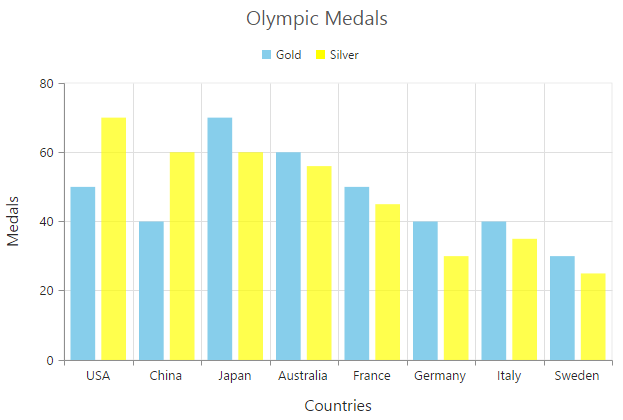

### Cylindrical Chart

To render a cylindrical chart, set the [`columnFacet`](../api/ejchart.html#members:series-columnfacet) property as "cylinder" in the chart series along with the series type. 

The following chart types can be rendered as cylinder in both 2D and in 3D view.

* Column Chart, Bar Chart, Stacked Column Chart, Stacked Bar Chart, 100% Stacked Column Chart, 100% Stacked Bar Chart.



"use strict";
		var series= [{
    
           //To change the shape of the series
           columnFacet: 'cylinder',
           type: 'column',     
           //  ...   
		}];

		//...
		
		ReactDOM.render(
			<EJ.Chart id="default_chart_sample_0"
			series={series}
			>        
            
			</EJ.Chart>,
				document.getElementById('chart')
		);



## RangeColumn Chart

To render a Range Column Chart, set the [`type`](../api/ejchart.html#members:series-type) as **"rangeColumn"** in the chart series. To change the RangeColumn color, use the [`fill`](../api/ejchart.html#members:series-fill) property of the series.

Since, the RangeColumn series requires two y values for a point, add the [`high`](../api/ejchart.html#members:series-high) and [`low`](../api/ejchart.html#members:series-low) value. High and Low value specifies the maximum and minimum range of the points.

* When you are using the [`points`](../api/ejchart.html#members:series-points) option, specify the high and low values by using the [`high`](../api/ejchart.html#members:series-points-high) and [`low`](../api/ejchart.html#members:series-points-low) option of the point.

* When you are using the [`dataSource`](../api/ejchart.html#members:series-datasource) option to assign the data, you have to map the fields from the dataSource that contains high and low values by using the [`series.high`](../api/ejchart.html#members:series-high) and [`series.low`](../api/ejchart.html#members:series-low) options.  



"use strict";
		var series= [{
    
            //Set chart type to series
             type: 'rangeColumn',        
             fill: "#E94649",
            //Use high and low values instead of y
            points:[{ high: 6.1, low:0.7 },
                //  ...         
            ],
            /  ...         
		}];

		//...
		
		ReactDOM.render(
			<EJ.Chart id="default_chart_sample_0"
			series={series}
			>        
            
			</EJ.Chart>,
				document.getElementById('chart')
		);



[Click](http://js.syncfusion.com/demos/web/#!/azure/chart/rangecolumn) here to view our Range Column Chart online demo.

### Change a point color 

To change the color of a range column, you can use the [`fill`](../api/ejchart.html#members:series-points-fill) property of point. 



"use strict";
        //   ...
        var series= [{
           //  Change the color of a range column
            points:[{ fill: 'skyblue' },
                   //  ...         
            ],
           //  ...         
        }];
        
        //    ...
		
		ReactDOM.render(
			<EJ.Chart id="default_chart_sample_0"
			series={series}
			>        
            
			</EJ.Chart>,
				document.getElementById('chart')
		);



## Stacked Column Chart

To render a Stacked Column Chart, set the [`type`](../api/ejchart.html#members:series-type) as **"stackingColumn"** in the chart series. To change the StackingColumn color, you can use the [`fill`](../api/ejchart.html#members:series-fill) property of the series.



"use strict";
        //   ...
        var series= [{
            //Change type and color of the series
            type: 'stackingColumn',       
            fill: "#E94649",  
            //  ...      
        }];
        
        //    ...
		
		ReactDOM.render(
			<EJ.Chart id="default_chart_sample_0"
			series={series}
			>        
            
			</EJ.Chart>,
				document.getElementById('chart')
		);



[Click](http://js.syncfusion.com/demos/web/#!/azure/chart/stackedcolumn) here to view our Stacked Column Chart online demo.

### Cluster / Group stacked columns

You can use the [`stackingGroup`](../api/ejchart.html#members:series-stackinggroup) property to group the stacked columns. Columns with same group name are stacked on top of each other.



"use strict";
        var series= [{
            // For grouping stacked columns
            stackingGroup: 'GroupOne'
            //  ...        
        }, 
        {
            // For grouping stacked columns
            stackingGroup: 'GroupOne'
            //  ...         
        }];
        //  ...
		
		ReactDOM.render(
			<EJ.Chart id="default_chart_sample_0"
			series={series}
			>        
            
			</EJ.Chart>,
				document.getElementById('chart')
		);



### Change a point color

To change the color of a stacking column, you can use the [`fill`](../api/ejchart.html#members:series-points-fill) property of the point. 



"use strict";
        //   ...
        var series= [{
           //  Change the color of a stacking column
            points:[{ fill: 'skyblue' },
                   //  ...         
            ],
           //  ...         
        }];    
        //    ...
		
		ReactDOM.render(
			<EJ.Chart id="default_chart_sample_0"
			series={series}
			>        
            
			</EJ.Chart>,
				document.getElementById('chart')
		);



## 100% Stacked Column Chart    

To render a 100% Stacked Column Chart, set the [`type`](../api/ejchart.html#members:series-type) as **"stackingColumn100"** in the chart series. To change the StackingColumn100 color, you can use the [`fill`](../api/ejchart.html#members:series-fill) property of the series.



"use strict";
        //   ...
        var series= [{
            //Change type and color of the series
            type: 'stackingColumn100',         
            fill: "#E94649",  
            //  .......       
        }];    
        //    ...
		
		ReactDOM.render(
			<EJ.Chart id="default_chart_sample_0"
			series={series}
			>        
            
			</EJ.Chart>,
				document.getElementById('chart')
		);



[Click](http://js.syncfusion.com/demos/web/#!/azure/chart/100%stackedcolumn) here to view our 100% Stacked Column Chart online demo.

### Cluster / Group 100% stacked columns

By using the [`stackingGroup`](../api/ejchart.html#members:series-stackinggroup) property, you can group the 100% stacking columns. Columns with same group name are stacked on top of each other. 



"use strict";
        // ...
        
        var series= [{
            // For grouping 100% stacked columns
            stackingGroup: 'GroupOne'
            //  ...        
        }, 
        {
            // For grouping 100% stacked columns
            stackingGroup: 'GroupOne'
            //  ...         
        }];
        //  ...
		
		ReactDOM.render(
			<EJ.Chart id="default_chart_sample_0"
			series={series}
			>        
            
			</EJ.Chart>,
				document.getElementById('chart')
		);



### Change a point color

To change the color of a 100% stacking column, you can use the [`fill`](../api/ejchart.html#members:series-points-fill) property of the point. 



"use strict";
        // ...        
        var series= [{
            //  Change the color of a 100% stacking column
             points:[{ fill: 'skyblue' },
                    //  ...         
             ],
            //  ...     
        }];
        //  ...
		
		ReactDOM.render(
			<EJ.Chart id="default_chart_sample_0"
			series={series}
			>        
            
			</EJ.Chart>,
				document.getElementById('chart')
		);



## Bar Chart

To render a bar Chart, set the [`type`](../api/ejchart.html#members:series-type) as **"bar"** in the chart series. To change the bar color, you can use the [`fill`](../api/ejchart.html#members:series-fill) property of the series.



"use strict";
        // ...        
        var series= [{
            //Change type and color of the series
            type: 'bar',         
            fill: "#E94649",  
            //  ...     
        }];
        //  ...
		
		ReactDOM.render(
			<EJ.Chart id="default_chart_sample_0"
			series={series}
			>        
            
			</EJ.Chart>,
				document.getElementById('chart')
		);



[Click](http://js.syncfusion.com/demos/web/#!/azure/chart/bar) here to view our Bar Chart demo.

### Change the color of a bar

By using the [`fill`](../api/ejchart.html#members:series-points-fill) property of the point, you can change the specific point of the series. 



"use strict";
        // ...        
        var series= [{
            //  Change the color of a bar
             points:[{ fill: 'skyblue' },
                    //  ...         
             ],
            //  ...      
        }];
        //  ...
		
		ReactDOM.render(
			<EJ.Chart id="default_chart_sample_0"
			series={series}
			>        
            
			</EJ.Chart>,
				document.getElementById('chart')
		);



## Stacked Bar Chart

To render a Stacked Bar Chart, set the [`type`](../api/ejchart.html#members:series-type) as **"stackingBar"** in the chart series. To change the StackingBar color, you can use the [`fill`](../api/ejchart.html#members:series-fill) property of the series.



"use strict";
        // ...        
        var series= [{
            //Change type and color of the series.
            type: 'stackingBar',         
             fill: "#E94649",  
            //  ...  
        }];
        //  ...
		
		ReactDOM.render(
			<EJ.Chart id="default_chart_sample_0"
			series={series}
			>        
            
			</EJ.Chart>,
				document.getElementById('chart')
		);      



[Click](http://js.syncfusion.com/demos/web/#!/azure/chart/stackedbar) here to view our Stacked Bar Chart online demo.

### Cluster / Group stacked bars

You can use the [`stackingGroup`](../api/ejchart.html#members:series-stackinggroup) property to group the stacking bars with the same group name. 



"use strict";
        // ...
        
        var series= [{
            // For grouping stacked bar
            stackingGroup: 'GroupOne'
            //  ...        
        }, 
        {
            // For grouping stacked bar
            stackingGroup: 'GroupOne'
            //  ...         
        }];
        //  ...
		
		ReactDOM.render(
			<EJ.Chart id="default_chart_sample_0"
			series={series}
			>        
            
			</EJ.Chart>,
				document.getElementById('chart')
		);



### Change a point color

You can change the color of a stacking bar by using the [`fill`](../api/ejchart.html#members:series-points-fill) property of the point.



"use strict";
        // ...        
        var series= [{
            //  Change the color of a stacking bar
             points:[{ fill: 'skyblue' },
                    //  ...         
             ],
            //  ...  
        }];
        //  ...
		
		ReactDOM.render(
			<EJ.Chart id="default_chart_sample_0"
			series={series}
			>        
            
			</EJ.Chart>,
				document.getElementById('chart')
		);



## 100% Stacked Bar Chart

To render a 100% Stacked Bar Chart, set the [`type`](../api/ejchart.html#members:series-type) as **"stackingBar100"** in the chart series. To change the StackingBar100 color, you can use the [`fill`](../api/ejchart.html#members:series-fill) property of the series.



"use strict";
        // ...        
        var series= [{
            //Change type and color of the series.
            type: 'stackingBar100',     
             fill: "#E94649",      
            //  ...         
        }];
        //  ...
		
		ReactDOM.render(
			<EJ.Chart id="default_chart_sample_0"
			series={series}
			>        
            
			</EJ.Chart>,
				document.getElementById('chart')
		);



[Click](http://js.syncfusion.com/demos/web/#!/azure/chart/100%stackedbar) here to view our 100% Stacked Bar Chart online demo.

By using the [`stackingGroup`](../api/ejchart.html#members:series-stackinggroup) property, you can group the 100% stacking bars with the same group name. 



"use strict";
        // ...
        
        var series= [{
            // For grouping 100% stacked bar
            stackingGroup: 'GroupOne'
            //  ...        
        }, 
        {
            // For grouping 100% stacked bar
            stackingGroup: 'GroupOne'
            //  ...         
        }];
        //  ...
		
		ReactDOM.render(
			<EJ.Chart id="default_chart_sample_0"
			series={series}
			>        
            
			</EJ.Chart>,
				document.getElementById('chart')
		);



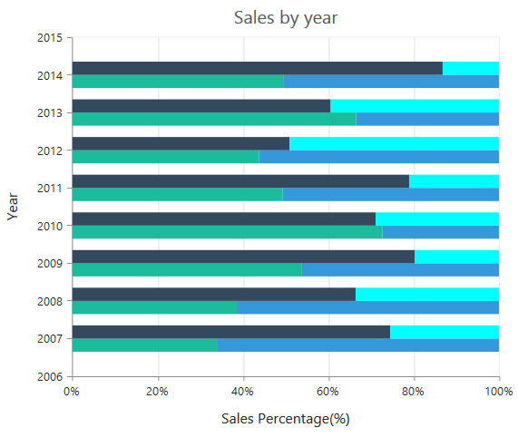

### Change a point color

To change the color of a 100% stacking bar, you can use the [`fill`](../api/ejchart.html#members:series-points-fill) property of the point. 



"use strict";
        // ...        
        var series= [{
            //  Change the color of a 100% stacking bar
             points:[{ fill: 'skyblue' },
                    //  ...         
             ],
            //  ...              
        }];
        //  ...
		
		ReactDOM.render(
			<EJ.Chart id="default_chart_sample_0"
			series={series}
			>        
            
			</EJ.Chart>,
				document.getElementById('chart')
		);



## Spline Chart

To render a Spline Chart, set the [`type`](../api/ejchart.html#members:series-type) as **"spline"** in the chart series. To change the Spline segment color, you can use the [`fill`](../api/ejchart.html#members:series-fill) property of the series.



"use strict";
        // ...        
        var series= [{
            //Change type and color of the series.
            type: 'spline',         
             fill: "#6ADCB0",     
            //  ...                  
        }];
        //  ...
		
		ReactDOM.render(
			<EJ.Chart id="default_chart_sample_0"
			series={series}
			>        
            
			</EJ.Chart>,
				document.getElementById('chart')
		);



[Click](http://js.syncfusion.com/demos/web/#!/azure/chart/spline) here to view the Spline Chart online demo sample.

### Spline Types

Spline series supports four types of curves, namely natural, monotonic, cardinal and clamped. To change the spline type, you can use the [`splineType`](../api/ejchart#members:series-splinetype) property in the series. 



"use strict";
        // ...        
        var series= [{
            //Change the spline series type.
            type: 'spline',         
             splineType:'Natural'
            //  ...                  
        }];
        //  ...
		
		ReactDOM.render(
			<EJ.Chart id="default_chart_sample_0"
			series={series}
			>        
            
			</EJ.Chart>,
				document.getElementById('chart')
		);



### Change the cardinal spline tension

To change cardinal spline tension, you can use the [`cardinalSplineTension`](../api/ejchart#members:series-cardinalsplinetension) property in the series.The default value of cardinalSplineTension is **0.5**.Its value ranges from 0 to 1.



"use strict";
        // ...        
        var series= [{            
            type: 'spline', 
            //Change the shape of cardinal spline        
            splineType: 'Natural',
            cardinalSplineTension: 0.7,     
            //  ...                  
        }];
        //  ...
		
		ReactDOM.render(
			<EJ.Chart id="default_chart_sample_0"
			series={series}
			>        
            
			</EJ.Chart>,
				document.getElementById('chart')
		);



### Change the spline width

To change the spline segment width, you can use the [`width`](../api/ejchart.html#members:series-width) property of the series.



"use strict";
        // ...        
        var series= [{
             //Change the width of spline series
              width: 3,         
            // ...               
        }];
        //  ...
		
		ReactDOM.render(
			<EJ.Chart id="default_chart_sample_0"
			series={series}
			>        
            
			</EJ.Chart>,
				document.getElementById('chart')
		);



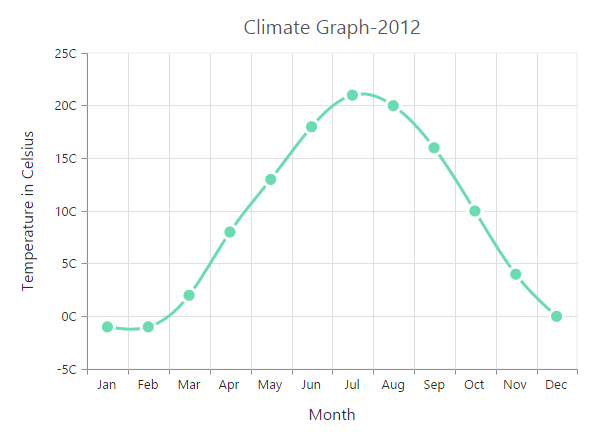

### Dashed lines

To render the spline series with dotted lines, you can use the [`dashArray`](../api/ejchart.html#members:series-dasharray) option of the series.



"use strict";
        // ...        
        var series= [{
            //Change dash array to display dotted or dashed splines
            dashArray: '5,5',           
            // ...    
        }];
        //  ...
		
		ReactDOM.render(
			<EJ.Chart id="default_chart_sample_0"
			series={series}
			>        
            
			</EJ.Chart>,
				document.getElementById('chart')
		);



## Pie Chart

You can create a pie chart by setting the series [`type`](../api/ejchart.html#members:series-type) as **"pie"** in the chart series.



"use strict";
        // ...        
        var series= [{
            //Set chart type to series
            type: 'pie',         
            //  ...  
        }];
        //  ...
		
		ReactDOM.render(
			<EJ.Chart id="default_chart_sample_0"
			series={series}
			>        
            
			</EJ.Chart>,
				document.getElementById('chart')
		);



[Click](http://js.syncfusion.com/demos/web/#!/azure/chart/pie) here to view the Pie chart online demo sample.

### Change the pie size

You can use the [`pieCoefficient`](../api/ejchart.html#members:series-piecoefficient) property to change the diameter of the Pie chart with respect to the plot area. It ranges from 0 to 1 and the default value is **0.8**.



"use strict";
        // ...        
        var series= [{
            //Change pie chart coefficient value
            pieCoefficient: 0.4,                                
            //  ...   
        }];
        //  ...
		
		ReactDOM.render(
			<EJ.Chart id="default_chart_sample_0"
			series={series}
			>        
            
			</EJ.Chart>,
				document.getElementById('chart')
		);



### Explode a pie segment

You can explode a pie segment on the chart load by using the [`explodeIndex`](../api/ejchart.html#members:series-explodeIndex) of the series.



"use strict";
        // ...        
        var series= [{
            //Set point index value to explode the pie segment. 
            explodeIndex: 1,                                  
            //  ...    
        }];
        //  ...
		
		ReactDOM.render(
			<EJ.Chart id="default_chart_sample_0"
			series={series}
			>        
            
			</EJ.Chart>,
				document.getElementById('chart')
		);



### Explode all the segments

To explode all the segments of the Pie chart, you can enable the [`explodeAll`](../api/ejchart.html#members:series-explodeall) property.



"use strict";
        // ...        
        var series= [{
            //Enable explodeAll property for pie chart. 
            explodeAll: true,                                  
            //  ...   
        }];
        //  ...
		
		ReactDOM.render(
			<EJ.Chart id="default_chart_sample_0"
			series={series}
			>        
            
			</EJ.Chart>,
				document.getElementById('chart')
		);



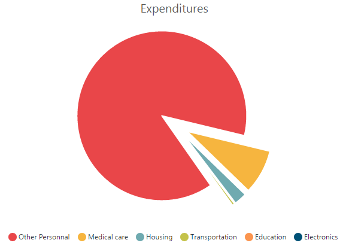

### Explode a pie segment on mouse over

To explode a pie segment on a mouse over, you can enable the [`explode`](../api/ejchart.html#members:series-explode) property of the series.



"use strict";
        // ...        
        var series= [{
             //Enable pie explode option on mouse over the chart 
            explode: true,                                  
            //  ...  
        }];
        //  ...
		
		ReactDOM.render(
			<EJ.Chart id="default_chart_sample_0"
			series={series}
			>        
            
			</EJ.Chart>,
				document.getElementById('chart')
		);



### Sector of Pie

EjChart allows you to render all the data points/segments in the semi-pie, quarter-pie or in any sector by using the [`startAngle`](../api/ejchart.html#members:series-startangle) and [`endAngle`](../api/ejchart.html#members:series-endangle) options.



"use strict";
        // ...        
        var series= [{
            type: 'pie',     
            //Set startAngle and endAngle to draw the semi pie chart
            startAngle: -90, endAngle: 90                                                        
            //  ...  
        }];
        //  ...
		
		ReactDOM.render(
			<EJ.Chart id="default_chart_sample_0"
			series={series}
			>        
            
			</EJ.Chart>,
				document.getElementById('chart')
		);



[Click](http://js.syncfusion.com/demos/web/#!/azure/chart/semipieanddoughnut) here to view the Semi Pie Chart online demo sample.

## Doughnut Chart

To create a Doughnut chart, you can specify the series [`type`](../api/ejchart.html#members:series-type) as **"doughnut"** in the chart series.



"use strict";
        // ...        
        var series= [{
            //Set chart type to series
            type: 'doughnut', 
            //  ...
        }];
        //  ...
		
		ReactDOM.render(
			<EJ.Chart id="default_chart_sample_0"
			series={series}
			>        
            
			</EJ.Chart>,
				document.getElementById('chart')
		);



[Click](http://js.syncfusion.com/demos/web/#!/azure/chart/doughnut) here to view the Doughnut Chart online demo sample.

### Change Doughnut inner radius

You can change the doughnut chart inner radius by using the [`doughnutCoefficient`](../api/ejchart.html#members:series-doughnutcoefficient) with respect to the plot area. It ranges from 0 to 1 and the default value is **0.4**.



"use strict";
        // ...        
        var series= [{
            //Change doughnut chart coefficient value
            doughnutCoefficient: 0.6
            //  ...
        }];
        //  ...
		
		ReactDOM.render(
			<EJ.Chart id="default_chart_sample_0"
			series={series}
			>        
            
			</EJ.Chart>,
				document.getElementById('chart')
		);



### Change the doughnut size

You can use the [`doughnutSize`](../api/ejchart.html#members:series-doughnutsize) property to change the diameter of the Doughnut chart with respect to the plot area. It ranges from 0 to 1 and the default value is **0.8**.



"use strict";
        // ...        
        var series= [{
            //Change doughnut chart coefficient value
            doughnutSize: 0.4,                         
            //  ...
        }];
        //  ...
		
		ReactDOM.render(
			<EJ.Chart id="default_chart_sample_0"
			series={series}
			>        
            
			</EJ.Chart>,
				document.getElementById('chart')
		);



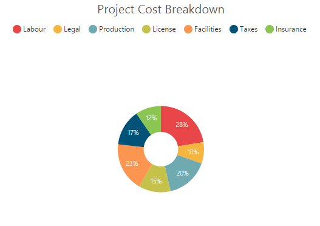

### Explode a doughnut segment

To explode a specific doughnut segment, set the index to be exploded by using the [`explodeIndex`](../api/ejchart.html#members:series-explodeIndex) option of the series.



"use strict";
        // ...        
        var series= [{
            //Set point index value to explode the doughnut segment. 
            explodeIndex: 1,                                     
            //  ...
        }];
        //  ...
		
		ReactDOM.render(
			<EJ.Chart id="default_chart_sample_0"
			series={series}
			>        
            
			</EJ.Chart>,
				document.getElementById('chart')
		);



### Explode all the segments

To explode all the segments, you can enable the [`explodeAll`](../api/ejchart.html#members:series-explodeall) property of the series.



"use strict";
        // ...        
        var series= [{
            //Enable explodeAll property of doughnut chart
            explodeAll: true,                                                
            //  ...
        }];
        //  ...
		
		ReactDOM.render(
			<EJ.Chart id="default_chart_sample_0"
			series={series}
			>        
            
			</EJ.Chart>,
				document.getElementById('chart')
		);



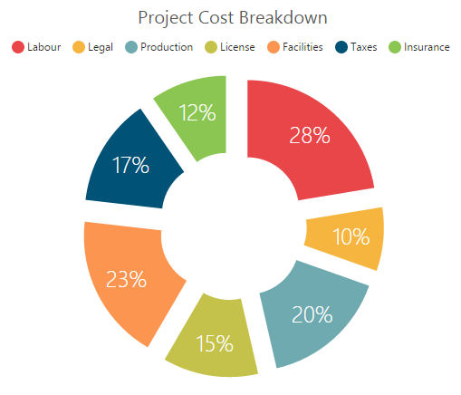

### Explode a doughnut segment on mouse over

To explode a doughnut segment on a mouse over, you can enable the [`explode`](../api/ejchart.html#members:series-explode) property of the series.



"use strict";
        // ...        
        var series= [{
            //Enable doughnut explode option on mouse over the chart
            explode: true,                                                           
            //  ...
        }];
        //  ...
		
		ReactDOM.render(
			<EJ.Chart id="default_chart_sample_0"
			series={series}
			>        
            
			</EJ.Chart>,
				document.getElementById('chart')
		);



### Sector of Doughnut

EjChart allows you to render all the data points/segments in the semi-doughnut, quarter- doughnut or in any sector by using the [`startAngle`](../api/ejchart.html#members:series-startangle) and [`endAngle`](../api/ejchart.html#members:series-endangle) options.



"use strict";
        // ...        
        var series= [{
            type: 'doughnut',     
            //Set startAngle and endAngle to draw the semi pie chart
            startAngle: -90, endAngle: 90                                                                                  
            //  ...
        }];
        //  ...
		
		ReactDOM.render(
			<EJ.Chart id="default_chart_sample_0"
			series={series}
			>        
            
			</EJ.Chart>,
				document.getElementById('chart')
		);



[Click](http://js.syncfusion.com/demos/web/#!/azure/chart/semipieanddoughnut) here to view the Semi Doughnut Chart online demo sample.

## Multiple Pie Chart

EjChart provides support to render more than one series in pie and in doughnut chart. Radius of each series is calculated based on the radius of the previous series. And in addition legend is displayed according to the list of chart series.



"use strict";
        // ...        
        var series= [{
              //Adding multiple pie series
              type: "pie",
              //...
            },{
               //Adding multiple pie series
               type: "pie",
               //...
        }];
        //  ...
		
		ReactDOM.render(
			<EJ.Chart id="default_chart_sample_0"
			series={series}
			>        
            
			</EJ.Chart>,
				document.getElementById('chart')
		);



**Multiple Pie** 

**Multiple Doughnut** 

[Click](http://js.syncfusion.com/demos/web/#%21/azure/chart/multiplepie) here to view the Multiple Pie chart online demo sample.

### Start and End Angle Support

In the Multiple Pie chart, the start and end angle property is also supported.

**Sector of Multiple Pie**

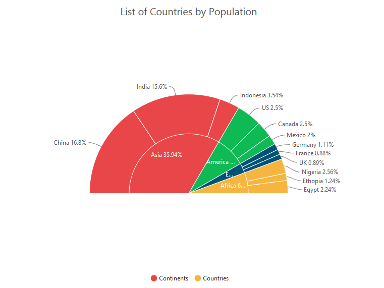

**Sector of Multiple Doughnut**

## Pyramid Chart

To create a Pyramid chart, you can specify the series [`type`](../api/ejchart.html#members:series-type) as **"pyramid"** in the chart series.  



"use strict";
        // ...        
        var series= [{
            //Set chart type to series
            type: 'pyramid', 
             // ...     
        }];
        //  ...
		
		ReactDOM.render(
			<EJ.Chart id="default_chart_sample_0"
			series={series}
			>        
            
			</EJ.Chart>,
				document.getElementById('chart')
		);



[Click](http://js.syncfusion.com/demos/web/#!/azure/chart/pyramid) here to view the Pyramid Chart online demo sample.

### Pyramid Mode

Pyramid mode has two types, *linear* and *surface* respectively. The default **"pyramidMode"** type is "linear".



"use strict";
        // ...        
        var series= [{
            //Change pyramid mode 
            pyramidMode: 'surface',                         
            // ...     
        }];
        //  ...
		
		ReactDOM.render(
			<EJ.Chart id="default_chart_sample_0"
			series={series}
			>        
            
			</EJ.Chart>,
				document.getElementById('chart')
		);



### Gap between the segments

You can control the gap between the segments by using the [`gapRatio`](../api/ejchart.html#members:series-gapratio) option of the series. Its ranges from 0 to 1.



"use strict";
        // ...        
        var series= [{
            //Set gapRatio value to pyramid chart
            gapRatio: 0.1,                                     
            // ...     
        }];
        //  ...
		
		ReactDOM.render(
			<EJ.Chart id="default_chart_sample_0"
			series={series}
			>        
            
			</EJ.Chart>,
				document.getElementById('chart')
		);



### Explode a pyramid segment

You can explode a pyramid segment on the chart load by using the [`explodeIndex`](../api/ejchart.html#members:series-explodeIndex) of the series.



"use strict";
        // ...        
        var series= [{
                //Set point index value to explode the pyramid segment. 
                explodeIndex: 4,                                                 
                // ...
        }];
        //  ...
		
		ReactDOM.render(
			<EJ.Chart id="default_chart_sample_0"
			series={series}
			>        
            
			</EJ.Chart>,
				document.getElementById('chart')
		);



## Funnel Chart

You can create a funnel chart by setting the series [`type`](../api/ejchart.html#members:series-type) as **"funnel"** in the chart series.  



"use strict";
        // ...        
        var series= [{
                //Set chart type to series
                type: 'funnel', 
                // ...
        }];
        //  ...
		
		ReactDOM.render(
			<EJ.Chart id="default_chart_sample_0"
			series={series}
			>        
            
			</EJ.Chart>,
				document.getElementById('chart')
		);



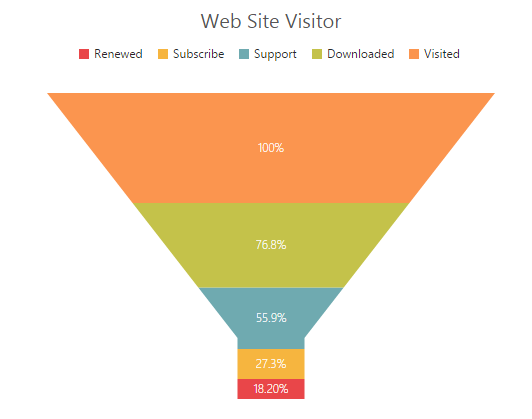

[Click](http://js.syncfusion.com/demos/web/#!/azure/chart/funnel) here to view the Funnel Chart online demo sample.

### Change the funnel width and height

Funnel segments height and width is calculated from the chart size, by default. You can change this height and width directly without changing the chart size by using the [`funnelHeight`](../api/ejchart.html#members:series-funnelheight) and [`funnelWidth`](../api/ejchart.html#members:series-funnelwidth) property of the series.



"use strict";
        // ...        
        var series= [{
            //Change funnel height and width
            funnelHeight:"22%",
            funnelWidth:"25%",             
            // ...
        }];
        //  ...
		
		ReactDOM.render(
			<EJ.Chart id="default_chart_sample_0"
			series={series}
			>        
            
			</EJ.Chart>,
				document.getElementById('chart')
		);



### Explode a funnel segment

You can explode a funnel segment on the chart load by using the [`explodeIndex`](../api/ejchart.html#members:series-explodeIndex) of the series.



"use strict";
        // ...        
        var series= [{
            //Set point index value to explode the funnel segment. 
            explodeIndex: 3,                         
            // ...
        }];
        //  ...
		
		ReactDOM.render(
			<EJ.Chart id="default_chart_sample_0"
			series={series}
			>        
            
			</EJ.Chart>,
				document.getElementById('chart')
		);



## Bubble Chart

To create a Bubble chart, you can set the series [`type`](../api/ejchart.html#members:series-type) as **"bubble"** in the chart series. Bubble chart requires 3 fields (*x, y and size*) to plot a point. Here, **size** is used to specify the size of each bubble segment. 



"use strict";
		var chartData = [
                { month: 'Jan', sales: 35, profit:1.34 },
                { month: 'Feb', sales: 28, profit:1.05 },
                { month: 'Mar', sales: 34, profit:0.45 },
                { month: 'Apr', sales: 32, profit:1.10 },
               // ...     
		];	

        // ...        
        var series= [{
            //Set chart type to series
            type: 'bubble', 
            //Add datasource and set xName, yName and size to bubble chart
            dataSource: chartData, 
            xName: "month", 
            yName: "sales",
            size: "profit"	,   
        }];
        //  ...
		
		ReactDOM.render(
			<EJ.Chart id="default_chart_sample_0"
			series={series}
			>        
            
			</EJ.Chart>,
				document.getElementById('chart')
		);



[Click](http://js.syncfusion.com/demos/web/#!/azure/chart/bubble) here to view the Bubble Chart online demo sample.

## Scatter

To create a Scatter chart, you can set the series [`type`](../api/ejchart.html#members:series-type) as **"scatter"** in the chart series. 



"use strict";
        // ...        
        var series= [{
            //Set chart type to series
             type: 'scatter', 
             // ...     
        }];
        //  ...
		
		ReactDOM.render(
			<EJ.Chart id="default_chart_sample_0"
			series={series}
			>        
            
			</EJ.Chart>,
				document.getElementById('chart')
		);



[Click](http://js.syncfusion.com/demos/web/#!/azure/chart/scatter) here to view the Scatter Chart online demo sample.

### Customize the scatter chart

You can change the scatter size by using the [`size`](../api/ejchart.html#members:series-marker-size) property of the series marker. And you can change the scatter color by using the series [`fill`](../api/ejchart.html#members:series-fill) property. 



"use strict";
        // ...        
        var series= [{
             // ...
               marker: {
                   //Change the scatter size
                   size: { height: 13, width: 13 }
            },
            //Set fill color to scatter series
            fill: "#41F282",                    
            // ...
        }];
        //  ...
		
		ReactDOM.render(
			<EJ.Chart id="default_chart_sample_0"
			series={series}
			>        
            
			</EJ.Chart>,
				document.getElementById('chart')
		);



## HiLoOpenClose Chart

To create a HiLoOpenClose chart, you can set the series [`type`](../api/ejchart.html#members:series-type) as **"hiloopenclose"** in the chart series. HiLoOpenClose chart requires 5 fields ([`x`](../api/ejchart.html#members:series-points-x), [`high`](../api/ejchart.html#members:series-high), [`low`](../api/ejchart.html#members:series-low), [`open`](../api/ejchart.html#members:series-open) and [`close`](../api/ejchart.html#members:series-close)) to plot a segment.  



"use strict";
        var chartData = [
            { month: 'Jan', high: 38, low: 10, open: 38, close: 29 },
            { month: 'Feb', high: 28, low: 15, open: 18, close: 27  },
            { month: 'Mar', high: 54, low: 35, open: 38, close: 49  },
            { month: 'Apr', high: 52, low: 21, open: 35, close: 29  },
            // ...    
         ];

        // ...        
        var series= [{
            //Set chart type to series
             type: 'hiloopenclose', 
             //Add datasource and set xName, high and low to hilo chart
             dataSource: chartData, 
             xName: "month", 
             high: "high",
             low: "low", 
             open: 'open',
             close: 'close',
        }];
        //  ...
		
		ReactDOM.render(
			<EJ.Chart id="default_chart_sample_0"
			series={series}
			>        
            
			</EJ.Chart>,
				document.getElementById('chart')
		);



[Click](http://js.syncfusion.com/demos/web/#!/azure/chart/hiloopenclose) here to view the HiLoOpenClose Chart online demo sample.

### DrawMode

You can change the HiLoOpenClose chart [`drawMode`](../api/ejchart.html#members:series-drawmode) to [`open`](../api/ejchart.html#members:series-open), [`close`](../api/ejchart.html#members:series-close) or *both*. The default value of [`drawMode`](../api/ejchart.html#members:series-drawmode) is **"both"**. 



"use strict";
        // ...        
        var series= [{
            // ...
            //Change the OHLC drawMode type
            drawMode: 'open', 
        }];
        //  ...
		
		ReactDOM.render(
			<EJ.Chart id="default_chart_sample_0"
			series={series}
			>        
            
			</EJ.Chart>,
				document.getElementById('chart')
		);



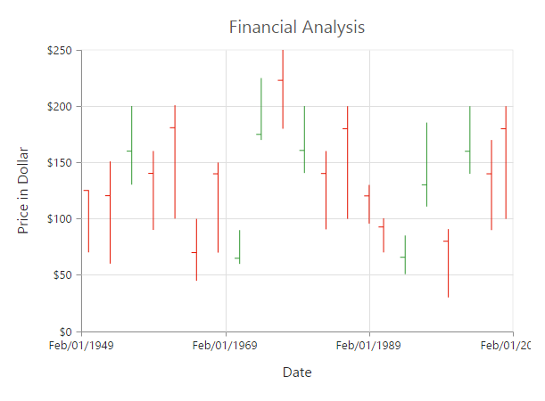

### Bull and Bear Color	

HiLoOpenClose chart [`bullFillColor`](../api/ejchart.html#members:series-bullfillcolor) is used to specify a fill color for the segments that indicates an increase in stock price in the measured time interval and [`bearFillColor`](../api/ejchart.html#members:series-bearfillcolor) is used to specify a fill color for the segments that indicates a decrease in the stock price in the measured time interval. 



"use strict";
        // ...        
        var series= [{
            //Change bullFill and bearFill color of hiloopenclose chart
            bullFillColor: '#FF6600',
            bearFillColor: '#336600',                   
            // ...  
        }];
        //  ...
		
		ReactDOM.render(
			<EJ.Chart id="default_chart_sample_0"
			series={series}
			>        
            
			</EJ.Chart>,
				document.getElementById('chart')
		);



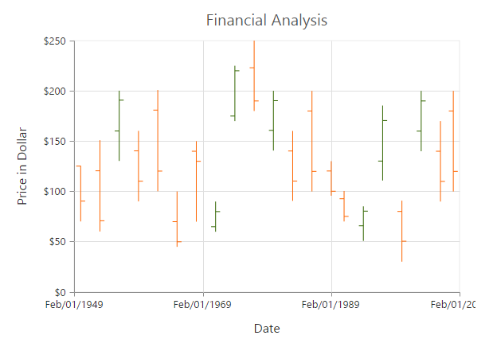

## Candle

You can create a Candle chart by specifying the series [`type`](../api/ejchart.html#members:series-type) as **"candle"** in the chart series. Candle chart requires 5 fields ([`x`](../api/ejchart.html#members:series-points-x), [`high`](../api/ejchart.html#members:series-high), [`low`](../api/ejchart.html#members:series-low), [`open`](../api/ejchart.html#members:series-open) and [`close`](../api/ejchart.html#members:series-close)) to plot a segment.



"use strict";
        var chartData = [
            { month: 'Jan', high: 38, low: 10, open: 38, close: 29 },
            { month: 'Feb', high: 28, low: 15, open: 18, close: 27  },
            { month: 'Mar', high: 54, low: 35, open: 38, close: 49  },
            { month: 'Apr', high: 52, low: 21, open: 35, close: 29  },
            // .......     
        ];

        // ...        
        var series= [{
            //Set chart type to series
             type: 'candle', 
             //Add datasource and set xName, high and low to hilo chart
             dataSource: chartData, 
             xName: "month", 
             high: "high",
             low: "low", 
             open: 'open',
             close: 'close' 
        }];
        //  ...
		
		ReactDOM.render(
			<EJ.Chart id="default_chart_sample_0"
			series={series}
			>        
            
			</EJ.Chart>,
				document.getElementById('chart')
		);



[Click](http://js.syncfusion.com/demos/web/#!/azure/chart/candle) here to view the Candle Chart online demo sample.

### Bull and Bear Color

Candle chart [`bullFillColor`](../api/ejchart.html#members:series-bullfillcolor) is used to specify a fill color for the segments that indicates an increase in the stock price in the measured time interval and [`bearFillColor`](../api/ejchart.html#members:series-bearfillcolor) is used to specify a fill color for the segments that indicates a decrease in the stock price in the measured time interval.



"use strict";
        // ...        
        var series= [{
            //Change bullFill and bearFill color of candle chart
            bullFillColor: '#FF6600',
            bearFillColor: '#336600',                   
            // ...
        }];
        //  ...
		
		ReactDOM.render(
			<EJ.Chart id="default_chart_sample_0"
			series={series}
			>        
            
			</EJ.Chart>,
				document.getElementById('chart')
		);



## HiLo

HiLo chart is created by setting the series [`type`](../api/ejchart.html#members:series-type) as **"hilo"** in the chart series. HiLo chart requires 3 fields ([`x`](../api/ejchart.html#members:series-points-x), [`high`](../api/ejchart.html#members:series-high) and [`low`](../api/ejchart.html#members:series-low)) to plot a segment.  



"use strict";
        var chartData = [
              { month: 'Jan', high: 38, low: 34 },
              { month: 'Feb', high: 28, low: 15 },
              { month: 'Mar', high: 54, low: 45 },
              { month: 'Apr', high: 32, low: 21 },
              // ...     
        ];

        // ...        
        var series= [{
            //Set chart type to series
             type: 'hilo', 
             //Add datasource and set xName, high and low to hilo chart
             dataSource: chartData, 
             xName: "month", 
             high: "high",
             low: "low",   
        }];
        //  ...
		
		ReactDOM.render(
			<EJ.Chart id="default_chart_sample_0"
			series={series}
			>        
            
			</EJ.Chart>,
				document.getElementById('chart')
		);



[Click](http://js.syncfusion.com/demos/web/#!/azure/chart/hilo) here to view the HiLo Chart online demo sample.

## Polar

Polar chart is created by setting the series [`type`](../api/ejchart.html#members:series-type) as **polar** in the chart series. 



"use strict";
        // ...        
        var series= [{
            //Set chart type to series
             type: 'polar'
        }];
        //  ...
		
		ReactDOM.render(
			<EJ.Chart id="default_chart_sample_0"
			series={series}
			>        
            
			</EJ.Chart>,
				document.getElementById('chart')
		);



[Click](http://js.syncfusion.com/demos/web/#!/azure/chart/polar) here to view the Polar Chart online demo sample.

### DrawType

Polar **DrawType** property is used to change the series plotting type to *Line*, *scatter*, *rangeColumn*, *stackingArea*, *spline*, *Column* or *Area*. The default value of DrawType is **Line**.



"use strict";
        // ...        
        var series= [{
            //Change polar series drawType
            drawType: 'column',
            // ...    
        }];
        //  ...
		
		ReactDOM.render(
			<EJ.Chart id="default_chart_sample_0"
			series={series}
			>        
            
			</EJ.Chart>,
				document.getElementById('chart')
		);



### Stack columns in Polar chart

By using the [`isStacking`](../api/ejchart.html#members:series-isstacking) property, you can specify whether the column has to be stacked when the [`drawType`](../api/ejchart.html#members:series-drawtype) is column. Its default value is **false**.



"use strict";
        // ...        
        var series= [{
            //Enable isStacking property for stacked column polar chart
            isStacking: true
            // ...  
        }];
        //  ...
		
		ReactDOM.render(
			<EJ.Chart id="default_chart_sample_0"
			series={series}
			>        
            
			</EJ.Chart>,
				document.getElementById('chart')
		);



[Click](http://js.syncfusion.com/demos/web/#!/azure/chart/windrose) here to view the Polar Wind Rose Chart online demo sample.

## Radar Chart  

Radar **DrawType** property is used to change the series plotting type to *Line*, *scatter*, *rangeColumn*, *stackingArea*, *spline*, *Column* or *Area*. The default value of DrawType is **Line**.



"use strict";
        // ...        
        var series= [{
            //Set chart type to series
            type: 'radar', 
            // ...  
        }];
        //  ...
		
		ReactDOM.render(
			<EJ.Chart id="default_chart_sample_0"
			series={series}
			>        
            
			</EJ.Chart>,
				document.getElementById('chart')
		);



[Click](http://js.syncfusion.com/demos/web/#!/azure/chart/radar) here to view the Radar Chart online demo sample.

### DrawType

Radar [`drawType`](../api/ejchart.html#members:series-drawtype) property is used to change the series plotting type to *line*, *column* or *area*. The default value of [`drawType`](../api/ejchart.html#members:series-drawtype) is **"line"**.



"use strict";
        // ...        
        var series= [{
            //Change radar series drawType
            drawType: 'column',                     
            // ...     
        }];
        //  ...
		
		ReactDOM.render(
			<EJ.Chart id="default_chart_sample_0"
			series={series}
			>        
            
			</EJ.Chart>,
				document.getElementById('chart')
		);



### Stack columns in Radar chart

By using the [`isStacking`](../api/ejchart.html#members:series-isstacking) property, you can specify whether the column has to be stacked when the [`drawType`](../api/ejchart.html#members:series-drawtype) is set as *column*. Its default value is set to **false**.



"use strict";
        // ...        
        var series= [{
            //Enable isStacking property for stacked column radar chart
            isStacking: true                     
            // ...  
        }];
        //  ...
		
		ReactDOM.render(
			<EJ.Chart id="default_chart_sample_0"
			series={series}
			>        
            
			</EJ.Chart>,
				document.getElementById('chart')
		);



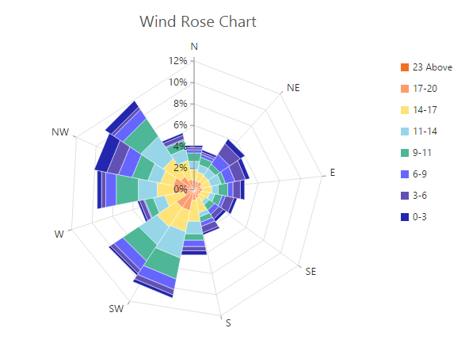

## Waterfall Chart 

For rendering a Waterfall chart, set series [`type`](../api/ejchart.html#members:series-type) as **"waterfall"** in the chart series. To change the waterfall series segment color use [`fill`](../api/ejchart.html#members:series-fill) option of series and use [`positiveFill`](../api/ejchart.html#members:series-positiveFill) property to differentiate the positive segments.

N> The inline property of the **series.positiveFill** has the first priority and override the **series.fill**.



"use strict";
        // ...        
        var series= [{
            //Change type and color of the series.
            type: waterfall,         
            fill: "#C64E4A",
            positiveFill: "#C64E4A" 
            // ...     
        }];
        //  ...
		
		ReactDOM.render(
			<EJ.Chart id="default_chart_sample_0"
			series={series}
			>        
            
			</EJ.Chart>,
				document.getElementById('chart')
		);



[Click](http://js.syncfusion.com/demos/web/#!/azure/chart/waterfall) here to view the Waterfall Chart online demo sample.

**ShowIntermediateSum**

To display the summary of values since the last intermediate point of the waterfall series, set **showIntermediateSum** property as true in the specific point.



"use strict";
        // ...        
        var series= [{
              points: [
                    //Enable showIntermediateSum in to a point.
                    //  ...
                    { x: "Intermediate sum",showIntermediateSum: true }
                    //  ...        
               ],
            //  ...
        }];
        //  ...
		
		ReactDOM.render(
			<EJ.Chart id="default_chart_sample_0"
			series={series}
			>        
            
			</EJ.Chart>,
				document.getElementById('chart')
		);



**ShowTotalSum**

The sum of all previous point in the waterfall series is displayed on enabling the **showTotalSum** property for a specific point.



"use strict";
        // ...        
        var series= [{
              points: [
                    //Enable showTotalSum in to a point.
                    //  ...
                    { x: "Total sum", showTotalSum: true }
                    //  ...        
               ],
            //  ...
        }];
        //  ...
		
		ReactDOM.render(
			<EJ.Chart id="default_chart_sample_0"
			series={series}
			>        
            
			</EJ.Chart>,
				document.getElementById('chart')
		);



### ConnectorLine

To customize the connector line color, width, opacity and dashArray of the waterfall series, you can use [`connectorLine`](../api/ejchart.html#members:series-connectorLine) option of series.



"use strict";
        // ...        
        var series= [{
            //customize waterfall series connector line styles
            connectorLine: {color: "#333000", width: 1, opacity: 1, dashArray: "3,2"},
            //  ...
        }];
        //  ...
		
		ReactDOM.render(
			<EJ.Chart id="default_chart_sample_0"
			series={series}
			>        
            
			</EJ.Chart>,
				document.getElementById('chart')
		);



## Error bar Chart 

EjChart can generate Error bar for Cartesian type series *(Line, Column, Bar, Scatter, Area, Candle, HiLo, etc.)*. To render the Error bar for the series, set [`visibility`](../api/ejchart.html#members:series-errorBar-visibility) as *"visible"* to [`errorBar`](../api/ejchart.html#members:series-errorBar) in the series.



"use strict";
        // ...        
        var series= [{
              	//...
                //To toggle the error bar visibility		    
	        errorBar: {
		        visibility: "visible"
		     }
        }];
        //  ...
		
		ReactDOM.render(
			<EJ.Chart id="default_chart_sample_0"
			series={series}
			>        
            
			</EJ.Chart>,
				document.getElementById('chart')
		);



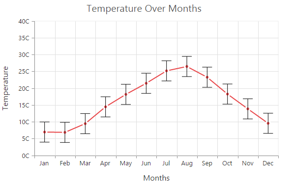

[Click](http://js.syncfusion.com/demos/web/#!/azure/chart/errorbar) here to view the Error bar Chart online demo sample.

### Changing Error Bar Type

You can change the error bar rendering type using [`type`](../api/ejchart.html#members:series-errorBar-type) *(like fixedValue, percentage, standardDeviation, standardError and custom)* option of errorBar. To change the error bar line length you can use [`verticalErrorValue`](../api/ejchart.html#members:series-errorBar-verticalErrorValue) property.



"use strict";
        // ...        
        var series= [{
                //...	
                //Change the error bar type	    
	        errorBar: {
		       type: "percentage",
               verticalErrorValue:3
		     }
        }];
        //  ...
		
		ReactDOM.render(
			<EJ.Chart id="default_chart_sample_0"
			series={series}
			>        
            
			</EJ.Chart>,
				document.getElementById('chart')
		);



#### Customizing error bar type              

To customize the error bar type, set error bar [`type`](../api/ejchart.html#members:series-errorBar-type) as **"custom"** and then change the horizontal/vertical positive and negative value of error bar.



"use strict";
        // ...        
        var series= [{
                //...	
                //Change the error bar type	    
	         errorBar: {
		         type: "custom",
                          verticalPositiveErrorValue:5,
                          horizontalPositiveErrorValue:1,
                          verticalNegativeErrorValue:5,
                          horizontalNegativeErrorValue:1
			      }
        }];
        //  ...
		
		ReactDOM.render(
			<EJ.Chart id="default_chart_sample_0"
			series={series}
			>        
            
			</EJ.Chart>,
				document.getElementById('chart')
		);



### Changing Error Bar Mode

Error bar mode is used to define whether the error bar line has to be drawn *horizontally, vertically* or in *both* side.  To change the error bar mode use [`errorBar.mode`](../api/ejchart.html#members:series-errorBar-mode) option.



"use strict";
        // ...        
        var series= [{
                //...	
                //Change the error bar mode	    
	           errorBar: {
		       type: "fixedValue",
               mode: "vertical"
		      }
        }];
        //  ...
		
		ReactDOM.render(
			<EJ.Chart id="default_chart_sample_0"
			series={series}
			>        
            
			</EJ.Chart>,
				document.getElementById('chart')
		);



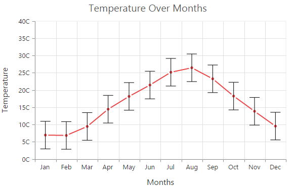

### Changing Error Bar Direction

You can change the error bar direction to plus, minus or both side using [`errorBar.directions`](../api/ejchart.html#members:series-errorBar-directions) option.



"use strict";
        // ...        
        var series= [{
            //...	
            //Change the error bar direction	    
	        errorBar: {
		         type: "fixedValue",
                 mode: "vertical",
                 direction: "minus" 
		     }
        }];
        //  ...
		
		ReactDOM.render(
			<EJ.Chart id="default_chart_sample_0"
			series={series}
			>        
            
			</EJ.Chart>,
				document.getElementById('chart')
		);



### Customizing Error bar cap

To customize the error bar cap *visibility, length, width* and *fill* color, you can use [`cap`](../api/ejchart.html#members:series-errorBar-cap) option in the **series.errorBar**.



"use strict";
        // ...        
        var series= [{
              //...	
            errorBar: {
                 //To customize the error bar cap
		         cap:{
                        visible: true,
                        length: 20,
                        width: 1,
                        fill :"#000000"
                      }
    		  }
        }];
        //  ...
		
		ReactDOM.render(
			<EJ.Chart id="default_chart_sample_0"
			series={series}
			>        
            
			</EJ.Chart>,
				document.getElementById('chart')
		);



## Box and Whisker Chart 

To render a Box and Whisker Chart, set the series [`type`](../api/ejchart.html#members:series-type) as **"boxAndWhisker"**.
Box and Whisker chart requires 2 fields (x and y) to plot a segment. 
The field y requires n number of data or it should  contains minimum of five values to plot a segment.



"use strict";
        //...
        var series=[{	
                //...
	            points:[ { x: "Development", y: [22,22,23,25,25,25,26,27,27,28,28,29,30,32,34,32,34,36,35,38]},
                         { x: "Testing", y: [22,33,23,25,26,28,29,30,34,33,32,31,50]}, 
                         { x: "HR", y: [22,24,25,30,32,34,36,38,39,41,35,36,40,56]}, 
                         { x: "Finance", y: [26,27,28,30,32,34,35,37,35,37,45]},
                         { x: "R&D", y: [26,27,29,32,34,35,36,37,38,39,41,43,58] }
                       ],                    	
	            type: 'boxAndWhisker',                     
        }]; 
        //...  
		
		ReactDOM.render(
			<EJ.Chart id="default_chart_sample_0"
			series={series}
			>        
            
			</EJ.Chart>,
				document.getElementById('chart')
		);



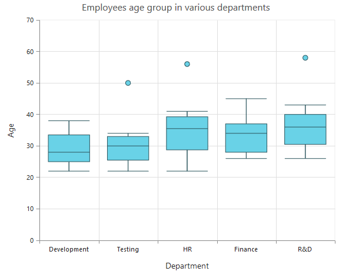

### BoxPlotMode

You can change the rendering mode of the  Box and Whisker series using the  [`boxPlotMode`](../api/ejchart.html#members:series-boxPlotMode) property. The default  [`boxPlotMode`](../api/ejchart.html#members:series-boxPlotMode) is **"exclusive"**.The other boxPlotModes available are `inclusive`and `normal`.



"use strict";
        //...
        var series=[{	
            //...	 
            boxPlotMode : 'inclusive',                    
        }]; 
        //...  
		
		ReactDOM.render(
			<EJ.Chart id="default_chart_sample_0"
			series={series}
			>        
            
			</EJ.Chart>,
				document.getElementById('chart')
		);



### ShowMedian

Box and Whisker [`showMedian`](../api/ejchart.html#members:series-showMedian) property is used to show the box and whisker average value. The default value of [`showMedian`](../api/ejchart.html#members:series-showMedian) is **"false"**.  



"use strict";
        //...
        var series=[{	
            //...		 
            showMedian : true,                         
        }]; 
        //...  
		
		ReactDOM.render(
			<EJ.Chart id="default_chart_sample_0"
			series={series}
			>        
            
			</EJ.Chart>,
				document.getElementById('chart')
		);



###  Customize the Outlier

Outlier symbol, width and height can be  customized using outlierSettings through [`outlierSettings`](../api/ejchart.html#members:series-outliersettings) property. By default Outlier symbol is displayed as circle with a height and width of 6 pixels.



"use strict";
        //...
        var series=[{	
            //...		 
            outlierSettings:{
                    shape: 'triangle',
                    size:
                    {
                        width:10,
                        height:10
                    }        
			}
        }]; 
        //...  
		
		ReactDOM.render(
			<EJ.Chart id="default_chart_sample_0"
			series={series}
			>        
            
			</EJ.Chart>,
				document.getElementById('chart')
		);



[Click](http://js.syncfusion.com/demos/web/#!/bootstrap/chart/boxandwhisker) here to view the Box and Whisker Chart online demo sample.

## Pie Of Pie Chart

To render the pie of pie chart, set the series [`type`](../api/ejchart.html#members:series-type) as **pieofpie**. Pie of pie chart is used for displaying the data of a pie slice as another pie chart. The values in the second pie is displayed based on the **splitMode**  property.



//..      
var series= [{	
	points: [
           {x: 'Saudi Arabia', y: 58, text: '58%'},
           {x: 'Persian Gulf', y: 15, text: '15%'},
           {x: 'Canada', y: 13, text: '13%'},
           {x: 'Venezuela', y: 8, text: '8%'},
           {x: 'Mexico', y: 3, text: '3%'},
           {x: 'Russia', y: 2, text: '2%'},
	    {x: 'Miscellaneous', y: 1, text: '1%'}
           ],	
	type: 'pieofpie',
 	splitValue:"10"
}]   
//..      

ReactDOM.render(
    <EJ.Chart id="default_chart_sample_0" series={series} >       
            
    </EJ.Chart>,
		  document.getElementById('chart')
);



[Click](http://js.syncfusion.com/demos/web/#!/bootstrap/chart/pieofpie) here to view the Pie Of Pie Chart online demo sample.

### Split Mode and Split Value 

The points to be displayed in the second pie is decided based on the [`splitMode`](../api/ejchart#members:series-splitmode) property.**SplitMode** property takes the following values. 
* Position  Have to split the data points based on its position
* Value  Have to split the data points based on its Y value
* Percentage  Have to split the points based on the percentage value
* Indexes  The data points with the specified indexes are split separately 
 By default, the splitMode is set to  **Value**. 



//..      
var series= [{	
    // .. 
	splitMode:"Position",
 	splitValue:"3"
}]   
//..      

ReactDOM.render(
    <EJ.Chart id="default_chart_sample_0" series={series} >

    </EJ.Chart>,
		  document.getElementById('chart')
);



### Changing Pie Of Pie Size

The size of the second Pie can be customized by using the [`pieOfPieCoefficient`](../api/ejchart#members:series-pieofpiecoefficient) property. The default value of pieOfPieCoefficient is **0.6**.Its value ranges from 0 to 1.



//..      
var series= [{	
    // .. 
	pieOfPieCoefficient : 1  
}]   
//..      

ReactDOM.render(
    <EJ.Chart id="default_chart_sample_0" series={series} >
            
    </EJ.Chart>,
		  document.getElementById('chart-default')
);



The following screenshot represents the pie of pie series with pieOfPieCoefficient as 1

#### Customizing the Gap

The distance between the two pies in the pie of pie chart can be controlled by using the [`gapWidth`](../api/ejchart#members:series-gapwidth) property. The default value is **50**.

 

//..      
var series= [{	
    // .. 
	gapWidth:150
}]   
//..      

ReactDOM.render(
    <EJ.Chart id="default_chart_sample_0" series={series} >
            
    </EJ.Chart>,
		  document.getElementById('chart-default')
);



