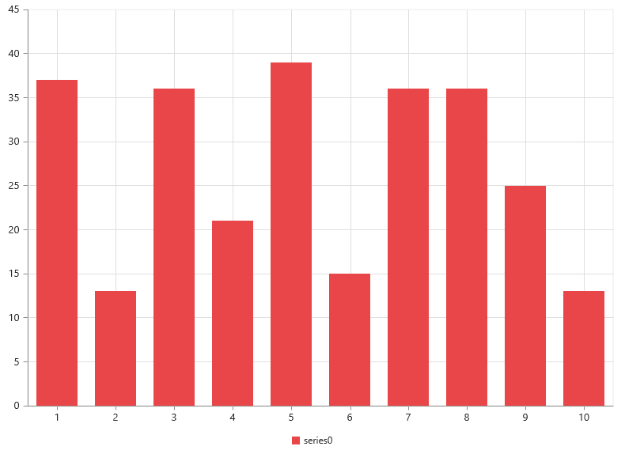
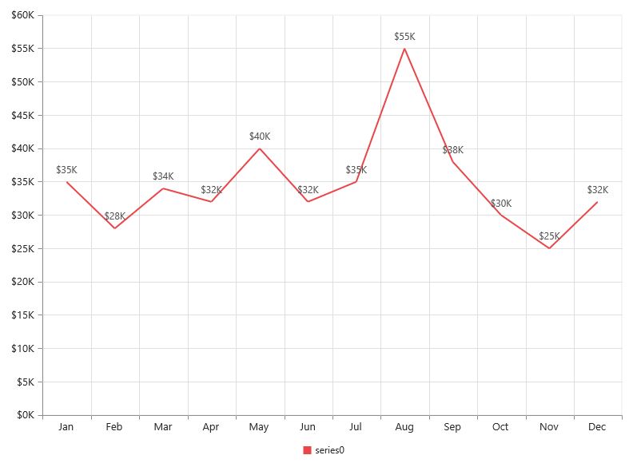

# Getting Started

This section explains you the steps required to populate the Chart with data, add data labels, tooltips and title to the Chart. This section covers only the minimal features that you need to know to get started with the Chart.

## Adding Script Reference

Create an **HTML** page and add the scripts references in the order mentioned in the following code example.

* [`jQuery`](http://jquery.com) 1.10.2 and later versions

The required ReactJS script dependencies as follows. And you can also refer [React](https://facebook.github.io/react/docs/getting-started.html) to know more about react js.

* `react.min.js` - [http://cdn.syncfusion.com/js/assets/external/react.min.js](http://cdn.syncfusion.com/js/assets/external/react.min.js)
* `react-dom.min.js` - [http://cdn.syncfusion.com/js/assets/external/react-dom.min.js](http://cdn.syncfusion.com/js/assets/external/react-dom.min.js)
* `ej.web.react.min.js` - [http://cdn.syncfusion.com/{{ site.releaseversion }}/js/common/ej.web.react.min.js](http://cdn.syncfusion.com/14.3.0.49/js/common/ej.web.react.min.js)

To get started, you can use the `ej.web.all.min.js` file that encapsulates all the `ej` controls and frameworks in one single file.


<!DOCTYPE html>
   <html>
     <head>
        <meta name="viewport" content="width=device-width, initial-scale=1.0">
        <meta name="description" content="Essential Studio for React JS">
        <meta name="author" content="Syncfusion">
        <title>Getting Started for Ribbon React JS</title>
        <!-- Essential Studio for JavaScript  theme reference -->
        <link href="http://cdn.syncfusion.com/{{ site.releaseversion }}/js/web/flat-azure/ej.web.all.min.css" rel="stylesheet" />
        <!-- Essential Studio for JavaScript  script references -->
        
         
        
        
        
        <!-- Add your custom scripts here -->
    </head>
        <body>
        </body>
   </html>



N> 1. In production, we highly recommend you to use our [`custom script generator`](http://help.syncfusion.com/js/custom-script-generator) to create custom script file with required controls and its dependencies only. Also to reduce the file size further please use [`GZip compression`](https://developers.google.com/web/fundamentals/performance/optimizing-content-efficiency/optimize-encoding-and-transfer?hl=en) in your server.
N> 2. For themes, you can use the `ej.web.all.min.css` CDN link from the code snippet given. To add the themes in your application, please refer to [`this link`](http://help.syncfusion.com/js/theming-in-essential-javascript-components).

## Control Initialization

Control can be initialized in two ways.
  * Using jsx Template.
  * Without using jsx Template.
  
 
## Using jsx Template

By using the jsx template, we can create the html file and jsx file. The `.jsx` file can be convert to `.js` file and it can be referred in html page.

### Create your chart

In this tutorial, you will learn how to create a simple chart.The following screen shot displays the output after completing this tutorial.

1.Create a 
 tag.
	
   

<!DOCTYPE html>
<html>    
    <body>
	

                
    </body>
</html>



2.Initialize the Chart by using the `EJ.Chart` tag. 



"use strict";
ReactDOM.render(
    

        <EJ.Chart id="chart1"></EJ.Chart>,
    
,
    document.getElementById('chart-default')
    );



Now, the Chart is rendered with some auto-generated random values and with default Column chart type.

 The chart is rendered to the size of its container, by default. You can also customize the chart dimension either by setting the width and height of the container element as in the above code example or by using the **Size** option of the Chart.

## Populate chart with data

Now, this section explains how to plot JSON data to the Chart. First, let us prepare a sample JSON data with each object containing following fields – month and sales.



  var chartData = [
      { month: 'Jan', sales: 35 },
      { month: 'Feb', sales: 28 },
      { month: 'Mar', sales: 34 },
      { month: 'Apr', sales: 32 },
      { month: 'May', sales: 40 },
      { month: 'Jun', sales: 32 },
      { month: 'Jul', sales: 35 },
      { month: 'Aug', sales: 55 },
      { month: 'Sep', sales: 38 },
      { month: 'Oct', sales: 30 },
      { month: 'Nov', sales: 25 },
      { month: 'Dec', sales: 32 }];
      


Add a Series to the Chart using **Series** option and set the chart type as **Line** using **type** option. 

 

    </body>
</html>



You can also add multiple series tags based on your requirement.

Next, map the Month and Sales values in the data source to the Line series by setting XName and YName with the field names respectively, and then set the actual data using DataSource option.



    </body>
</html>



Since the data is related to Sales, format the vertical axis labels by adding ‘$’ as a prefix and ‘K’ as a suffix to each label. This can be achieved by setting the “${value}K” to the **labelFormat** option of the axis. Here, {value} acts as a placeholder for each axis label, “$” and “K” are the actual prefix and suffix added to each axis label. 

The following code example illustrates this,



    </body>
</html>



## Add Data Labels

You can add data labels to improve the readability of the chart. This can be achieved by enabling the Visible option in the **dataLabel** option. Now, the data labels are rendered at the top of all the data points.

The following code example illustrates this,



    </body>
</html>



There are situations where the default label content is not sufficient to the user. In this case, you can use the **template** option to format the label content with some additional information.

 

<!DOCTYPE html>
<html>
<body>
      

         
#point.x#:$#point.y#K

      

</body>
</html>



The above HTML template is used as a template for each data label. Here, “point.x” and “point.y” are the placeholder text used to display the corresponding data point’s x & y value.

The following code example shows how to set the id of the above template to dataLabel template option,



var series= {
                 marker: {
                         dataLabel: {
                                
                                visible: true,
                                 //Set the id of HTML template to the chart series
                                  template: "dataLabelTemplate"
                   } }
            };
        
<!DOCTYPE html>
<html>    
    <body>
        
    </body>
</html>



## Enable Legend

You can enable or disable the legend by using the Visible option in the **legend** option. It is enabled in the chart, by default.



var series= {
               //Add series name  to display on the legend item 
                 name:"Sales"
            };
 
 var legend = { 
              //Enable chart legend
                visible: true
 };           
        
<!DOCTYPE html>
<html>    
    <body>
        
    </body>
</html>



## Enable Tooltip

The Tooltip is useful when you cannot display information by using the **dataLabel** due to the space constraints. You can enable tooltip by using the Visible option of the **tooltip** option in the specific series.

The following code example illustrates this,



var series= {
                //Enable tooltip in chart area
                   tooltip: {visible: true}
            };
        
<!DOCTYPE html>
<html>    
    <body>
        
    </body>
</html>



## Add Chart Title

You need to add a title to the chart to provide quick information to the user about the data being plotted in the chart. You can add it by using the text option of the **title** option.



var title= { 
	           //Add chart title
               text: 'Sales Analysis'			
	        
            };
        
<!DOCTYPE html>
<html>    
    <body>
        
    </body>
</html>



## Without using jsx Template

The Chart can be created from a HTML `DIV` element with the HTML `id` attribute set to it. Refer to the following code example.


           




var chartData = [
      { month: 'Jan', sales: 35 },
      { month: 'Feb', sales: 28 },
      { month: 'Mar', sales: 34 },
      { month: 'Apr', sales: 32 },
      { month: 'May', sales: 40 },
      { month: 'Jun', sales: 32 },
      { month: 'Jul', sales: 35 },
      { month: 'Aug', sales: 55 },
      { month: 'Sep', sales: 38 },
      { month: 'Oct', sales: 30 },
      { month: 'Nov', sales: 25 },
      { month: 'Dec', sales: 32 }];
      
var series= [{
                  dataSource: chartData, 
                   xName: "month", 
                   yName: "sales",
                   type:"line"
}];
var size = {height:"400",width:"600"}; 

ReactDOM.render(
    React.createElement(EJ.Chart, {id: "default_chart0", 
    series:series, 
    size:size  
    }       
    ),
	document.getElementById('chart-default')
);      
 </script>
 
Now the line chart is rendered 

      