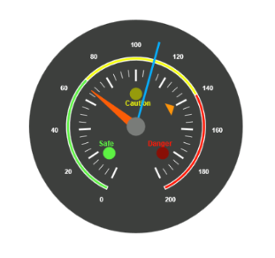
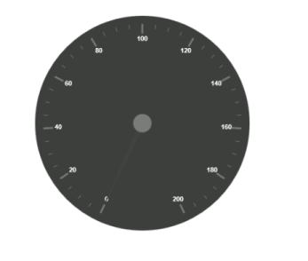
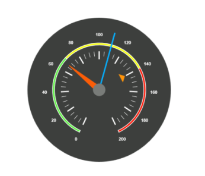

# Getting Started

* This section encompasses how to configure Circular Gauge. You can provide data to a Circular Gauge and make them to display in a required way.

* The following screen shot displays a Circular Gauge, which visually represents the functions of an Automobile speedometer with RPM (Rotation per Minute), kph (Kilometer per hour) and it denotes the speed level indicators (Safe, Caution and Danger).

Analog Speedometer
{:.caption}

## Adding Script Reference

Create an **HTML** page and add the scripts references in the order mentioned in the following code example.

* [`jQuery`](http://jquery.com) 1.10.2 and later versions

The required ReactJS script dependencies as follows. And you can also refer [React](https://facebook.github.io/react/docs/getting-started.html) to know more about ReactJS.

* `react.min.js` - [http://cdn.syncfusion.com/js/assets/external/react.min.js](http://cdn.syncfusion.com/js/assets/external/react.min.js)
* `react-dom.min.js` - [http://cdn.syncfusion.com/js/assets/external/react-dom.min.js](http://cdn.syncfusion.com/js/assets/external/react-dom.min.js)
* `ej.web.react.min.js` - [http://cdn.syncfusion.com/{{ site.releaseversion }}/js/common/ej.web.react.min.js](http://cdn.syncfusion.com/14.3.0.49/js/common/ej.web.react.min.js)

To get started, you can use the `ej.web.all.min.js` file that encapsulates all the `ej` controls and frameworks in one single file.


<!DOCTYPE html>
   <html>
     <head>
        <meta name="viewport" content="width=device-width, initial-scale=1.0">
        <meta name="description" content="Essential Studio for React JS">
        <meta name="author" content="Syncfusion">
        <title>Getting Started for Ribbon React JS</title>
        <!-- Essential Studio for JavaScript  theme reference -->
        <link href="http://cdn.syncfusion.com/{{ site.releaseversion }}/js/web/flat-azure/ej.web.all.min.css" rel="stylesheet" />
        <!-- Essential Studio for JavaScript  script references -->
        
         
        
        
        
        <!-- Add your custom scripts here -->
    </head>
        <body>
        </body>
   </html>



N> 1. In production, we highly recommend you to use our [`custom script generator`](http://help.syncfusion.com/js/custom-script-generator) to create custom script file with required controls and its dependencies only. Also to reduce the file size further please use [`GZip compression`](https://developers.google.com/web/fundamentals/performance/optimizing-content-efficiency/optimize-encoding-and-transfer?hl=en) in your server.
N> 2. For themes, you can use the `ej.web.all.min.css` CDN link from the code snippet given. To add the themes in your application, please refer to [`this link`](http://help.syncfusion.com/js/theming-in-essential-javascript-components).

## Control Initialization

Control can be initialized in two ways.

 * Using jsx Template
 * Without using jsx Template
 
## Using jsx Template

By using the jsx template, we can create the HTML file and jsx file. The `.jsx` file can be convert to `.js` file and it can be referred in HTML page.

### Create your circularGauge

In this tutorial, you will learn how to create a simple circular gauge.

1.Create a 
 tag.
	
   

<!DOCTYPE html>
<html>    
    <body>
	

                
    </body>
</html>


   
 2.Initialize the CircularGauge by using the `EJ.CircularGauge` tag. 



"use strict";
ReactDOM.render(
    

        <EJ.CircularGauge id="circulargauge1"></EJ.CircularGauge>,
    
,
    document.getElementById('circulargauge-default')
    );



Run the above code example to get a default CircularGauge with default values.

## Set Height and Width

Pointers have different height and width so you can set the height and width of the gauge according to your requirements.Set the basic values of the gauge such as height and width of the canvas element values that are to be rendered.



    </body>
</html>



Run the above code example and you will see the following output.

## Set Background Color

The speedometer must have some dark color as background so that its value is clearly visible and you can vary the speed of the pointer by setting ReadOnly as False for user interaction.



    </body>
</html>



Run the above code example and you will see the following output.

## Provide Scale Values

* The pointer cap can be customized with the following options. Cap radius, cap border color, cap background color, pointer cap border width are some of the properties that are customizable.
* The speed limit in the gauge has maximum value of 200 kph. So you can set maximum value for the gauge as 200.
* Major Ticks have the interval value of 20 and minor ticks have the interval value of 5. Show ranges and show indicators are used to display the ranges and indicators in their respective positions.



    </body>
</html>



Run the above code example and you will see the following output.

## Add Label Customization

To display the value around the scales, labels are used. By customizing the label color it displays as specified.



    </body>
</html>



Run the above code example and you will see the following output.

## Add Pointers

Here, you have three pointers that denote the kilometer value, rotation per minute value and torque value.The torque value pointer needs not be similar to the other two pointers. You can set torque pointer as marker pointer. And you can set other attributes for pointer such as background color, border color, length, width and distance from scale.



    </body>
</html>



Run the above code example and you will see the following output.

## Add Tick Details

* You can set Major ticks with their width and height equal to Minor ticks. 
* You can set Color according to your preference for better visibility in dark backgrounds.
* To display and customize the tick value add the following code example. 



    </body>
</html>



Run the above code example and you will see the following output.

## Add Range Values

* Ranges denote the property of the scale value in the speedometer. The color values of the ranges denote speed variation. Set ShowRanges as true for showing the ranges in the Circular Gauge.
* For Low speed, you can mention it as safe zone; for moderate speed, you can call it as caution zone and for high speed, you can mark it as high speed.
* You can customize the range with properties such as start value, end value, start width, end width,  background color , border color, etc.,



    </body>
</html>



Run the above code example and you will see the following output.

## Add Indicator Details

* Indicators denote whether the pointers values are in their respective zones or not. Positioning the indicator on the respective range value gives you the required changes.
* By using Position property, you can set the location of the indicator. StateRanges defines how the indicator should behave when the pointer is in certain values. 



    </body>
</html>



Run the above code example and you will see the following output.

## Add Custom Label Details

Custom labels are used to specify the texts that need to be displayed in the gauge. You can customize it through various properties.To display the three range description, custom texts are used here.



    </body>
</html>


Run the above code example and you will see the following output.

## Without using jsx Template

The Circular Gauge can be created from a HTML `DIV` element with the HTML `id` attribute set to it. Refer to the following code example.


           




 
 Run the above code example and you will see the following output.

  