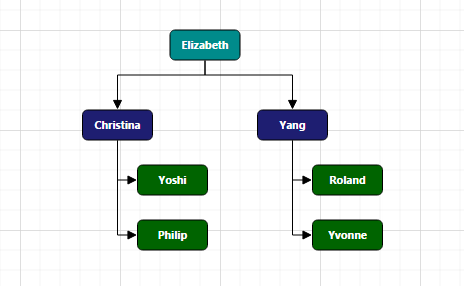

# Getting started

This section explains briefly about how to create a **Diagram** control in your application with **reactjs**.

## Adding Script Reference

Create an **HTML** page and add the scripts references in the order mentioned in the following code example.

* [`jQuery`](http://jquery.com) 1.10.2 and later versions

The required ReactJS script dependencies as follows. And you can also refer [React](https://facebook.github.io/react/docs/getting-started.html) to know more about react js.

* `react.min.js` - [http://cdn.syncfusion.com/js/assets/external/react.min.js](http://cdn.syncfusion.com/js/assets/external/react.min.js)
* `react-dom.min.js` - [http://cdn.syncfusion.com/js/assets/external/react-dom.min.js](http://cdn.syncfusion.com/js/assets/external/react-dom.min.js)
* `ej.web.react.min.js` - [http://cdn.syncfusion.com/{{ site.releaseversion }}/js/common/ej.web.react.min.js](http://cdn.syncfusion.com/14.3.0.49/js/common/ej.web.react.min.js)

To get started, you can use the `ej.web.all.min.js` file that encapsulates all the `ej` controls and frameworks in one single file.


<!DOCTYPE html>
   <html>
     <head>
        <meta name="viewport" content="width=device-width, initial-scale=1.0">
        <meta name="description" content="Essential Studio for React JS">
        <meta name="author" content="Syncfusion">
        <title>Getting Started for Ribbon React JS</title>
        <!-- Essential Studio for JavaScript  theme reference -->
        <link href="http://cdn.syncfusion.com/{{ site.releaseversion }}/js/web/flat-azure/ej.web.all.min.css" rel="stylesheet" />
        <!-- Essential Studio for JavaScript  script references -->
        
        
        
        
        
        <!-- Add your custom scripts here -->
    </head>
        <body>
        </body>
   </html>



N> 1. In production, we highly recommend you to use our [`custom script generator`](http://help.syncfusion.com/js/custom-script-generator) to create custom script file with required controls and its dependencies only. Also to reduce the file size further please use [`GZip compression`](https://developers.google.com/web/fundamentals/performance/optimizing-content-efficiency/optimize-encoding-and-transfer?hl=en) in your server.
N> 2. For themes, you can use the `ej.web.all.min.css` CDN link from the code snippet given. To add the themes in your application, please refer to [`this link`](http://help.syncfusion.com/js/theming-in-essential-javascript-components).

## Control Initialization

Control can be initialized in two ways.

 * Using jsx Template
 * Without using jsx Template
 
## Using jsx Template

By using the jsx template, we can create the html file and jsx file. The `.jsx` file can be convert to `.js` file and it can be referred in html page.

### Initialize Diagram

Add a `div` container to render the Diagram.



<!DOCTYPE html>
<html>    
    <body>
	

                
    </body>
</html>



Initialize the Diagram by using the `EJ.Diagram` tag. The Diagram is rendered based on default `width` and `height`. You can also customize the Diagram dimension by setting the `width` and `height` attribute in `scrollSettings`.



"use strict";
ReactDOM.render(
    

        <EJ.Diagram id="diagram1" width="100%" height="100%" ></EJ.Diagram>,
    
,
    document.getElementById('diagram-default')
    );



This creates an empty diagram as shown in image

### Populate Diagram with nodes and connectors

Now, this section explains how to populate JSON data to the Diagram. 



    </body>
</html>



### Business object (Employee information)

* Define Employee Information as JSON data. The following code example shows an employee array whose,
	* `Name` is used as a unique identifier and
	* `ReportingPerson` is used to identify the person to whom an employee report to, in the organization.



var data = [
	{ Name: "Elizabeth", Role: "Director" },
	{ Name: "Christina", ReportingPerson: "Elizabeth", Role: "Manager" },
	{ Name: "Yoshi", ReportingPerson: "Christina", Role: "Lead" },
	{ Name: "Philip", ReportingPerson: "Christina", Role: "Lead" },
	{ Name: "Yang", ReportingPerson: "Elizabeth", Role: "Manager" },
	{ Name: "Roland", ReportingPerson: "Yang", Role: "Lead" },
	{ Name: "Yvonne", ReportingPerson: "Yang", Role: "Lead" }
];



## Without using jsx Template

The Diagram can be created from a HTML `DIV` element with the HTML `id` attribute set to it. Refer to the following code example.

* You can configure data mapping using "Employee Information" with Diagram, so that the node and connector are automatically generated using mapping properties. DefaultSettings can define the default appearance of node and connector. 

* The NodeTemplate is used to update each node based on employee data.

* The following code examples show how dataSourceSetting is used to map id and parent with property name identifiers for employee information.







//To represent the roles
var codes = {
    Director: "rgb(0, 139,139)",
    Manager: "rgb(30, 30,113)",
    Lead: "rgb(0, 100,0)"
}

//Binds custom data with node
function nodeTemplate(diagram, node) {
    node.labels[0].text = node.Name;
    node.fillColor = codes[node.Role];
}

var layout= { type: "organizationalchart", orientation: "toptobottom", horizontalSpacing: 25, verticalSpacing: 35, marginX: 3, marginY: 3};
var defaultSettings= {
    node: { constraints: ej.datavisualization.Diagram.NodeConstraints.Select | ej.datavisualization.Diagram.NodeConstraints.PointerEvents, width: 100, height: 40, borderColor: "black", labels: [{ fontColor: "#ffffff" }] },
    connector: {
        lineColor: "#000000", segments: [{ type: "orthogonal" }], targetDecorator: { shape: "none" },
        constraints: ej.datavisualization.Diagram.ConnectorConstraints.None
    }
};

var dataSourceSettings = { id: "Name", parent: "ReportingPerson", dataSource: data }

function diagram5Create(args)
{
 var height=$("#diagram4").height()- $(".e-box.e-addborderbottom.e-header").height()
 $("#diagram4").ejDiagram({ height : height}); 
}
    React.createElement(EJ.Diagram, {
    id: "diagram5", 
    height: "100%", 
    width: "100%", 
    layout: layout, 
    defaultSettings: defaultSettings, 
    dataSourceSettings: dataSourceSettings, 
    nodeTemplate: nodeTemplate, 
    create: diagram5Create
    }),	document.getElementById('diagram-organizationalchart')


* The Employee details are displayed in the Diagram as follows.

