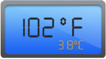

# Getting Started
* This section encompasses the details on how to configure DigitalGauge. Here you will learn how to provide data for a DigitalGauge and display the data in the required way. 
* In addition, you will learn how to customize the default DigitalGauge appearance according to your requirements. As a result, you will get a DigitalGauge that shows it as Digital thermometer.
* You can use this DigitalGauge in advertisements, decorative purposes, displaying share details in share market, game score boards, token systems, etc.

Digital Thermometer
{:.caption}

## Adding Script Reference

Create an **HTML** page and add the scripts references in the order mentioned in the following code example.

* [`jQuery`](http://jquery.com) 1.10.2 and later versions

The required ReactJS script dependencies as follows. And you can also refer [React](https://facebook.github.io/react/docs/getting-started.html) to know more about react js.

* `react.min.js` - [http://cdn.syncfusion.com/js/assets/external/react.min.js](http://cdn.syncfusion.com/js/assets/external/react.min.js)
* `react-dom.min.js` - [http://cdn.syncfusion.com/js/assets/external/react-dom.min.js](http://cdn.syncfusion.com/js/assets/external/react-dom.min.js)
* `ej.web.react.min.js` - [http://cdn.syncfusion.com/{{ site.releaseversion }}/js/common/ej.web.react.min.js](http://cdn.syncfusion.com/14.3.0.49/js/common/ej.web.react.min.js)

To get started, you can use the `ej.web.all.min.js` file that encapsulates all the `ej` controls and frameworks in one single file.


<!DOCTYPE html>
   <html>
     <head>
        <meta name="viewport" content="width=device-width, initial-scale=1.0">
        <meta name="description" content="Essential Studio for React JS">
        <meta name="author" content="Syncfusion">
        <title>Getting Started for Ribbon React JS</title>
        <!-- Essential Studio for JavaScript  theme reference -->
        <link href="http://cdn.syncfusion.com/{{ site.releaseversion }}/js/web/flat-azure/ej.web.all.min.css" rel="stylesheet" />
        <!-- Essential Studio for JavaScript  script references -->
        
         
        
        
        
        <!-- Add your custom scripts here -->
    </head>
        <body>
        </body>
   </html>



N> 1. In production, we highly recommend you to use our [`custom script generator`](http://help.syncfusion.com/js/custom-script-generator) to create custom script file with required controls and its dependencies only. Also to reduce the file size further please use [`GZip compression`](https://developers.google.com/web/fundamentals/performance/optimizing-content-efficiency/optimize-encoding-and-transfer?hl=en) in your server.
N> 2. For themes, you can use the `ej.web.all.min.css` CDN link from the code snippet given. To add the themes in your application, please refer to [`this link`](http://help.syncfusion.com/js/theming-in-essential-javascript-components).

## Control Initialization

Control can be initialized in two ways.

 * Using jsx Template
 * Without using jsx Template
 
## Using jsx Template

By using the jsx template, we can create the html file and jsx file. The `.jsx` file can be convert to `.js` file and it can be referred in html page.

### Create a Digital Gauge

1.Create a 
 tag.
	
   

<!DOCTYPE html>
<html>    
    <body>
	

                
    </body>
</html>



2.Initialize the DigitalGauge in ts file by using the `EJ.DigitalGauge` tag



"use strict";
ReactDOM.render(
    

        <EJ.DigitalGauge id="digitalgauge1"></EJ.DigitalGauge>,
    
,
    document.getElementById('digitalgauge-default')
    );


   
Run the above code example and you will get a default Digital Gauge as follows.

Digital Gauge
{:.caption}

## Set Height and Width values

Basic attributes of each canvas elements are height and width. You can set the height and width of the gauge.



    </body>
</html>



Run the above code example and you will see a default gauge with the specified height and width values.

Digital Gauge with Height and Width
{:.caption}

## Set Items Property

Items have different properties to customize the Digital Gauge.

### Add Segment and Character Properties

* In the Welcome Board, the text color must be attentive in nature. You can give some segment properties such as segment spacing, segment width, segment color, segment length and segment opacity.
* Character type is to define the Digital representation of the character. The five types of character representation available are,
	1. EightCrossEightDotMatrix
	2. SevenSegment
	3. FourteenSegment
	4. SixteenSegment 
	5. EightCrossEightSquareMatrix.



    </body>
</html>



Run the above code example and you will see the following output.

Digital Gauge Segment Properties
{:.caption}

## Add Background Image

* Add a 
 element to set the background for the Digital Gauge. 
* Add a style tag in the View page to add the background image for the Digital Gauge.
* Add the required properties to show the background image such as position, margin, display, etc.,





Run the above code example and you will see the following output.                    

Digital Gauge Background Image
{:.caption}

## Add Location

The Location property is used to position the digital letters inside the canvas element.



var items=[{
                //For Displaying Fahrenheit value
                segmentSettings: { width: 2, length: 20 },
                characterSettings: { type: "sevensegment", spacing: 12, },
                value: "102", position: { x: 15, y: 40 }
                ]}
            }];
            
<!DOCTYPE html>
<html>    
    <body>
        
    </body>
</html>


Run the above code example and you will see the following output. 

Digital Gauge with Segment Location
{:.caption}

## Add Items Collection 

You can further add the Items Collection to display the temperature value like Digital Thermometer.



var items=[{
               //For Displaying Fahrenheit value
                segmentSettings: { width: 2, length: 20, spacing: 0 },
                characterSettings: { type: "sevensegment", spacing: 12, },
                value: "102",
                position: { x: 15, y: 40 }
            },
            {
                //For displaying degree symbol
                segmentSettings: { width: 2, length: 5, spacing: 0 },
                characterSettings: { type: "sevensegment", spacing: 5, },
                value: "0",
                position: { x: 70, y: 28 }
            },
            {
                //For displaying Fahrenheit symbol
                segmentSettings: { width: 2, length: 20, spacing: 0 },
                characterSettings: { type: "sevensegment", spacing: 12, },
                value: "F",
                position: { x: 170, y: 40 }
            },
            {
                //For displaying Celcius value
                segmentSettings: { width: 1, length: 9, spacing: 0, color: "#F5b43f" },
                characterSettings: { type: "sevensegment", spacing: 12, },
                value: "38",
                position: { x: 70, y: 90 },
            },
            {
                //For displaying degree symbol
                segmentSettings: { width: 1, length: 3, spacing: 0, color: "#F5b43f" },
                characterSettings: { type: "sevensegment", spacing: 12, },
                value: "0",
                position: { x: 90, y: 80 }
            },
            {
                //For displaying celcius symbol
                segmentSettings: { width: 1, length: 9, spacing: 0, color: "#F5b43f" },
                characterSettings: { type: "sevensegment", spacing: 12, },
                value: "c",
                position: { x: 120, y: 90 }
              }];
            
<!DOCTYPE html>
<html>    
    <body>
        
    </body>
</html>



Run the above code example and you will see the following output.                    

Digital Gauge with Item Collection
{:.caption}

##Without using jsx Template

The Digital Gauge can be created from a HTML `DIV` element with the HTML `id` attribute set to it. Refer to the following code example.


           




 

Run the above code example and you will see the following output.

