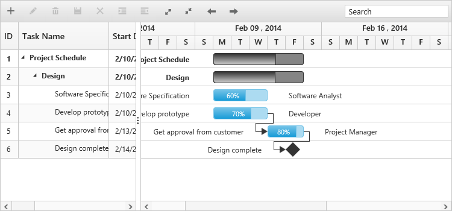
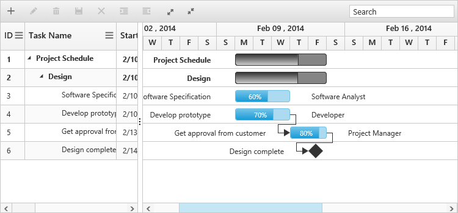

# Getting Started

This section explains briefly about how to create a Gantt chart in your application with ReactJS.

## Create your first Gantt in ReactJS

To get started Syncfusion ReactJS application refer [`this`](https://help.syncfusion.com/reactjs/overview) page for basic control integration and script references.

In this tutorial, you can learn how to create a simple Gantt chart, add tasks or subtasks, and set relationship between tasks during the design phase of a software project. The following screenshot displays the desired output after completing this tutorial,

The required ReactJS script dependencies as follows. And you can also refer [React](https://facebook.github.io/react/docs/getting-started.html) to know more about react js.

* `react.min.js` - [http://cdn.syncfusion.com/js/assets/external/react.min.js](http://cdn.syncfusion.com/js/assets/external/react.min.js)
* `react-dom.min.js` - [http://cdn.syncfusion.com/js/assets/external/react-dom.min.js](http://cdn.syncfusion.com/js/assets/external/react-dom.min.js)
* `browser.min.js` - [http://cdnjs.cloudflare.com/ajax/libs/babel-core/5.8.34/browser.min.js](http://cdnjs.cloudflare.com/ajax/libs/babel-core/5.8.34/browser.min.js)
* `ej.web.react.min.js` - [http://cdn.syncfusion.com/{{ site.releaseversion }}/js/common/ej.web.react.min.js](http://cdn.syncfusion.com/14.3.0.49/js/common/ej.web.react.min.js)

## Adding script references

Create an HTML file and add the following template to the HTML file.

To get started, you can use the `ej.web.all.min.js` file that encapsulates all the `ej` controls and frameworks in one single file. So the complete boilerplate code is



    <!DOCTYPE html>

    <html xmlns="http://www.w3.org/1999/xhtml">

    <head>

        <title>Getting Started with Gantt Control for Aurelia</title>

        <!-- style sheet for default theme(flat azure) -->
        <link href="http://cdn.syncfusion.com/{{ site.releaseversion }}/js/web/flat-azure/ej.web.all.min.css" rel="stylesheet" />

        <!--scripts-->
        
        
        
        
        

        

        

        

        

        

        
    </head>

    <body>
        <!--Add  Gantt control here-->
    </body>

    </html>



## Initialize the Gantt with data source

## Create a Gantt

Control can be initialized in two ways.

 * Using jsx Template
 * Without using jsx Template
 
## Using jsx Template

By using the jsx template, we can create the html file and jsx file. The `.jsx` file can be convert to `.js` file and it can be referred in html page.

Please refer to the code of HTML file.



       

       



Create an app.JSX file and paste the following content



var projectData = [{
    TaskId: 1,
    TaskName: "Project Schedule",
    StartDate: "02/03/2014",
    EndDate: "03/07/2014",
    col1: "check",
    Children: [{
        TaskId: 2,
        TaskName: "Design",
        StartDate: "02/10/2014",
        EndDate: "02/14/2014",
        Children: [{
            TaskId: 3,
            TaskName: "Software Specification",
            StartDate: "02/10/2014",
            EndDate: "02/12/2014",
            Duration: 3,
            Progress: "60",
            resourceId: [2]
        }, {
            TaskId: 4,
            TaskName: "Develop prototype",
            StartDate: "02/10/2014",
            EndDate: "02/12/2014",
            Duration: 3,
            Progress: "100",
            resourceId: [3]
        }, {
            TaskId: 5,
            TaskName: "Get approval from customer",
            StartDate: "02/13/2014",
            EndDate: "02/14/2014",
            Duration: 2,
            Progress: "100",
            Predecessor: "4FS",
            resourceId: [1]
        }, {
            TaskId: 6,
            TaskName: "Design complete",
            StartDate: "02/14/2014",
            EndDate: "02/14/2014",
            Duration: 0,
            Predecessor: "5FS"
        }]
    }, ]
}];
ReactDOM.render( 
  <EJ.Gantt dataSource = {projectData}
    childMapping = "Children"
    taskIdMapping = "TaskId"
    taskNameMapping = "TaskName"
    startDateMapping = "StartDate"
    endDateMapping = "EndDate"
    durationMapping = "Duration"
    progressMapping = "Progress"
    treeColumnIndex = {1}>

    </EJ.Gantt>,
    document.getElementById('Gantt-default')
);



A Gantt chart is created as shown in the following screen shot.

## Enable Toolbar

Gantt control contains toolbar options to edit, search, expand or collapse all records, indent, outdent, delete, and add a task. You can enable toolbar using the [`toolbarSettings`](http://help.syncfusion.com/js/api/ejgantt#members:toolbarsettings "toolbarSettings") property.



var toolbarsettings = {
     showToolbar: true,
     toolbarItems: [
         ej.Gantt.ToolbarItems.Add,
         ej.Gantt.ToolbarItems.Edit,
         ej.Gantt.ToolbarItems.Delete,
         ej.Gantt.ToolbarItems.Update,
         ej.Gantt.ToolbarItems.Cancel,
         ej.Gantt.ToolbarItems.Indent,
         ej.Gantt.ToolbarItems.Outdent,
         ej.Gantt.ToolbarItems.ExpandAll,
         ej.Gantt.ToolbarItems.CollapseAll
     ]
 };
 var editsettings = {
     allowEditing: true,
     allowAdding: true,
     allowDeleting: true,
     allowIndent: true,
     editMode: 'cellEditing'
 };
 ReactDOM.render( 
   <EJ.Gantt toolbarSettings = {toolbarsettings}
     editSettings = {editsettings}>

   </EJ.Gantt>,
     document.getElementById('Gantt-default')
 );


The following screen shot displays a Tool bar in Gantt chart control:

N>  Add, edit, delete, indent and outdent options are enabled when enabling the allowEditing, allowAdding, allowDelete, allowIndent and allowOutdent properties in the edit Options.

## Enable Sorting

The Gantt control has sorting functionality to arrange the tasks in ascending or descending order based on a particular column.

### Multicolumn Sorting

Enable the multicolumn sorting in Gantt by setting [`allowMultiSorting`](http://help.syncfusion.com/js/api/ejgantt#members:allowmultisorting "allowMultiSorting") as `true`. You can sort multiple columns in Gantt, by selecting the desired column header while holding the `CTRL` key.



 ReactDOM.render(
  <EJ.Gantt dataSource = {projectData}
        allowSorting = {true}
        allowMultiSorting = {true}>
   
</EJ.Gantt>,
   document.getElementById('Gantt-default')
);



## Enable Editing

You can enable editing using [`editSettings`](http://help.syncfusion.com/js/api/ejgantt#members:editsettings "editSettings") and [`allowGanttChartEditing`](http://help.syncfusion.com/js/api/ejgantt#members:allowganttchartediting "allowGanttChartEditing") options.

### Cell Editing

Modify the task details through the grid cell editing by setting the [`editMode`](http://help.syncfusion.com/js/api/ejgantt#members:editsettings-editmode "editSettings.editMode") as [`cellEditing`](http://help.syncfusion.com/js/api/ejgantt#members:editsettings-editmode "cellEditing").

### Normal Editing

Modify the task details through the edit dialog by setting the [`editMode`](http://help.syncfusion.com/js/api/ejgantt#members:editsettings-editmode "editSettings.editMode") as [`normal`](http://help.syncfusion.com/js/api/ejgantt#members:editsettings-editmode "normal").

### Taskbar Editing

Modify the task details through user interaction such as resizing and dragging the taskbar.

### Predecessor Editing

Modify the predecessor details of a task using mouse interactions by setting [`allowGanttChartEditing`](http://help.syncfusion.com/js/api/ejgantt#members:allowganttchartediting "allowGanttChartEditing") as `true` and setting the value for `predecessorMapping` property.



var editsettings = {
    allowEditing: true,
    allowAdding: true,
    allowDeleting: true,
    allowIndent: true,
    editMode: 'cellEditing'
};
ReactDOM.render( 
  <EJ.Gantt dataSource = {projectData}
    allowGanttChartEditing = {true}
    predecessorsMapping = "Predecessor"
    editSettings = {editsettings}>

    </EJ.Gantt>,
    document.getElementById('Gantt-default')
);



The following screen shot displays a Gantt chart control with Enable Editing options.

N>  Both cellEditing and normal editing operations are performed through double-click or single click action that can be defined by editSettings.beginEditAction property.

## Enable Context Menu

You can enable the context menu in Gantt, by setting the [`enableContextMenu`](http://help.syncfusion.com/js/api/ejgantt#members:enablecontextmenu "enableContextMenu") as `true`.



 ReactDOM.render( 
     <EJ.Gantt dataSource = {projectData}
     enableContextMenu = {true}>

     </EJ.Gantt>,
     document.getElementById('Gantt-default')
 );



The following screen shot displays Gantt chart in which Context menu option is enabled:

## Enable Column Menu

You can enable the column menu in Gantt, by setting the [`showColumnChooser`](http://help.syncfusion.com/js/api/ejgantt#members:showcolumnchooser "showColumnChooser") as `true`.



 ReactDOM.render( 
   <EJ.Gantt dataSource = {projectData}
     showColumnChooser = {true}>

   </EJ.Gantt>,
     document.getElementById('Gantt-default')
 );



The following screen shot displays Gantt chart in which column chooser option is enabled:

## Provide tasks relationship

In Gantt, you have the predecessor support to show the relationship between two different tasks.

* **Start to Start (SS)** - You cannot start a task until the other task also starts.
* **Start to Finish (SF)** - You cannot finish a task until the other task finishes.
* **Finish to Start (FS)** - You cannot start a task until the other task completes.
* **Finish to Finish (FF)** - You cannot finish a task until the other task completes.

You can show the relationship in tasks, by using the [`predecessorMapping`](http://help.syncfusion.com/js/api/ejgantt#members:predecessormapping "predecessorsMapping")

, as shown in the following code example.



 ReactDOM.render( 
   <EJ.Gantt dataSource = {projectData}
     predecessorsMapping = "Predecessor" >

   </EJ.Gantt>,
     document.getElementById('Gantt-default')
 );



The following screenshot displays the relationship between tasks.

## Provide Resources

In Gantt control, you can display and assign the resource for each task. Create a collection of `JSON` object, which contains id and name of the resource and assign it to [`resources`](http://help.syncfusion.com/js/api/ejgantt#members:resources "resources") property. Then, specify the field name for id and name of the resource in the resource collection to [`resourceIdMapping`](http://help.syncfusion.com/js/api/ejgantt#members:resourceidmapping "resourceIdMapping") and [`resourceNameMapping`](http://help.syncfusion.com/js/api/ejgantt#members:resourcenamemapping "resourceNameMapping") options. The name of the field, which contains the actual resources assigned for a particular task in the `dataSource` is specified using [`resourceInfoMapping`](http://help.syncfusion.com/js/api/ejgantt#members:resourceinfomapping "resourceInfoMapping").

1.Create the resource collection to be displayed in ejGantt



var projectResources = [{
    resourceId: 1,
    resourceName: "Project Manager"
}, {
    resourceId: 2,
    resourceName: "Software Analyst"
}, {
    resourceId: 3,
    resourceName: "Developer"
}, {
    resourceId: 4,
    resourceName: "Testing Engineer"
}];
ReactDOM.render( 
    <EJ.Gantt resourceInfoMapping = "resourceId"
    resourceNameMapping = "resourceName"
    resourceIdMapping = "resourceId"
    resources = {
        projectResources
    }>

    </EJ.Gantt>,
    document.getElementById('Gantt-default')
);



The following screenshot displays resource allocation for tasks in Gantt chart.

By following these steps, you have learned how to provide data source to Gantt chart, how to configure Gantt to set task relationships, assign resources for each task, and add toolbar with necessary buttons.

## Highlight Weekend

In Gantt, you can on or off weekends high lighting by setting the [`highlightWeekends`](https://help.syncfusion.com/api/js/ejgantt#members:highlightweekends "highlightWeekEnds")

 as `true` or `false`.



 ReactDOM.render( 
     <EJ.Gantt dataSource = {projectData}
     highlightWeekends = {true}>

     </EJ.Gantt>,
     document.getElementById('Gantt-default')
 );
 


The following screen shot displays Gantt chart in which highlight weekends is enabled:

