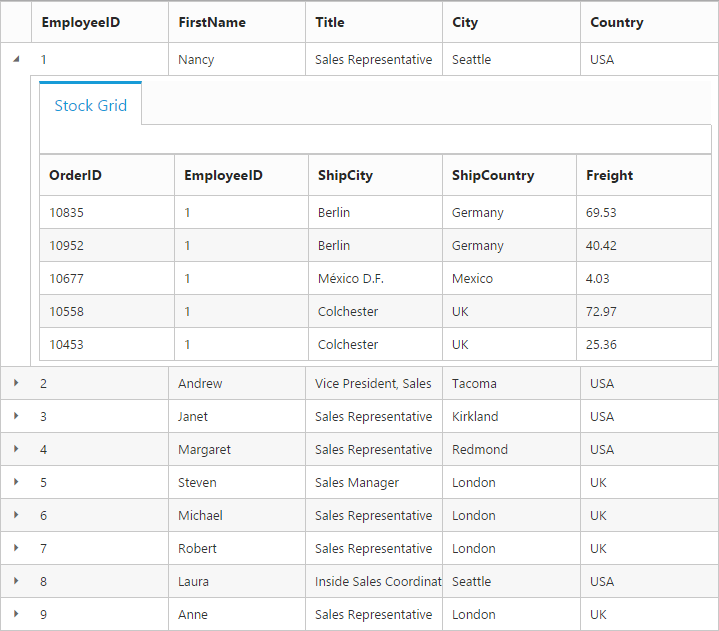
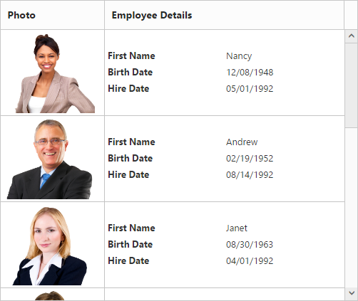

---
layout: post
title: Row with Grid widget for Syncfusion Essential ReactJs
description: How to use and customize the grid row
platform: reactjs
control: Grid
documentation: ug
--- 
# Row

It represents the record details that are fetched from the datasource.

## Details Template

It provides a detailed view /additional information about each row of the grid. You can render any type of JsRender template and assign the script template id in the [`detailsTemplate`](http://help.syncfusion.com/api/js/ejgrid#members:detailstemplate "detailsTemplate") property. And also you can change HTML elements in detail template row into JavaScript controls using [`detailsDataBound`](http://help.syncfusion.com/api/js/ejgrid#events:detailsdatabound "detailsDataBound") event.

On enabling details template, new column will be added in grid with an expander button in it and that can be expanded or collapsed to show or hide the underlying details row respectively.

The following code example describes the above behavior.



 


Create a JSX file and paste the following content


        var DetailGrid = React.createClass({
		 detailGrid: function(e){
                var filteredData = e.data["EmployeeID"];
                var data = ej.DataManager(window.ordersView).executeLocal(ej.Query().where("EmployeeID", "equal", parseInt(filteredData), true).take(5));
                e.detailsElement.find("#detailGrid").ejGrid({
                    dataSource: data,
                    columns: ["OrderID", "EmployeeID", "ShipCity", "ShipCountry", "Freight"]
                });
                e.detailsElement.find(".tabcontrol").ejTab();
            },

		render: function () {
            return (   
			 //The datasource "window.employeeView" is referred from 'http://js.syncfusion.com/demos/web/scripts/jsondata.min.js'
		  <EJ.Grid dataSource = {window.employeeView} detailsTemplate = "#tabGridContents" detailsDataBound={this.detailGrid}>
            <columns>
                <column field="EmployeeID" />
                <column field="FirstName" />
                <column field="Title" />
                <column field="City" />
                <column field="Country" />
            </columns>    
          </EJ.Grid>
			);
			}
		});
		
		ReactDOM.render(<DetailGrid />, document.getElementById('Grid'));



The following output is displayed as a result of the above code example.

## Row Template

Row template enables you to set the customized look and behavior to grid all rows. [`rowTemplate`](http://help.syncfusion.com/api/js/ejgrid#members:rowtemplate "rowTemplate") property can be used bind the `id` of HTML template.

The following code example describes the above behavior.



 
 

 Create a JSX file and paste the following content


        var scroll = { width: 500, height: 380 };

        ReactDOM.render(
		  <EJ.Grid dataSource = {window.employeeData} allowScrolling = {true} scrollSettings={scroll} rowTemplate="#rowTemp">
            <columns>
                <column field="Photo" headerText="Photo" width={30} />
                <column headerText="Employee Details" width={70} />
            </columns>    
          </EJ.Grid>,
          document.getElementById('Grid')
        );
  


  



   
The following output is displayed as a result of the above code example.

