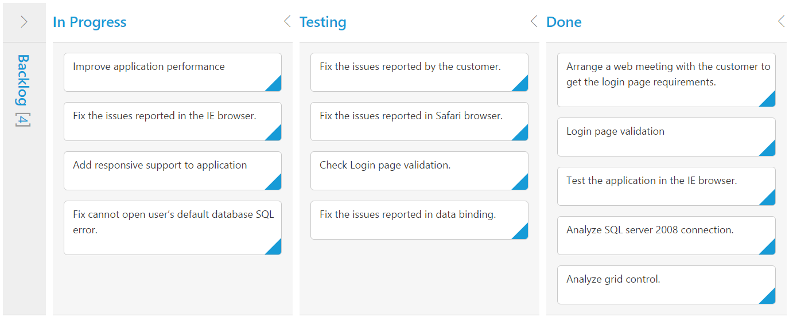

# Columns 

Column fields are present in the [`dataSource`](https://help.syncfusion.com/api/js/ejkanban#members:datasource) schema and it is rendering cards based its mapping column values.

## Key Mapping

To render Kanban with simple cards, you need to map the `dataSource` fields to Kanban cards and [`columns`](https://help.syncfusion.com/api/js/ejkanban#members:columns). The required mapping field are listed as follows

<table>
<tr>
<th>
Mapping Fields</th><th>
Description</th></tr>
<tr>
<td>
{{ '[keyField](https://help.syncfusion.com/api/js/ejkanban#members:keyField)' | markdownify }} </td><td>
Map the column name to use as {{ '[key](https://help.syncfusion.com/api/js/ejkanban#members:columns-key)'| markdownify }} values to columns.</td></tr>
<tr>
<td>
{{ '[column-key](https://help.syncfusion.com/api/js/ejkanban#members:columns-key)' | markdownify }} </td><td>
Map the corresponding `key` values of `keyField` column to each columns.</td></tr>
<tr>
<td>
{{ '[column-headerText](https://help.syncfusion.com/api/js/ejkanban#members:columns-headertext)' | markdownify }} </td><td>
 It represents the title for particular column</td></tr>
<tr>
<td>
{{ '[fields-content](https://help.syncfusion.com/api/js/ejkanban#members:fields-content)' | markdownify }} </td><td>
Map the column name to use as content to cards.</td></tr>
</table>

N> 1. If the column with `keyField` is not in the dataSource and `key` values specified will not available in column values, then the cards will not be rendered.
N> 2. If the `fields-content` is not in the dataSource, then empty cards will be rendered.

The following code example describes the above behavior.

     

var data = ej.DataManager(window.kanbanData).executeLocal(ej.Query().take(10));
ReactDOM.render(
<EJ.Kanban dataSource={data} keyField="Status" fields-content="Summary" fields-primaryKey="Id">
    <columns>
		<column headerText="Backlog" key="Open"></column>
		<column headerText="In Progress" key="InProgress"></column>
	    <column headerText="Testing" key="Testing"></column>
	    <column headerText="Done" key="Close"></column>
	</columns>
</EJ.Kanban>,
   document.getElementById('kanbanboard-default')
);
    


The following output is displayed as a result of the above code example.

## Multiple Key Mapping

You can map more than one datasource fields as [`key`](https://help.syncfusion.com/api/js/ejkanban#members:columns-key) values to show different key cards into single column. For e.g , you can map "Validate,In progress" keys under "In progress" column. 

The following code example and screenshot which describes the above behavior.

  

var data = ej.DataManager(window.kanbanData).executeLocal(ej.Query().take(20));
ReactDOM.render(
<EJ.Kanban dataSource={data} keyField="Status" fields-content="Summary" fields-primaryKey="Id" allowTitle={true}>
   <columns>
		<column headerText="Backlog" key="Open"></column>
		<column headerText="In Progress or Validate" key="InProgress,Validate"></column>
	    <column headerText="Testing" key="Testing"></column>
	    <column headerText="Done" key="Close"></column>
	</columns>
</EJ.Kanban>,
   document.getElementById('kanbanboard-default')
);



The following output is displayed as a result of the above code example.

## Headers

### Header Template

The template design that applies on for the column header. To render template, set [`headerTemplate`](https://help.syncfusion.com/api/js/ejkanban#members:columns-headertemplate) property of the [`column`](https://help.syncfusion.com/api/js/ejkanban#members:columns).

You can use JsRender syntax in the template. For more information about JsRender syntax, please refer the [`link`](https://www.jsviews.com/).

The following code example describes the above behavior.



    

    
    
    

         Done
    

    



Kanban control can be initialized with the following in HTML document.

     

var data = ej.DataManager(window.kanbanData).executeLocal(ej.Query().take(20));
ReactDOM.render(
<EJ.Kanban dataSource={data} keyField="Status" fields-content="Summary" fields-primaryKey="Id">
    <columns>
		<column headerText="Backlog" key="Open" headerTemplate="#column1"></column>
		<column headerText="In Progress" key="InProgress"></column>
	    <column headerText="Testing" key="Testing"></column>
	    <column headerText="Done" key="Close" headerTemplate="#column4"></column>
	</columns>
</EJ.Kanban>,
   document.getElementById('kanbanboard-default')
);     
    


The following output is displayed as a result of the above code example.

## Width

You can specify the width for particular column by setting [`width`](https://help.syncfusion.com/api/js/ejkanban#members:columns-width) property of [`column`](https://help.syncfusion.com/api/js/ejkanban#members:columns) as in pixel (ex: 100) or in percentage (ex: 40%).

The following code example describes the above behavior.


  
var data = ej.DataManager(window.kanbanData).executeLocal(ej.Query().take(20));
ReactDOM.render(
<EJ.Kanban dataSource={data} keyField="Status" fields-content="Summary" fields-primaryKey="Id">
    <columns>
		<column headerText="Backlog" key="Open" width="5%"></column>
		<column headerText="In Progress" key="InProgress" width="12%"></column>
	    <column headerText="Testing" key="Testing" width="100"></column>
	    <column headerText="Done" key="Close" width="100"></column>
	</columns>
</EJ.Kanban>,
   document.getElementById('kanbanboard-default')
);



The following output is displayed as a result of the above code example.

## Visibility 

You can hide particular column in Kanban by setting [`visible`](https://help.syncfusion.com/api/js/ejkanban#members:columns-visible) property of it as false.

The following code example describes the above behavior.



var data = ej.DataManager(window.kanbanData).executeLocal(ej.Query().take(20));
ReactDOM.render(
<EJ.Kanban dataSource={data} keyField="Status" fields-content="Summary" fields-primaryKey="Id">
    <columns>
		<column headerText="Backlog" key="Open"></column>
		<column headerText="In Progress" key="InProgress"></column>
	    <column headerText="Testing" key="Testing" visible={false}></column>
	    <column headerText="Done" key="Close"></column>
	</columns>
</EJ.Kanban>,
   document.getElementById('kanbanboard-default')
);



The following output is displayed as a result of the above code example.

## Toggle 

You can set particular column collapsed state in Kanban by setting [`isCollapsed`](https://help.syncfusion.com/api/js/ejkanban#members:columns-iscollapsed) property of it as true. You need to set [`allowToggleColumn`](https://help.syncfusion.com/api/js/ejkanban#members:allowtogglecolumn) as true to use “Expand/Collapse” Column.

The following code example describes the above behavior.



var data = ej.DataManager(window.kanbanData).executeLocal(ej.Query().take(20));
ReactDOM.render(
<EJ.Kanban dataSource={data} keyField="Status" fields-content="Summary" fields-primaryKey="Id" allowToggleColumn={true}>
    <columns>
		<column headerText="Backlog" key="Open" isCollapsed={true}></column>
		<column headerText="In Progress" key="InProgress"></column>
	    <column headerText="Testing" key="Testing"></column>
	    <column headerText="Done" key="Close"></column>
	</columns>
</EJ.Kanban>,
   document.getElementById('kanbanboard-default')
);



The following output is displayed as a result of the above code example.

## Allow Dragging

You can enable and disable drag behavior to the cards in the Kanban columns using the `allowDrag` property and the default value is `true`.

The following code example describes the above behavior.



var data = ej.DataManager(window.kanbanData).executeLocal(ej.Query().take(20));
ReactDOM.render(
<EJ.Kanban dataSource={data} keyField="Status" fields-content="Summary" fields-primaryKey="Id" fields-priority="RankId">
    <columns>
		<column headerText="Backlog" key="Open" allowDrag={false}></column>
		<column headerText="In Progress" key="InProgress"></column>
	    <column headerText="Done" key="Close"></column>
	</columns>
</EJ.Kanban>,
   document.getElementById('kanbanboard-default')
);



The following output is displayed as a result of the above code example.

## Allow Dropping

You can enable and disable drop behavior to the cards in the Kanban columns using the `allowDrop` property and the default value is `true`.

The following code example describes the above behavior.



var data = ej.DataManager(window.kanbanData).executeLocal(ej.Query().take(20));
ReactDOM.render(
<EJ.Kanban dataSource={data} keyField="Status" fields-content="Summary" fields-primaryKey="Id" fields-priority="RankId">
    <columns>
		<column headerText="Backlog" key="Open"></column>
		<column headerText="In Progress" key="InProgress"></column>
	    <column headerText="Done" key="Close" allowDrop={false}></column>
	</columns>
</EJ.Kanban>,
   document.getElementById('kanbanboard-default')
);



The following output is displayed as a result of the above code example.

##Items Count

You can show total cards count in each column's header using the property `enableTotalCount` and the default value is `false`.

The following code example describes the above behavior.



var data = ej.DataManager(window.kanbanData).executeLocal(ej.Query().take(20));
ReactDOM.render(
<EJ.Kanban dataSource={data} keyField="Status" fields-content="Summary" fields-primaryKey="Id" enableTotalCount={true}>
    <columns>
		<column headerText="Backlog" key="Open"></column>
		<column headerText="In Progress" key="InProgress"></column>
	    <column headerText="Done" key="Close"></column>
	</columns>
</EJ.Kanban>,
   document.getElementById('kanbanboard-default')
);



The following output is displayed as a result of the above code example.

## Customize Items Count Text

You can customize the Items count text using the property `totalCount-text`.

The following code example describes the above behavior.



var data = ej.DataManager(window.kanbanData).executeLocal(ej.Query().take(20));
ReactDOM.render(
<EJ.Kanban dataSource={data} keyField="Status" fields-content="Summary" fields-primaryKey="Id" enableTotalCount={true}>
    <columns>
		<column headerText="Backlog" key="Open" totalCount-text="Backlog Count"></column>
		<column headerText="In Progress" key="InProgress"></column>
	    <column headerText="Done" key="Close"></column>
	</columns>
</EJ.Kanban>,
   document.getElementById('kanbanboard-default')
);



The following output is displayed as a result of the above code example.

