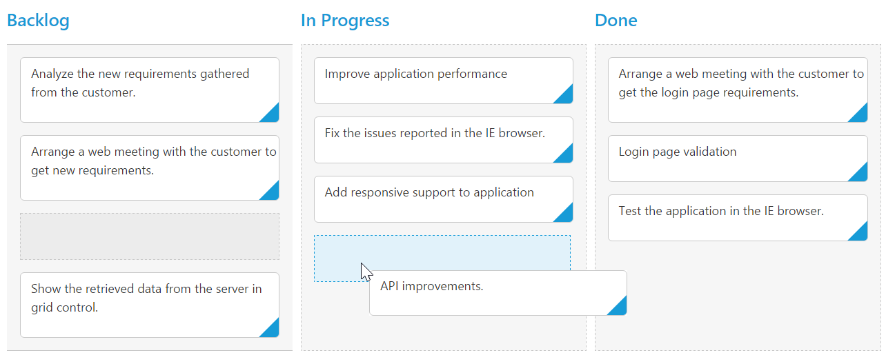

# Drag and Drop

By default [`allowDragAndDrop`](https://help.syncfusion.com/api/js/ejkanban#members:allowdraganddrop) is true.Cards can be transited from one column to another column, by dragging and dropping. And it has drop position indicator which enables easier positioning of cards

N> It is not possible transit cards to other swim lanes through Drag and Drop.

## Prioritization of cards

Prioritizing cards is easy with drag-and-drop re-ordering that helps you to categorize most important work at the top.Cards can be categorized with priority by mapping specific database field into [`fields-priority`](https://help.syncfusion.com/api/js/ejkanban#members:fields-priority) property.

`RankId` defined in the dataSource which is consist priority of cards. The `RankId` will be changed while card ordering changes through `Drag and Drop` and `Editing`.

The following code example describes the above behavior.



var data = ej.DataManager(window.kanbanData).executeLocal(ej.Query().take(20));
ReactDOM.render(
<EJ.Kanban dataSource={data} keyField="Status" fields-content="Summary" fields-primaryKey="Id" fields-priority="RankId">
    <columns>
		<column headerText="Backlog" key="Open"></column>
		<column headerText="In Progress" key="InProgress"></column>
	    <column headerText="Done" key="Close"></column>
	</columns>
</EJ.Kanban>,
   document.getElementById('kanbanboard-default')
);



The following output is displayed as a result of the above code example.

