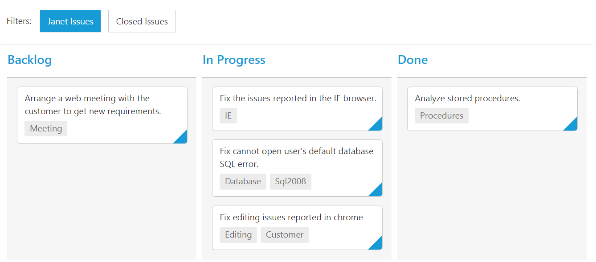

# Filtering

Filtering allows to filter the collection of cards from `dataSource` which meets the predefined `query` in the quick filters collection. To enable filtering, define [`filterSettings`](https://help.syncfusion.com/api/js/ejkanban#members:filtersettings) collection with display `text` and [`ej.Query`](https://help.syncfusion.com/js/datamanager/query). 

You can also define display tip to describe filter definition to user using property `description`. If the [`description`](https://help.syncfusion.com/api/js/ejkanban#members:filtersettings-description) property is not defined, given [`text`](https://help.syncfusion.com/api/js/ejkanban#members:filtersettings-text) will act as display tip.

We can also customize filter option through external button or [`customToolbarItems`](https://help.syncfusion.com/api/js/ejkanban#members:customtoolbaritems) by using [`filterCards()`](https://help.syncfusion.com/api/js/ejkanban#methods:filtercards) method.

The following code example describes the above behavior.



var data = ej.DataManager(window.kanbanData).executeLocal(ej.Query().take(20));
var filter = [                             
        { text: "Janet Issues", query: new ej.Query().where("Assignee", "equal", "Janet Leverling"), description: "Displays issues which matches the assignee as 'Janet Leverling'" },
        { text: "Andrew Issues", query: new ej.Query().where("Assignee", "equal", "Andrew Fuller"), description: "Displays issues which matches the assignee as 'Andrew Fuller'" }
    ];
ReactDOM.render(
<EJ.Kanban dataSource={data} keyField="Status" fields-content="Summary" fields-primaryKey="Id" fields-tag="Tags" filterSettings={filter}>
    <columns>
		<column headerText="Backlog" key="Open"></column>
		<column headerText="In Progress" key="InProgress"></column>
	    <column headerText="Done" key="Close"></column>
	</columns>
</EJ.Kanban>,
   document.getElementById('kanbanboard-default')
);



The following output is displayed as a result of the above code example.

