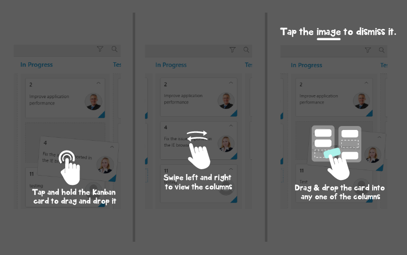

# Responsive

The Kanban control has support for responsive behavior based on client browser’s width and height. To enable responsive, [`isResponsive`](https://help.syncfusion.com/api/js/ejkanban#members:isresponsive) property should be true.There are two modes of responsive layout is available in Kanban based on client width. They are.

* Mobile(<480px)
* Desktop(>480px)

You can check the image representation of touch actions from the below image.

## Mobile Layout

If client width is less than 480px, the Kanban will render in mobile mode. In which, you can see that kanban user interface is customized and redesigned for best view in small screens.To enable responsive, [`isResponsive`](https://help.syncfusion.com/api/js/ejkanban#members:isresponsive) property should be true.



var data = ej.DataManager(window.kanbanData).executeLocal(ej.Query().take(20));
var editItems = [
              { field: "Id", editType: ej.Kanban.EditingType.String, validationRules: { required: true, number: true } },
              { field: "Status", editType: ej.Kanban.EditingType.Dropdown },
              { field: "Assignee", editType: ej.Kanban.EditingType.Dropdown },
              { field: "Estimate", editType: ej.Kanban.EditingType.Numeric, editParams: { decimalPlaces: 2 }, validationRules: { range: [0, 1000] } },
              { field: "Summary", editType: ej.Kanban.EditingType.TextArea, validationRules: { required: true } }
		];
		var filter = [                             
        { text: "Janet Issues", query: new ej.Query().where("Assignee", "equal", "Janet Leverling"), description: "Displays issues which matches the assignee as 'Janet Leverling'" },
        { text: "Andrew Issues", query: new ej.Query().where("Assignee", "equal", "Andrew Fuller"), description: "Displays issues which matches the assignee as 'Andrew Fuller'" }
    ];
ReactDOM.render(
<EJ.Kanban dataSource={data} keyField="Status" isResponsive={true} fields-content="Summary" fields-primaryKey="Id" fields-imageUrl="ImgUrl" editSettings-editItems={editItems} editSettings-allowEditing={true} editSettings-allowAdding={true} allowSearching={true} filterSettings={filter}>
    <columns>
		<column headerText="Backlog" key="Open"></column>
		<column headerText="In Progress" key="InProgress"></column>
		<column headerText="Testing" key="Testing"></column>
	    <column headerText="Done" key="Close"></column>
	</columns>
</EJ.Kanban>,
   document.getElementById('kanbanboard-default')
);



W> IE8 and IE9 does not support responsive kanban. `ej.responsive.css` should be referred to display Responsive Kanban.

{:caption}
CRUD in mobile layout

{:caption}
Filtering in mobile layout

{:caption}
Searching in mobile layout

{:caption}
Kanban with Swim-lane

## Width

By default, the Kanban is adaptable to its parent container. It can adjust its width of columns based on parent container width. You can also assign width of [`columns`](https://help.syncfusion.com/api/js/ejkanban#members:columns) in percentage. 

The following code example describes the above behavior.



var data = ej.DataManager(window.kanbanData).executeLocal(ej.Query().take(20));

ReactDOM.render(
<EJ.Kanban dataSource={data} keyField="Status" isResponsive={true} fields-content="Summary" fields-primaryKey="Id" fields-tag="Tags">
    <columns>
		<column headerText="Backlog" key="Open" width="10%"></column>
		<column headerText="In Progress" key="InProgress" width="10%"></column>
	    <column headerText="Done" key="Close" width="10%"></column>
	</columns>
</EJ.Kanban>,
   document.getElementById('kanbanboard-default')
);



N> `allowScrolling` should be false while defining width in percentage.

## Min Width

Min Width is used to maintain minimum width for the Kanban. If the Kanban width is less than [`minWidth`](https://help.syncfusion.com/api/js/ejkanban#members:minwidth) then the scrollbar will be displayed to maintain minimum width.

The following code example describes the above behavior.



var data = ej.DataManager(window.kanbanData).executeLocal(ej.Query().take(20));

ReactDOM.render(
<EJ.Kanban dataSource={data} keyField="Status" minWidth="700" isResponsive={true} fields-content="Summary" fields-primaryKey="Id" fields-tag="Tags">
    <columns>
		<column headerText="Backlog" key="Open" width="120"></column>
		<column headerText="In Progress" key="InProgress" width="110"></column>
	    <column headerText="Done" key="Close" width="110"></column>
	</columns>
</EJ.Kanban>,
   document.getElementById('kanbanboard-default')
);



The following output is displayed as a result of the above code example.

