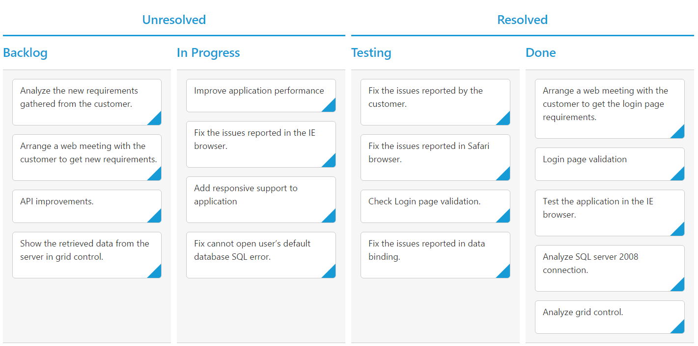

# Stacked Headers

The stacked headers helps you to group the logical columns in Kanban. It can be shown by setting `showStackedHeader` as true and by defining [`stackedHeaderRows`](https://help.syncfusion.com/api/js/ejkanban#members:stackedheaderrows).

## Adding Stacked header columns

To stack columns in stacked header, you need to define [`column`](https://help.syncfusion.com/api/js/ejkanban#members:stackedheaderrows-stackedheadercolumns-column) property in [`stackedHeaderColumns`](https://help.syncfusion.com/api/js/ejkanban#members:stackedheaderrows-stackedheadercolumns) with field names of visible columns.

The following code example describes the above behavior.



var data = ej.DataManager(window.kanbanData).executeLocal(ej.Query().take(20));
var stackedHeaderRow =[{
            stackedHeaderColumns: [{
                headerText: "Unresolved",
                column: "Backlog,In Progress"
            }, {
                    headerText: "Resolved",
                    column: "Testing,Done"
                }]
}];
ReactDOM.render(
<EJ.Kanban dataSource={data} keyField="Status" fields-content="Summary" fields-primaryKey="Id" stackedHeaderRows={stackedHeaderRow}>
    <columns>
		<column headerText="Backlog" key="Open"></column>
		<column headerText="In Progress" key="InProgress"></column>
		<column headerText="Testing" key="Testing"></column>
	    <column headerText="Done" key="Close"></column>
	</columns>
</EJ.Kanban>,
   document.getElementById('kanbanboard-default')
);



The following output is displayed as a result of the above code example.

