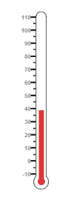
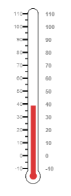
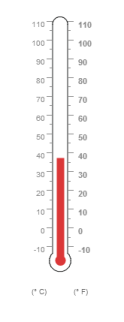

# Getting Started

This section briefly explains on how to create a Linear Gauge control for your application.

* You can provide data for a Linear Gauge and display them in a required way. You can also customize the default Linear Gauge appearance to meet your requirements.
*  In this example, you will learn how to create a Linear Gauge and how to design a thermometer, which can be used to check the body temperature of a person.

## Adding Script Reference

Create an **HTML** page and add the scripts references in the order mentioned in the following code example.

* [`jQuery`](http://jquery.com) 1.10.2 and later versions

The required ReactJS script dependencies as follows. And you can also refer [React](https://facebook.github.io/react/docs/getting-started.html) to know more about ReactJS.

* `react.min.js` - [http://cdn.syncfusion.com/js/assets/external/react.min.js](http://cdn.syncfusion.com/js/assets/external/react.min.js)
* `react-dom.min.js` - [http://cdn.syncfusion.com/js/assets/external/react-dom.min.js](http://cdn.syncfusion.com/js/assets/external/react-dom.min.js)
* `ej.web.react.min.js` - [http://cdn.syncfusion.com/{{ site.releaseversion }}/js/common/ej.web.react.min.js](http://cdn.syncfusion.com/14.3.0.49/js/common/ej.web.react.min.js)

To get started, you can use the `ej.web.all.min.js` file that encapsulates all the `ej` controls and frameworks in one single file.


<!DOCTYPE html>
   <html>
     <head>
        <meta name="viewport" content="width=device-width, initial-scale=1.0">
        <meta name="description" content="Essential Studio for React JS">
        <meta name="author" content="Syncfusion">
        <title>Getting Started for Ribbon React JS</title>
        <!-- Essential Studio for JavaScript  theme reference -->
        <link href="http://cdn.syncfusion.com/{{ site.releaseversion }}/js/web/flat-azure/ej.web.all.min.css" rel="stylesheet" />
        <!-- Essential Studio for JavaScript  script references -->
        
         
        
        
        
        <!-- Add your custom scripts here -->
    </head>
        <body>
        </body>
   </html>



N> 1. In production, we highly recommend you to use our [`custom script generator`](http://help.syncfusion.com/js/custom-script-generator) to create custom script file with required controls and its dependencies only. Also to reduce the file size further please use [`GZip compression`](https://developers.google.com/web/fundamentals/performance/optimizing-content-efficiency/optimize-encoding-and-transfer?hl=en) in your server.
N> 2. For themes, you can use the `ej.web.all.min.css` CDN link from the code snippet given. To add the themes in your application, please refer to [`this link`](http://help.syncfusion.com/js/theming-in-essential-javascript-components).

## Control Initialization

Control can be initialized in two ways.

 * Using jsx Template
 * Without using jsx Template
 
## Using jsx Template

By using the jsx template, we can create the HTML file and jsx file. The `.jsx` file can be convert to `.js` file and it can be referred in HTML page.

### Create a Linear Gauge

You can easily create the Linear Gauge widget by using the following steps.

1.Create a 
 tag.
	
   

<!DOCTYPE html>
<html>    
    <body>
	

                
    </body>
</html>



2.Initialize the LinearGauge  by using the `EJ.LinearGauge` tag



"use strict";
ReactDOM.render(
    

        <EJ.LinearGauge id="lineargauge1"></EJ.LinearGauge>,
    
,
    document.getElementById('linearGauge-default')
    );


   

Run the above code example to get a default Linear Gauge with default values as follows.

## Set Height and Width values

Basic attributes of each canvas elements are height and width. You can set the height and width of the gauge using the following code example. It sets the height and width of the canvas image where the thermometer is to be rendered.



    </body>
</html>


Run the above code example and you will get the following gauge as similar to default. Here height and width of the canvas are set for given values.

## Set Animation option and Label Color

* You can draw the Thermometer with some Label color to display the measurement value. For example give the labelColor as “#8c8c8c”.
* Set the EnableAnimation property as false to avoid animation on the pointers.



  
    </body>
</html>


Run the above code example and you will get the following gauge as the output.

## Provide Scale Values

* The scale must have the appearance of a thermometer. By giving ScaleType as Thermometer, you can render a thermometer design.
* Minimum temperature can go up to -10 and maximum temperature can rise up to 110, so you can give minimum scale value as -10 and maximum value as 110.
* Set the location values such as vertical and horizontal position of the thermometer and give the thermometer height as Length.
* You can give the Minor Interval value as 5 to get the exact temperature on the patient.



    </body>
</html>
    


Run the above code example and you will get the following gauge as the output.

## Add Pointers

In Linear Gauge the two types of pointers available are: Marker pointer and Bar pointer.

* Marker pointer is displayed as a pointer device that shows the actual values. But for your thermometer there is no need for the marker pointer. So you can hide the marker pointer by giving opacity as 0. 
* Bar pointer acts as the mercury metal that shows the exact temperature of the patient. Set some of the basic properties of the Bar pointer such as Width, BarPointerDistanceFromScale, BarPointerValue and BarPointerBackgroundColor.



 
    </body>
</html>
    


On executing the above code sample renders a Linear Gauge with bar marker as follows.

##Add Label Customization

* For thermometer, you can display the label value on two sides, to get temperature in different scales. For that you can add two label values in an array.
* To display the value around the scales, labels are used. You can customize the label placement, font (including its style and family) and its distance from scale.



    </body>
</html>



On executing the above code sample renders a customized Linear Gauge as follows.

## Add Tick Details

* Tick style has two values called major interval and minor interval. You can set major ticks width and height greater than Minor ticks. And you can give TickColor, for better visibility in light backgrounds.
* Here four tick details are used for both sides having minor and major ticks. To display the tick value add the following code example.



    </body>
</html>



On executing the above code sample renders a Linear Gauge with custom labels as follows.

## Add Custom Label Details

* Custom labels are used to specify the texts in the gauge.
* It can be customized through various properties.
* In order to show the custom labels, change the showIndicators property to true.
* Here you can use custom text to display three range descriptions.



    </body>
</html>



Run the above code example to get the following gauge as output.

## Change Scale from Degree to Fahrenheit 

Add the function that converts the temperature in degree to Fahrenheit in the label, with an index value of 1.



    </body>
</html>

    


Run the above code example and you will get the following gauge as output.

## Add Custom Label for Current Value

Add the function that displays the current temperature value in the custom label.



    </body>
</html>



## Without using jsx Template

The Linear  Gauge can be created from a HTML `DIV` element with the HTML `id` attribute set to it. Refer to the following code example.



           




 
 Run the above code example and you will see the following output.

  