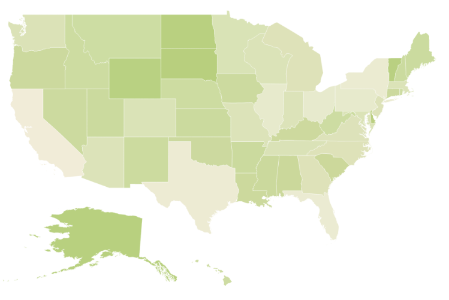

# Getting Started

* This section explains briefly about how to create Maps in your application with TypeScript

* You can learn how to configure Map with simple steps. In this example, you can learn how to configure USA population map with customized appearance and tooltip.

## Create a Map
You can easily create  the Map widget by following the below steps 

## Adding Script Reference

Create an **HTML** page and add the scripts references in the order mentioned in the following code example.

* [`jQuery`](http://jquery.com) 1.10.2 and later versions
* [`jsRender`](https://github.com/borismoore/jsrender) - to render the templates

The required ReactJS script dependencies as follows. And you can also refer [React](https://facebook.github.io/react/docs/getting-started.html) to know more about ReactJS.

* `react.min.js` - [http://cdn.syncfusion.com/js/assets/external/react.min.js](http://cdn.syncfusion.com/js/assets/external/react.min.js)
* `react-dom.min.js` - [http://cdn.syncfusion.com/js/assets/external/react-dom.min.js](http://cdn.syncfusion.com/js/assets/external/react-dom.min.js)
* `ej.web.react.min.js` - [http://cdn.syncfusion.com/{{ site.releaseversion }}/js/common/ej.web.react.min.js](http://cdn.syncfusion.com/14.3.0.49/js/common/ej.web.react.min.js)

To get started, you can use the `ej.web.all.min.js` file that encapsulates all the `ej` controls and frameworks in one single file.


<!DOCTYPE html>
   <html>
     <head>
        <meta name="viewport" content="width=device-width, initial-scale=1.0">
        <meta name="description" content="Essential Studio for React JS">
        <meta name="author" content="Syncfusion">
        <title>Getting Started for Ribbon React JS</title>
        <!-- Essential Studio for JavaScript  theme reference -->
        <link href="http://cdn.syncfusion.com/{{ site.releaseversion }}/js/web/flat-azure/ej.web.all.min.css" rel="stylesheet" />
        <!-- Essential Studio for JavaScript  script references -->
        
         
        
        
        
        <!-- Add your custom scripts here -->
    </head>
        <body>
        </body>
   </html>



N> 1. In production, we highly recommend you to use our [`custom script generator`](http://help.syncfusion.com/js/custom-script-generator) to create custom script file with required controls and its dependencies only. Also to reduce the file size further please use [`GZip compression`](https://developers.google.com/web/fundamentals/performance/optimizing-content-efficiency/optimize-encoding-and-transfer?hl=en) in your server.
N> 2. For themes, you can use the `ej.web.all.min.css` CDN link from the code snippet given. To add the themes in your application, please refer to [`this link`](http://help.syncfusion.com/js/theming-in-essential-javascript-components).

## Control Initialization

Control can be initialized in two ways.

 * Using jsx Template
 * Without using jsx Template
 
## Using jsx Template

By using the jsx template, we can create the HTML file and jsx file. The `.jsx` file can be convert to `.js` file and it can be referred in html page.

#### Preparing Shape Data

The Shape Data collection describing geographical shape information can be obtained from [GEOJSON format shapes](http://www.syncfusion.com/uploads/user/uploads/Maps_GeoJSON.zip). 

In this example, USA shape is used as shape data by utilizing the `United States of America.json` file in the following folder structure obtained from downloaded Maps_GeoJSON folder.

`..\ Maps_GeoJSON\All Countries with States`

You can assign the complete contents in “United States of America.json” file to new JSON object. For your better understanding, a JS file “usa.js” is already created to store JSON data in JSON object “usMap”.



var usMap = //Paste all the content copied from the JSON file//
	


### Prepare Data Source

The datasource is populated with JSON data relative to shape data and stored in JSON object. USA population as datasource is used for better understanding.
 The “populationData.js” file is used to store JSON data in JSON object “populationData”.



var populationData = [
        { name: "California", population: "38332521" },
        { name: "Texas", population: "26448193" },
        { name: "New York", population: "19651127" },
        { name: "Florida", population: "19552860" },
        { name: "Illinois", population: "12882135" },
        { name: "Pennsylvania", population: "12773801" },
        { name: "Ohio", population: "11570808" },
        { name: "Georgia", population: "9992167" },
        { name: "Michigan", population: "9895622" },
        { name: "North Carolina", population: "9848060" },
        { name: "New Jersey", population: "8899339" },
        { name: "Virginia", population: "8260405" },
        { name: "Washington", population: "6971406" },
        { name: "Massachusetts", population: "6692824" },
        { name: "Arizona", population: "6626624" },
        { name: "Indiana", population: "6570902" },
        { name: "Tennessee", population: "6495978" },
        { name: "Missouri", population: "6044171" },
        { name: "Maryland", population: "5928814" },
        { name: "Wisconsin", population: "5742713" },
        { name: "Minnesota", population: "5420380" },
        { name: "Colorado", population: "5268367" },
        { name: "Alabama", population: "4833722" },
        { name: "South Carolina", population: "4774839" },
        { name: "Louisiana", population: "4625470" },
        { name: "Kentucky", population: "4395295" },
        { name: "Oregon", population: "3930065" },
        { name: "Oklahoma", population: "3850568" },
        { name: "Puerto Rico", population: "3615086" },
        { name: "Connecticut", population: "3596080" },
        { name: "Iowa", population: "3090416" },
        { name: "Mississippi", population: "2991207" },
        { name: "Arkansas", population: "2959373" },
        { name: "Utah", population: "2900872" },
        { name: "Kansas", population: "2893957" },
        { name: "Nevada", population: "2790136" },
        { name: "New Mexico", population: "2085287" },
        { name: "Nebraska", population: "1868516" },
        { name: "West Virginia", population: "1854304" },
        { name: "Idaho", population: "1612136" },
        { name: "Hawaii", population: "1404054" },
        { name: "Maine", population: "1328302" },
        { name: "New Hampshire", population: "1323459" },
        { name: "Rhode Island", population: "1051511" },
        { name: "Montana", population: "1015165" },
        { name: "Delaware", population: "925749" },
        { name: "South Dakota", population: "844877" },
        { name: "Alaska", population: "735132" },
        { name: "North Dakota", population: "723393" },
        { name: "District of Columbia", population: "646449" },
        { name: "Vermont", population: "626630" },
        { name: "Wyoming", population: "582658" }
]



You can refer to shape data and datasource as illustrated in the HTML page,



	<!-- Shape data file-->
    
    
    <!-- Data source file-->
    
    


## Initialize Map

1.Create a &lt;div&gt; tag and set the height and width to determine the map size. 
      		



<!DOCTYPE html>
<html>    
    <body>
	

                
    </body>
</html>


  

2.Initialize the Map  by using the `EJ.Map` tag. 



"use strict";
ReactDOM.render(
    

        <EJ.Map id="map1"></EJ.Map>,
    
,
    document.getElementById('map-default')
    );


3.Add the **shapeData** property in the maps to render it in layers



    </body>
</html>
	


   

The above code renders a map with default properties and shape input provided through data in layers.

## Data Binding in Map

The following properties in shape layers is used for binding data in Maps control.

* DataSource
* ShapeDataPath
* ShapePropertyPath

### DataSource

The `dataSource` property accepts collection values as input. For example, you can provide the list of objects as input.

### Shape Data Path 

The `shapeDataPath` property is used to refer the data ID in DataSource. For example, population MapData contains data ids ‘Name’ and ‘Population’. The `shapeDataPath` and `shapePropertyPath` properties are related to each other (refer to `shapePropertyPath` for more details).

### Shape Property Path

The `shapePropertyPath` property is similar to the `shapeDataPath` that refers the column name in the Data property of shape layers to identify the shape. When the values of the `shapeDataPath` property in the `dataSource` property and the value of `shapePropertyPath` in the Data property match, then the associated object from the `dataSource` is bound to the corresponding shape.



    </body>
</html>
	


### Customize Map Appearance 

You can customize the shape’s color by using `fill`, `stroke` and `strokeThickness` properties in `shapeSettings`.



    </body>
</html>



### Customizing Map Appearance by Range

The Range color mapping is used to differentiate the shape’s fill based on its underlying value and color ranges. The `from` and `to` properties defines the value ranges and the `gradientColors` property defines the equivalent color ranges respective to their value ranges.

N> The `enableGradient` property value should be true to apply gradient colors for maps.



    </body>
</html>



The following screenshot illustrates a Map with gradient color property enabled.

## Enable Tooltip

The tooltip is displayed only when `showTooltip` is set to ‘true’ in the shape layers. By default, it takes the property of the bound object that is referred in the `valuePath` and displays its content on hovering the corresponding shape. The `tooltipTemplate` property is used for customizing the template for tooltip.



    </body>
</html>



The following screenshot illustrates a map control displaying a Tooltip.

## Legend

A Legend can be made visible by setting the `showLegend` property in `legendSetting`. 

### Interactive Legend

The legends can be made interactive with an arrow mark indicating the exact range color in the legend, when the mouse hovers the corresponding shapes. You can enable this option by setting `mode` property in `legendSettings` value as ‘Interactive’. The default value of `mode` property is ‘Default’ to enable the normal legend.

#### Title

Use `title` property to provide title for interactive legend.

#### Label

You can use `leftLabel` and `rightLabel` property to provide left and right labels for interactive legend. 



    </body>
</html>



The following screenshot illustrates a map displaying an interactive legend.

## Without using jsx Template

The Map can be created from a HTML `DIV` element with the HTML `id` attribute set to it. Refer to the following code example.



           




 
 
On running the above code the Map will rendered along with tooltip

  