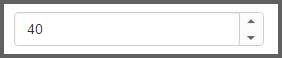

# Getting Started

This section helps to get started of the NumericTextbox component in a React application 

## Create a NumericTextbox

Refer the common React Getting Started Documentation to create an application and add necessary scripts and styles for rendering our ReactJS components.

Create a JSX file and use &lt;EJ.NumericTextbox&gt; syntax to render React NumericTextbox component. Add required properties to &lt;EJ.NumericTextbox&gt; tag element. 



    ReactDOM.render(   
        <EJ.NumericTextbox>
        </EJ.NumericTextbox>,
        document.getElementById('numeric')  
    );



Define an HTML element for adding NumericTextbox in the application and refer the JSX file created.



    

    <script type="text/babel" src="sample.jsx"> 



This will render an empty NumericTextbox component on executing.

## Configure Properties

In the JSX, need to declare the NumericTextbox properties. Refer to the following code,.



    ReactDOM.render(   
        <EJ. NumericTextbox value={40} width="250px">
        </EJ. NumericTextbox >,
        document.getElementById('numeric')
    );



Run the above code to render the following output,

> _Note:_ _You can find the NumericTextbox properties from the_ [API reference](https://help.syncfusion.com/api/js/ejtextboxes) _document._

