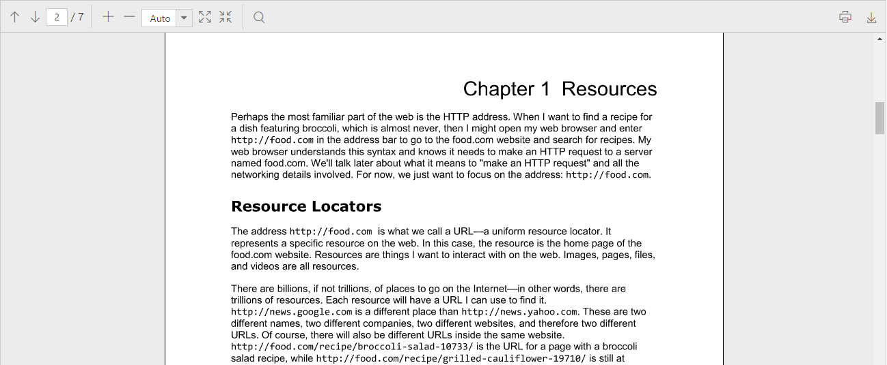

# Getting Started

This section explains briefly about how to integrate a **PDF viewer** control in your application with **React JS**.

## Script and CSS Reference

Create a **HTML** page and add the scripts and CSS references in the order mentioned in the following code example.



    <!DOCTYPE html>
    <html>
        <head>
            <!-- Essential Studio for JavaScript  theme reference -->
            <link rel="stylesheet" href="http://cdn.syncfusion.com/14.4.0.15/js/web/bootstrap-theme/ej.web.all.min.css" />           
            <!--  react script  -->
            
            
            
            <!--  jquery script  -->
            
            <!-- Essential JS UI widget -->    
            
            

            <!--Add custom scripts here -->
        </head>
        <body>
        </body>
    </html>



N> 1. In production, we highly recommend you to use our [`custom script generator`](http://help.syncfusion.com/js/custom-script-generator) to create custom script file with required controls and its dependencies only. Also to reduce the file size further please use [`GZip compression`](https://developers.google.com/web/fundamentals/performance/optimizing-content-efficiency/optimize-encoding-and-transfer?hl=en) in your server.

N> 2. For themes, you can use the `ej.web.all.min.css` CDN link from the code snippet given. To add the themes in your application, please refer to [`this link`](http://help.syncfusion.com/js/theming-in-essential-javascript-components).

* `react.js` and `react-dom.js` are the core files needed to create react elements.
* `browser.min.js` file is required for code transform.
* `ej.web.react.min.js`  is a react-syncfusion bridge to render Syncfusion components.

## Initialize and configure the control

Control can be initialized in two ways.

 * Using jsx Template
 * Without using jsx Template
 
## Using jsx Template

By using the jsx template, we can create the html file and jsx file. The `.jsx` file can be converted into `.js` file and it can be referred in html page.

Please refer to the code of HTML file.





Initialize the PDF viewer by using the `EJ.PdfViewer` tag.



    <!DOCTYPE html>
    <html>
        <head>
            
        </head>
        <body>
            

            
        </body>
    </html>



Now, the PDF viewer control is rendered with default PDF document, which used in the services.

## Without using jsx Template

PDF viewer can be created from a HTML `DIV` element with the HTML `id` attribute set to it. Refer to the following code example.



    <body>
      

    </body>



Initialize the PDF viewer control by adding the following script code to the body section of the HTML document.



    

    



Now, the PDF viewer control will be rendered with the default PDF document, which is used in the service.

