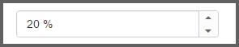

# Getting Started

This section helps to get started of the PercentageTextbox component in a React application 

## Create a PercentageTextbox

Refer the common React Getting Started Documentation to create an application and add necessary scripts and styles for rendering our ReactJS components.

Create a JSX file and use &lt;EJ.PercentageTextbox&gt; syntax to render React PercentageTextbox component. Add required properties to &lt;EJ.PercentageTextbox&gt; tag element. 



    ReactDOM.render(   
        <EJ.PercentageTextbox>
        </EJ.PercentageTextbox>,
        document.getElementById('percent')  
    );



Define an HTML element for adding PercentageTextbox in the application and refer the JSX file created.



    

    <script type="text/babel" src="sample.jsx"> 



This will render an empty PercentageTextbox component on executing.

## Configure Properties

In the JSX, need to declare the PercentageTextbox properties. Refer to the following code,.



    ReactDOM.render(   
        <EJ.PercentageTextbox value={20} width="250px">
        </EJ.PercentageTextbox>,
        document.getElementById('percent')
    );



Run the above code to render the following output,

> _Note:_ _You can find the PercentageTextbox properties from the_ [API reference](https://help.syncfusion.com/api/js/ejtextboxes) _document._

