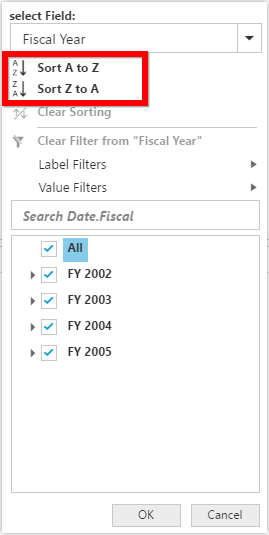
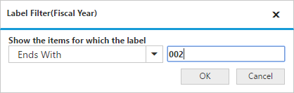

# Advanced Filtering & Sorting

It allows to filter and sort the field members in PivotGrid. You can enable the Advanced Filtering and Sorting option in PivotGrid by setting the [`enableAdvancedFilter`](/api/js/ejpivotgrid#members:enableAdvancedFilter) property to true.





## Sorting

Sorting provides an option to sort the members of a field either in ascending or descending order. 

## Label Filtering

Label filtering provides an option to filter the members of a field purely based on their caption. 

## Value Filtering

Value filtering provides an option to filter members based on the total values of the appropriate measure between the members of the level. 

