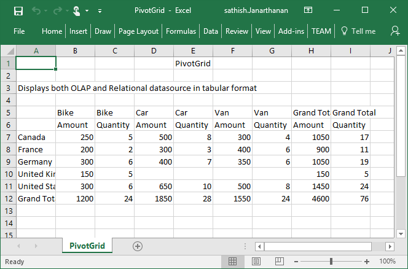

# Exporting

The PivotGrid control can be exported to the following file formats.

* Excel
* Word
* PDF
* CSV

The PivotGrid control can be exported by invoking **"exportPivotGrid"** method, with an appropriate export option as parameter.

## JSON Export



<button id="btnExport">Export</button>

                                   



### Excel Export

User can export the contents of PivotGrid to an Excel document for future archival, references and analysis purposes.

To achieve Excel export, service URL and file name is sent as the parameter.



$( "#btnExport" ).click(function() {
    var pGridObj = $('#PivotGrid').data("ejPivotGrid");
    pGridObj.exportPivotGrid("http://js.syncfusion.com/ejservices/api/PivotGrid/Olap/ExcelExport", "fileName");
});

  

### Word Export

User can export the contents of PivotGrid to a Word document for future archival, references and analysis purposes.

To achieve Word export, service URL and file name is sent as the parameter.



$( "#btnExport" ).click(function() {
    var pGridObj = $('#PivotGrid').data("ejPivotGrid");
    pGridObj.exportPivotGrid("http://js.syncfusion.com/ejservices/api/PivotGrid/Olap/WordExport", "fileName");
});

  

### PDF Export

User can export the contents of PivotGrid to a PDF document for future archival, references and analysis purposes.

To achieve PDF export, service URL and file name is sent as the parameter.



$( "#btnExport" ).click(function() {
    var pGridObj = $('#PivotGrid').data("ejPivotGrid");
    pGridObj.exportPivotGrid("http://js.syncfusion.com/ejservices/api/PivotGrid/Olap/PDFExport", "fileName");
});

  

### CSV Export

User can export the contents of PivotGrid to a CSV document for future archival, references and analysis purposes.

To achieve CSV export, service URL and file name is sent as the parameter.



$( "#btnExport" ).click(function() {
    var pGridObj = $('#PivotGrid').data("ejPivotGrid");
    pGridObj.exportPivotGrid("http://js.syncfusion.com/ejservices/api/PivotGrid/Olap/CSVExport", "fileName");
});

  

### Customize the export document name

For customizing file name, we need to send file name as parameter to the **exportPivotGrid**  method along with service URL.



$( "#btnExport" ).click(function() {
    var pGridObj = $('#PivotGrid').data("ejPivotGrid");
    pGridObj.exportPivotGrid("http://js.syncfusion.com/ejservices/api/PivotGrid/Olap/ExcelExport", "fileName");
});
    


## Exporting Customization

You can add title and description to the exporting document by using title and description property obtained in the "beforeExport" event.



<button id="btnExport">Export</button>

                                          



The below screenshot shows the PivotGrid control exported to Excel document.

The below screenshot shows the PivotGrid control exported to Word document.

The below screenshot shows the PivotGrid control exported to PDF document.

The below screenshot shows the PivotGrid control exported to CSV document.

