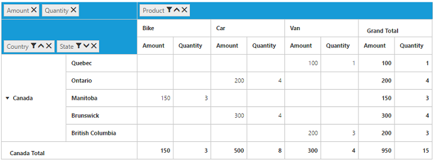
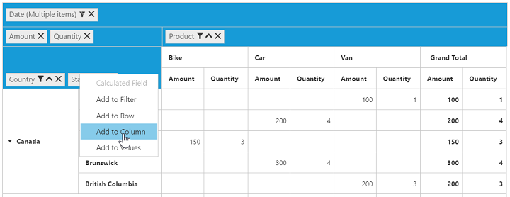
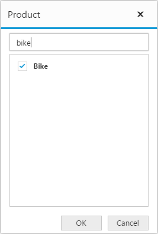
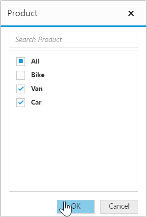
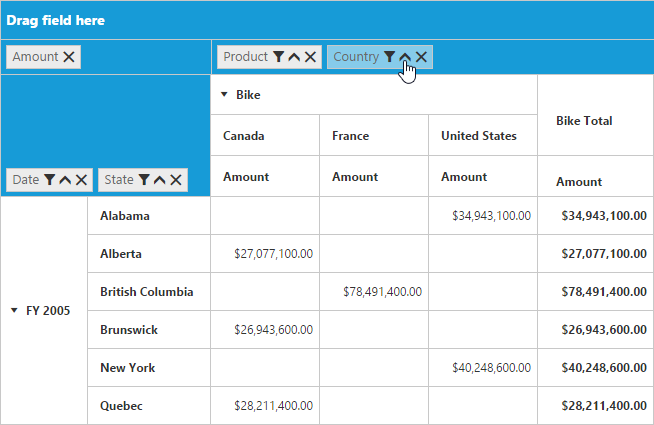
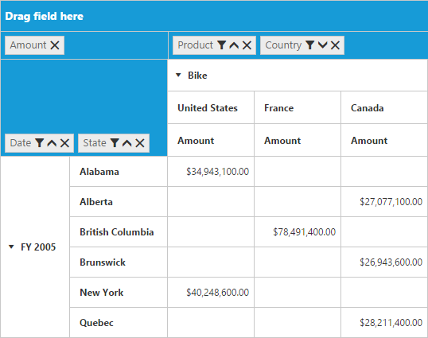
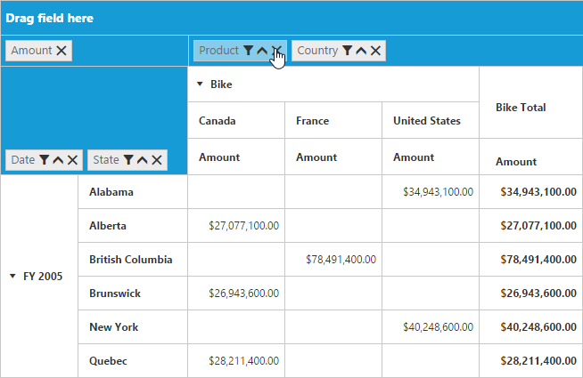
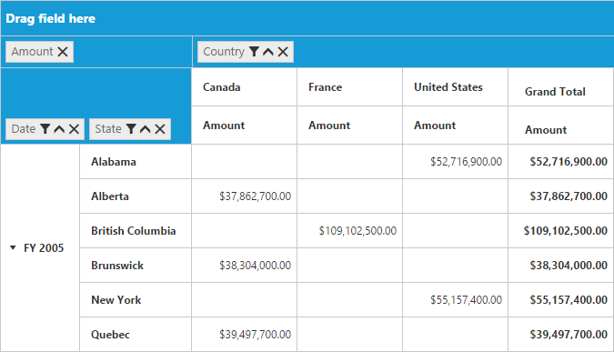

# Grouping Bar

## Initialization 
Grouping Bar allows user to dynamically alter the report by filter, sort and remove operations in the PivotGrid control. Based on the Relational datasource and report bound to the PivotGrid control, Grouping Bar will be automatically populated. You can enable Grouping Bar option in PivotGrid by setting the [`enableGroupingBar`](/api/js/ejpivotgrid#members:enablegroupingbar) property to true.





## Drag and Drop

You can alter the report on fly through drag-and-drop operation.

## Context Menu

You can also alter the report by using context menu.

## Searching Values
Search option available in Grouping Bar allows you to search a specific value that needs to be filtered from the list of values inside the filter pop-up window.

## Filtering Values
Filtering option available in Grouping Bar allows you to select a specific set of values that needs to be displayed in the PivotGrid control. At least one value needed to be in checked state while filtering otherwise “Ok” button will be disabled.

## Sorting Values
Sorting option available in Grouping Bar allows you to arrange headers either in ascending or descending order. Sorting option is applicable for fields available only in Row and Column region. By default, headers are sorted in ascending order. Regarding sorting indicator, up arrow denotes ascending order and down arrow denotes descending order.

## Removing Field
Remove option available in the Grouping Bar allows you to completely remove a specific field from the PivotGrid control. Remove operation can be either achieved by clicking remove icon available inside each field or by dragging and dropping field out of Grouping Bar region.

