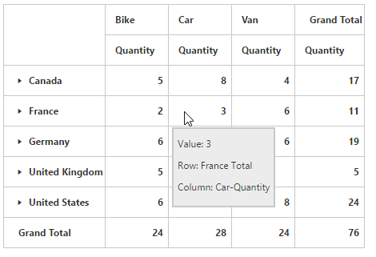

# ToolTip

Allows you to display the details of the cell on hovering value cells. By default, tooltip is enabled.  You can disable tooltip in PivotGrid by setting the [`enableToolTip`](/api/js/ejpivotgrid#members:enabletooltip)  property to false.





## ToolTip Animation

The PivotGrid provides option to animate tooltip displayed in the grid. The animation enhances the appearance of tooltip by displaying it slowly.  You can enable animation in tooltip by setting [`enableToolTipAnimation`](/api/js/ejpivotgrid#members:enabletooltip) property to true.





