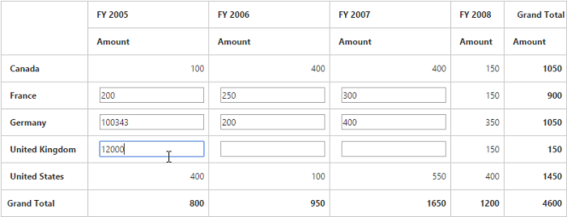

# Cell Editing

I> This feature is applicable only for Relational data source.

Cell editing allows you to edit and alter the values in PivotGrid. The summary values will be recreated based on the edited values. By selecting multiple cells (like in cell selection feature), you can edit multiple cells at the same time.
  
You can enable cell editing option in PivotGrid by setting the [`enableCellEditing`](/api/js/ejpivotgrid#members:enablecellediting) property to true.





