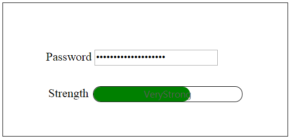

# Getting Started

This section briefly describes how to create a **ProgressBar** control using **Javascript** and learn its features.
**Essential JavaScript** **ProgressBar** displays a **ProgressBar** within a web page that allows you to show the progress of an event. Here, you can learn how to customize the progress and color of the **ProgressBar** in a real-time application to indicate the strength of the password, where the progress changes with respect to the change in length of the password. This helps you to validate the password is typed. 

The following screenshot shows the **ProgressBar.**

 

## Create a ProgressBar

**Essential JavaScript ProgressBar** widget is created using a simple **&lt;div&gt;** element. This element provides built-in features that allow you to change the progress, size and text of the control.

You can create a React application and add necessary scripts and styles with the help of the given [React Getting Started Documentation.](https://help.syncfusion.com/reactjs/overview)

Create a JSX file for rendering ProgressBar component using &lt;EJ.ProgressBar&gt; syntax. Add required properties to it in &lt;EJ.ProgressBar&gt; tag element



var DefaultProgressbar = React.createClass({
    render: function () {
        return (
            

                

                    Water Purification
                    <EJ.ProgressBar value={45} height="20" text="45 %">
                    </EJ.ProgressBar>
                

            

        );
    }
});

ReactDOM.render(<DefaultProgressbar />, document.getElementById('progressbar-default'));



Define an HTML element for adding ProgressBar in the application and refer the JSX file.



<script src="app/progressbar/default.js">



Add **&lt;input&gt;** element inside the **&lt;body&gt;** tag of your file to create a **ProgressBar.**



   

      

         

            

               <!--Initializing password field*-->
               <label for="startButton">Password</label>
               <input type="password" id="password" style="border-radius:0px"/>
            

            

               <!--initializing ProgressBar control-->
               

            

         

      

   



It also includes a Password field and through that the progress of the **ProgressBar** can be controlled

Initialize **ProgressBar** in script.


    
var DefaultProgressbar = React.createClass({
 componentDidMount: function () {
 $("#progressbar-default").ejProgressBar({
            height: 20,
            value: 30,  /*Specify the initial value of the progress in percentage*/
            width: 200,
        });
        progresObj = $("#progressbar-default").data("ejProgressBar");
        progresObj.option("text", "weak");
        $(".e-progress").css({ "background-color": "#DE0909", "border-radius":"10px" });
        $(".e-progressbar").css({ "border-radius": "10px", "border": "1px solid black" });
    render: function () {
        return (
        

        

        

        );
    }
});

ReactDOM.render(<defaultprogressbar />, document.getElementById('progressbar-default'));



Here, you can initialize the properties of the **ProgressBar** such as height, value, width, text that is applied to the control by default.

The following screenshot displays a **ProgressBar** control.

 

Include the following code within the **&lt;head&gt;** tag to change the page layout.





## Progress Control using Length of the Password Field

In real-time scenario, the progress of **ProgressBar** is changed according to the length of text in the password field by binding the change in the properties of control and checking the length of the password field.

Add the following code example inside the **&lt;script&gt;** tag of your **HTML** file.



var DefaultProgressbar = React.createClass({
 componentDidMount: function () {
 $("#progressbar-default").ejProgressBar({
            height: 20,
            value: 30,  /*Specify the initial value of the progress in percentage*/
            width: 200,
        });
        progresObj = $("#progressbar-default").data("ejProgressBar");
        progresObj.option("text", "weak");
        $(".e-progress").css({ "background-color": "#DE0909", "border-radius":"10px" });
        $(".e-progressbar").css({ "border-radius": "10px", "border": "1px solid black" });
		var progresObj, buttonObj, k = 10, timer = window.clearInterval(timer), i = 0, obj;
    $(document).keypress(function () {    //To capture the keypress inside the document
        i = $("#password").val().length;
                if (i < 5)
                    weak();
                else if (i == 5 || i < 7)
                    Strong();
                else if (i ==7 ||i>7) {
                    var pwd = $("#password").val();
                    very_strong();
                }
    });
    function Strong() {     //Change the width and text of the progress ... called when the length is greater than 5
        progresObj.option("text", "strong");
        progresObj.option("percentage", k + 50);
        $(".e-progress").css("background-color", "#0055FF");
        $(".e-progressbar").css("color", "#000000");
    }
    function very_strong() {     //Change the width and text of the progress ... called when the length is greater than 7
        progresObj.option("text", "Very strong");
        progresObj.option("percentage", k + 90);
        $(".e-progress").css("background-color", "Green");
        $(".e-progressbar").css("color", "#000000");
    }
    function weak() {     //Change the width and text of the progress... called when the length is less than 5
        progresObj.option("text", "Weak");
        progresObj.option("percentage", k+20 );
        $(".e-progress").css("background-color", "#DE0909");
        $(".e-progressbar").css("border-radius", "10px");
    }
  },
    render: function () {
        return (
        

        

        

        );
    }
});

ReactDOM.render(<defaultprogressbar />, document.getElementById('progressbar-default'));



You can calculate length of the password and call the appropriate function that changes the percentage property of **ProgressBar**.

* The **weak()** function changes the text inside the ProgressBar to **Weak** and percentage to 30, that is invoked when the length of the text is less than 5.
* The **strong()** function changes the text inside the ProgressBar to **Strong** and percentage to 60, that is invoked when the length of the text exceeds 5.
* The **very_strong()** function changes the text inside the ProgressBar to Very **Strong** and percentage to 100, that is invoked when the length of the text exceeds 7 and the text contains a symbol in it.

You can change themes or appearance of the ProgressBar as required.

The final output is displayed as follows.

 

 

 

You can also bind an event at the start and finish of a ProgressBar by using the start, complete and change properties of the ProgressBar.

