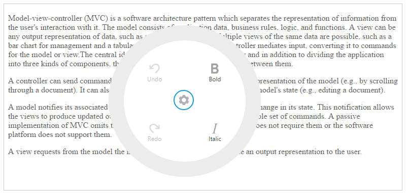
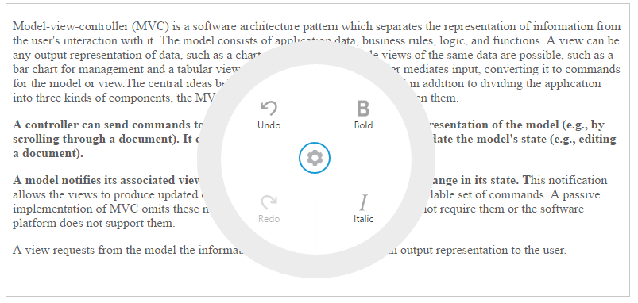

# Getting Started

This section helps to get started of the RadialMenu component in a React application.

## Create a RadialMenu

The following steps guide you to add a RadialMenu component.

Refer the common React JS [Getting Started Documentation](https://help.syncfusion.com/reactjs/overview#getting-started-with-react) to create an application and add necessary scripts and styles for rendering our React JS components.

Create a JSX file for rendering RadialMenu component using &lt;EJ.RadialMenu&gt; syntax. Add required properties to it in &lt;EJ.RadialMenu&gt; tag element.



    "use strict";
    ReactDOM.render(   
    <EJ.RadialMenu id="defaultradialmenu" imageClass="imageclass" backImageClass="backimageclass" targetElementId="radialtarget1" >
    </EJ.RadialMenu>	
    document.getElementById('radialmenu-default')  
    );



Define an HTML element for adding RadialMenu in the application and refer the JSX file created.



    

    <script type="text/babel" src="sample.jsx"> 



This will render an empty RadialMenu component on executing.

> _Note:_ _You can find the RadialMenu properties from the_ [API reference](https://help.syncfusion.com/api/js/ejradialmenu) _document___

## Configure Items

To configure items for RadialMenu component, define RadialMenu items using ‘li’ element in JSX. You can set the images for each item by giving the image URL with the data-ej-imageUrl attribute in the inner list element and text with data-ej-text attribute for the Item. 

Refer to the following code example. Initialize Radial Menu component with items and set its target content as follows.



    <EJ.RadialMenu id="defaultradialmenu" imageClass="imageclass" backImageClass="backimageclass" targetElementId="radialtarget1">
      <ul>
        <li data-ej-imageurl="content/images/radialmenu/font.png" data-ej-text="Bold"></li>
        <li data-ej-imageurl="content/images/radialmenu/f1.png" data-ej-text="Italic"></li>
        <li data-ej-imageurl="content/images/radialmenu/redo.png" data-ej-text="Redo"></li>
        <li data-ej-imageurl="content/images/radialmenu/undo.png" data-ej-text="Undo"></li>
      </ul>
    </EJ.RadialMenu>



Refer to the following code example to add target content to the **RadialMenu**. You need to perform any actions while selecting the RTE content, you need to add **Select** and **change** events in RTE.



    

    <EJ.RTE id="rteSample4" width="100%" height="400" change={this.rteChange} select={this.radialShow} showToolbar={false} showContextMenu={false} value={content}>
    </EJ.RTE>  
    
  



Define the RTE content by using value property of RTE. Declare the value property in &lt;EJ.RTE&gt; attribute and define the content of RTE in JSX.



    var content = "Model–view–controller (MVC) is a software architecture pattern which separates the representation of information from the user's interaction with it. The model consists of application data, business rules, logic, and functions. A view can be any output representation of data, such as a chart or a diagram. Multiple views of the same data are possible, such as a bar chart for management and a tabular view for accountants. The controller mediates input, converting it to commands for the model or view.The central ideas behind MVC are code reusability and in addition to dividing the application into three kinds of components, the MVC design defines the interactions between them.A controller can send commands to its associated view to change the view's presentation of the model (e.g., by scrolling through a document). It can also send commands to the model to update the model's state (e.g., editing a document).A model notifies its associated views and controllers when there has been a change in its state. This notification allows the views to produce updated output, and the controllers to change the available set of commands. A passive implementation of MVC omits these notifications, because the application does not require them or the software platform does not support them.A view requests from the model the information that it needs to generate an output representation to the user.";   



## Displaying RadialMenu

You can display the Radial Menu by performing desired action on the target content while selecting the text inside the target. Therefore, call the **radialShow** event to perform the select action of the RTE content. Refer to the following code example and add it to event handler function.



    radialShow: function (e) {
        var target = $("#radialtarget1"), radialRadius = 150, radialDiameter = 2 * radialRadius,
        // To get Iframe positions
        iframeY = target.offset().top + e.event.clientY, iframeX = target.offset().left + e.event.clientX,
        // To set Radial Menu position within target
        x = iframeX > target.width() - radialRadius ? target.width() - radialDiameter : (iframeX > radialRadius ? iframeX - radialRadius : 0),
        y = (iframeY > target.height() - radialRadius ? target.height() - radialDiameter : (iframeY > radialRadius ? iframeY - radialRadius : 0)) + radialRadius;
        $('#defaultradialmenu').ejRadialMenu("setPosition", x, y);
        $('iframe').contents().find('body').blur();
    },



Run the above code and select any text inside the target. The settings icon is displayed. Click that icon to render the following output.

## RadialMenu item functionalities

You can set the functionalities for each item and define click event by using **Click** event of RadialMenu. Refer to the following code example. Define the click event for Radial Menu component as follows.



    <EJ.RadialMenu id="defaultradialmenu" imageClass="imageclass" backImageClass="backimageclass" targetElementId="radialtarget1" click={this.onItemClick}>
        <ul>
            <li data-ej-imageurl="content/images/radialmenu/font.png" data-ej-text="Bold"></li>
            <li data-ej-imageurl="content/images/radialmenu/f1.png" data-ej-text="Italic"></li>
            <li data-ej-imageurl="content/images/radialmenu/redo.png" data-ej-text="Redo"></li>
            <li data-ej-imageurl="content/images/radialmenu/undo.png" data-ej-text="Undo"></li>
        </ul>
    </EJ.RadialMenu>



Refer to the following code example to add functionalities for each items in event handler for items click and you can enable items in RadialMenu by using **Change** event in JSX.



    rteChange: function (e) {
        $('#defaultradialmenu').ejRadialMenu("enableItem", "Undo");
    },
    onItemClick: function (e){
        var rteObj = $("#rteSample4").data("ejRTE");
        var itemName = (ej.isNullOrUndefined(e.text)) ? "none" : e.text.toLowerCase();
        switch (itemName) {
            case "bold":
                rteObj.executeCommand("bold");
                break;
            case "italic":
                rteObj.executeCommand("italic");
                break;
            case "undo":
                rteObj.executeCommand("undo");
                break;
            case "redo":
                rteObj.executeCommand("redo");
                break;
            }
    }	



Run the above code and select any text inside the target. The settings icon is displayed. Click that icon to render the RadialMenu component. Click **bold** item in RadialMenu component, to render the following output.

