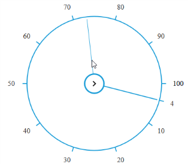

# Getting Started

This section helps you to understand the getting started of the RadialSlider component with the step-by-step instructions 

## Create a simple Radial Slider

Refer the common React’s Getting Started Documentation to create an application and add necessary scripts and styles for rendering our React JS components.

Create a JSX file for rendering RadialSlider component using &lt;EJ.RadialSlider&gt; syntax. Add required properties to it in &lt;EJ. RadialSlider &gt; tag element



    ReactDOM.render(   
        <EJ.RadialSlider id="defaultslider" radius={150} innerCircleImageUrl="http://js.syncfusion.com/demos/web/content/images/radialslider/chevron-right.png">
        </EJ.RadialSlider>,
        document.getElementById('RadialSlider-default')  
    );



Define an HTML element for adding RadialSlider in the application and refer the JSX file created with script type “text/babel”.



    

    <script type="text/babel" src="sample.jsx">



This will render a RadialSlider component on executing.

> _Note: You can find the RadialSlider properties from the_ [API reference](https://help.syncfusion.com/api/js/ejradialslider) _document_ 