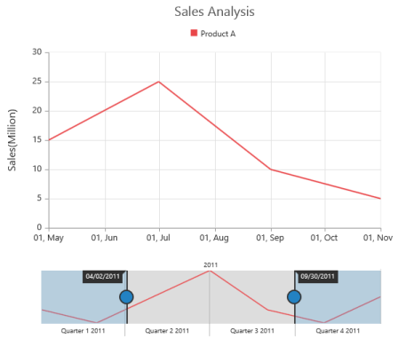

# Getting Started

This section explains you the steps required to populate the RangeNavigator with data, add data labels, tooltips and title to the Chart. This section covers only the minimal features that you need to know to get started with the RangeNavigator.

## Create your RangeNavigator

This section encompasses on how to configure the ejRangeNavigator and update the chart control for RangeNavigator’s selected range. It also helps you to learn how to pass the required data to RangeNavigator and customize the scale and selected range for your requirements. In this example, you will look at the steps to configure a RangeNavigator to analyze sales of a product for a particular quarter in a year.

## Adding Script Reference

Create an **HTML** page and add the scripts references in the order mentioned in the following code example.

* [`jQuery`](http://jquery.com) 1.10.2 and later versions

The required ReactJS script dependencies as follows. And you can also refer [React](https://facebook.github.io/react/docs/getting-started.html) to know more about react js.

* `react.min.js` - [http://cdn.syncfusion.com/js/assets/external/react.min.js](http://cdn.syncfusion.com/js/assets/external/react.min.js)
* `react-dom.min.js` - [http://cdn.syncfusion.com/js/assets/external/react-dom.min.js](http://cdn.syncfusion.com/js/assets/external/react-dom.min.js)
* `ej.web.react.min.js` - [http://cdn.syncfusion.com/{{ site.releaseversion }}/js/common/ej.web.react.min.js](http://cdn.syncfusion.com/14.3.0.49/js/common/ej.web.react.min.js)

To get started, you can use the `ej.web.all.min.js` file that encapsulates all the `ej` controls and frameworks in one single file.


<!DOCTYPE html>
   <html>
     <head>
        <meta name="viewport" content="width=device-width, initial-scale=1.0">
        <meta name="description" content="Essential Studio for React JS">
        <meta name="author" content="Syncfusion">
        <title>Getting Started for Ribbon React JS</title>
        <!-- Essential Studio for JavaScript  theme reference -->
        <link href="http://cdn.syncfusion.com/{{ site.releaseversion }}/js/web/flat-azure/ej.web.all.min.css" rel="stylesheet" />
        <!-- Essential Studio for JavaScript  script references -->
        
         
        
        
        
        <!-- Add your custom scripts here -->
    </head>
        <body>
        </body>
   </html>



N> 1. In production, we highly recommend you to use our [`custom script generator`](http://help.syncfusion.com/js/custom-script-generator) to create custom script file with required controls and its dependencies only. Also to reduce the file size further please use [`GZip compression`](https://developers.google.com/web/fundamentals/performance/optimizing-content-efficiency/optimize-encoding-and-transfer?hl=en) in your server.
N> 2. For themes, you can use the `ej.web.all.min.css` CDN link from the code snippet given. To add the themes in your application, please refer to [`this link`](http://help.syncfusion.com/js/theming-in-essential-javascript-components).

## Control Initialization

Control can be initialized in two ways.

 * Using jsx Template
 * Without using jsx Template
 
## Using jsx Template

By using the jsx template, we can create the html file and jsx file. The `.jsx` file can be convert to `.js` file and it can be referred in html page.

### Configure ejRangeNavigator

Getting started with your ejRangeNavigator is simple. You can initialize the ejRangeNavigator by setting its range values.

1.Create a 
 tag.
	
    

<!DOCTYPE html>
<html>    
    <body>
	

                
    </body>
</html>



2.Initialize the RangeNavigator by using the `EJ.RangeNavigator` tag. 




   
The following Screen shot displays the RangeNavigator with a range from 2010 January 1st to December 31st.

## Add series

To add a series to **RangeNavigator**, you need to set **dataSource** property, as given in the following code example. 

You can create data source for RangeNavigator as follows.



var data = [{ "xDate": new Date(2011, 0, 1), "yValue": 10 },
                        { "xDate": new Date(2011, 2, 1), "yValue": 5 },
                        { "xDate": new Date(2011, 4, 1), "yValue": 15 },
                        { "xDate": new Date(2011, 6, 1), "yValue": 25 },
                        { "xDate": new Date(2011, 8, 1), "yValue": 10 },
                        { "xDate": new Date(2011, 10, 1), "yValue": 5 },
                        { "xDate": new Date(2011, 12, 1), "yValue": 15 }];



Now, add the dataSource to the RangeNavigator and provide the field name to get the values from the dataSource in xName and yName options



    </body>
</html>


The following screenshot displays the RangeNavigator with the type series as “line”. 

## Enable tooltip

Tooltip can be customized for RangeNavigator using tooltip option. You can also use TooltipDisplayMode option in tooltip to display the tooltip “always” or “ondemand” (displays tooltip only while dragging the sliders). You can also specify label format for tooltip using LabelFormat.


    </body>
</html>


The following screen shot displays the label format Tooltip in RangeNavigator:

## Update Chart

You can use ejRangeNavigator with controls such as chart and grid to view the range of data selected in ejRangeNavigator.

In order to update chart, whenever the selected range changes in ejRangeNavigator, you need to use rangeChanged event of ejRangeNavigator and then update the chart with the selected data in this event.

You can create a chart with line series using the following code sample.

 Create a 
 tag with an id for rendering the chart.


<body>

</body>





    </body>
</html>


The following screenshot displays how the RangeNavigator is updated when the selected range is changed.

## Set value type

RangeNavigator can also be used with numerical values. You can specify the data type using ValueType option. 

First let’s create a DataSource for Chart Series with integer Values. 



var Data = [
    { "xDate": 0, "yValue": 10 },
    { "xDate": 50, "yValue": 5 },
    { "xDate": 100, "yValue": 15 },
    { "xDate": 150, "yValue": 25 },
    { "xDate": 200, "yValue": 10 },
    { "xDate": 250, "yValue": 5 },
    { "xDate": 300, "yValue": 15 },
      ];



Now, you can set the dataSource for Chart Series and valueType property to “numeric” as given in the following code example. 



    </body>
</html>



The following screenshot displays the RangeNavigator with numerical values:

## Without using jsx Template

The Range Navigator can be created from a HTML `DIV` element with the HTML `id` attribute set to it. Refer to the following code example.



           




    </body>
</html>



The following screenshot displays the RangeNavigator with numerical values:

