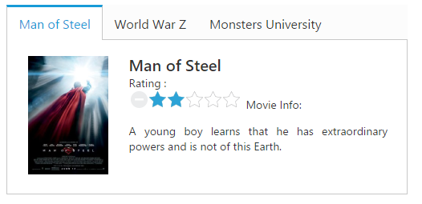

# Getting Started

This section explains briefly about how to create a **Rating** control in your application with **JavaScript**. **Essential JavaScript** **Rating** helps to select the number of stars that represent Rating. Here, you can learn how to create **Rating** control in a real-time movie download application and also learn how to rate the application.

The following screenshot illustrates the functionality of a Rating widget with a Rating range of 0 to 5. 

 

##Create a Rating Widget in React JS

**Essential JavaScript Rating** widget is provided with built-in features such as precision, orientation and flexible API’s. You can create the **Rating** widget by using input textbox element as follows:

You can create a React application and add necessary scripts and styles with the help of the given [React Getting Started Documentation.](https://help.syncfusion.com/reactjs/overview)

Define an HTML element for adding Rating in the application and refer the JSX file.



<script src="app/rating/default.js">



Create a JSX file for rendering Rating component using &lt;EJ.Rating&gt; syntax. Add required properties to it in &lt;EJ.Rating&gt; tag element



var DefaultRating = React.createClass({
    render: function () {
        return (
        

            <ej.tab width="100%">
                <ul>
                    <li><a href="#steelman">Man of Steel</a></li>
                    <li><a href="#woldwar">World War Z</a></li>
                    <li><a href="#unive">Monsters University</a></li>
                </ul>
                

                    <table>
                        <tr>
                            <td classname="movies-img" valign="top">
                                
                            </td>
                            <td valign="top">
                                

                                    Man of Steel 
                                    Rating :
                                     
                                    <ej.rating value={3}></ej.rating> 
                                    Movie Info:
                                    

                                        A young boy learns that he has extraordinary powers and is not of this Earth.
                                    

                                

                            </td>
                        </tr>
                    </table>
                

                

                    <table>
                        <tr>
                            <td classname="movies-img" valign="top">
                                
                            </td>
                            <td valign="top">
                                

                                    World War Z 
                                    Rating :
                                     
                                    <ej.rating value={4}></ej.rating> 
                                    Movie Info:
                                    

                                        The story revolves around United Nations employee Gerry Lane (Pitt).
                                    

                                

                            </td>
                        </tr>
                    </table>
                

                

                    <table>
                        <tr>
                            <td classname="movies-img" valign="top">
                                
                            </td>
                            <td valign="top">
                                

                                    Monsters University 
                                    Rating :
                                     
                                    <ej.rating value={4}></ej.rating> 
                                    Movie Info:
                                    

                                        Mike Wazowski and James P. Sullivan are an inseparable pair, but that wasn't always the case.
                                    

                                

                            </td>
                        </tr>
                    </table>
                

            </ej.tab>
        

        );
        }
        });
ReactDOM.render(
<defaultrating />, document.getElementById('rating-default'));



 Apply the following styles to show the Rating widget in the horizontal order.





 The following screenshot displays a Rating widget.

 

##Set the Min and Max Value

In a real-time scenario, you can extend the range by using the properties **minValue** and **maxValue** in the **Rating** widget. 



<script src="app/rating/default.js">





var DefaultRating = React.createClass({
    render: function () {
        return (
            

                
                

                    <table id="table">
                        <tr>
                            <td valign="top">
                                Rate :
                            </td>
                            <td>
                                <EJ.Rating value={4} minValue={2} maxValue={10} ></EJ.Rating>
                            </td>
                        </tr> 
                        
                    </table>
                

            

        );
    }
});

ReactDOM.render(<DefaultRating />, document.getElementById('rating-default'));



The above code example displays the following output.

##Set Precision

In a real-time movie **Rating** scenario, you can set precision in between two whole numbers, such as 2.5 or 3.7 and it is done using the property **precision** by changing the value to **ej.Rating.Precision.Half** or **ej.Rating.Precision.Exact.**



<script src="app/rating/default.js">





var PrecisionRating = React.createClass({
    render: function () {
        return (
            

                
                

                    <table id="table">
                        <tr>
                            <td valign="top">
                                Full Precision :
                            </td>
                            <td>
                                <EJ.Rating value={4} ></EJ.Rating>
                            </td>
                        </tr>
                        <tr>
                            <td valign="top">
                                Half Precision :
                            </td>
                            <td>
                                <EJ.Rating value={3.5} precision="half" ></EJ.Rating>
                            </td>
                        </tr>
                        <tr>
                            <td valign="top">
                                Exact Precision :
                            </td>
                            <td>
                                <EJ.Rating value={3.7} precision="exact" ></EJ.Rating>
                            </td>
                        </tr>
                    </table>
                

        );
    }
});

ReactDOM.render(<PrecisionRating />, document.getElementById('rating-precision'));



The above code example displays the following output.

You can also add additional functionalities such as orientation, event tracer and API’s to the **Rating**. 

