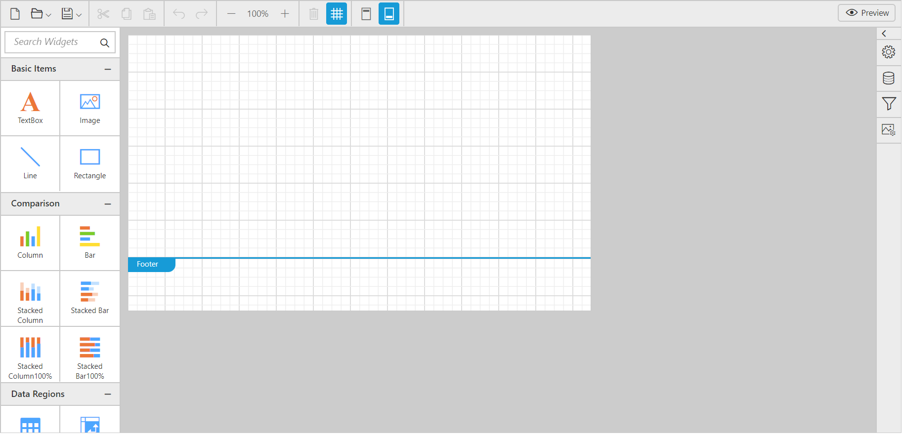

# Getting Started

This section explains briefly about how to create a ReportDesigner control in your application with **ReactJS**.

## Script and CSS Reference

* [`jQuery`](http://jquery.com) 1.10.2 and later versions
* [jsRender](https://github.com/borismoore/jsrender) - to render the templates

The required ReactJS script dependencies as follows. And you can also refer [React](https://facebook.github.io/react/docs/getting-started.html) to know more about ReactJS.

* `react.min.js` - [http://cdn.syncfusion.com/js/assets/external/react.min.js](http://cdn.syncfusion.com/js/assets/external/react.min.js)
* `react-dom.min.js` - [http://cdn.syncfusion.com/js/assets/external/react-dom.min.js](http://cdn.syncfusion.com/js/assets/external/react-dom.min.js)
* `ej.web.react.min.js` - [http://cdn.syncfusion.com/{{ site.releaseversion }}/js/common/ej.web.react.min.js](http://cdn.syncfusion.com/16.3.0.17/js/common/ej.web.react.min.js)

**External Dependency - Code Mirror**

In report designer to edit the SQL queries with syntax highlighter need to refer the below code mirror scripts and themes.



<link href="https://cdnjs.cloudflare.com/ajax/libs/codemirror/5.37.0/codemirror.min.css" rel="stylesheet" />
<link href="https://cdnjs.cloudflare.com/ajax/libs/codemirror/5.37.0/addon/hint/show-hint.min.css" rel="stylesheet" />

 

Create a **HTML** page and add the below script and CSS references in the &lt;head&gt; tag of the html page.



<!DOCTYPE html>
<html>
    <head>
        <!-- theme reference -->
        <link rel="stylesheet" href="http://cdn.syncfusion.com/{{site.releaseversion}}/js/web/bootstrap-theme/ej.web.all.min.css" />
        <link rel="stylesheet" href="http://cdn.syncfusion.com/{{site.releaseversion}}/js/web/bootstrap-theme/ej.reportdesigner.min.css" />  
        <!--  code miror theme  -->
        <link href="https://cdnjs.cloudflare.com/ajax/libs/codemirror/5.37.0/codemirror.min.css" rel="stylesheet" />
        <link href="https://cdnjs.cloudflare.com/ajax/libs/codemirror/5.37.0/addon/hint/show-hint.min.css" rel="stylesheet" />
        <!--  react script  -->
        
        
        
        <!--  jquery script  -->
        
        
        <!--  code miror script  -->
        
        
        
        
        <!-- Essential JS UI widget -->    
        
        
        
        <!--Add custom scripts here -->
    </head>
    <body>
    </body>
</html>



N> In the above code, `ej.web.all.min.js` script reference has been added for demonstration purpose. It is not recommended to use this for deployment purpose, as its file size is larger since it contains all the widgets. Instead, you can use [CSG](http://csg.syncfusion.com/# "") utility to generate a custom script file with the required widgets for deployment purpose.

## Initialize and configure the control

Control can be initialized in two ways.

 * Using jsx Template
 * Without using jsx Template
 
### Using jsx Template

While making use of jsx template, we have to create both the html and jsx files. The `.jsx` file should be converted into `.js` file using [gulp](/reactjs/overview#converting-jsx-to-javascript-with-react) command and then needs to be added as a reference in the html page.
 
Add a `div` container to render the ReportDesigner in **HTML** page.



<!DOCTYPE html>
<html>    
     <body>
         

         
     </body>
</html>



Initialize the ReportDesigner by using the `EjReportDesigner` tag.



"use strict";
ReactDOM.render(  
    <EJ.ReportDesigner
		id = "designerId"
		serviceUrl = {'http://js.syncfusion.com/ejservices/api/ReportDesigner'}
	</EJ.ReportDesigner>,
	document.getElementById('reportDesigner')
);



N> The above jsx template needs to be converted from `.jsx` to `.js` extension by using `gulp` nuget package (refer [here](/reactjs/overview#converting-jsx-to-javascript-with-react)) and then it must be referred in the html page.

### Without using jsx Template

ReportDesigner can be created from a HTML `DIV` element with the HTML `id` attribute set to it. Refer to the following code example.



<body>
	

</body>



Initialize the ReportDesigner control by adding the following script code to the body section of the HTML document.





N> In the report designer service url, need to mention the controller name of the reporting service. To create reporting service for report designer follow the steps explained in the following link [Reporting Service ](https://help.syncfusion.com/js/reportdesigner/getting-started#add-webapi-controller-for-report-designer).

### Run the Application

Run the application and you can see the ReportDesigner on the page as displayed in the following screenshot.

