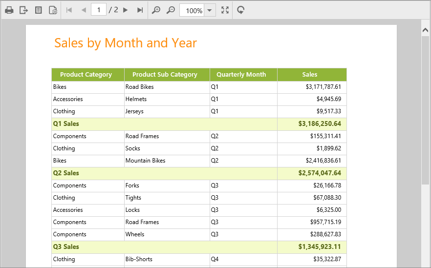
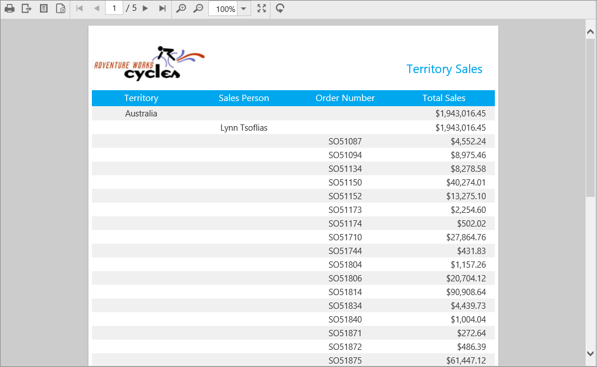
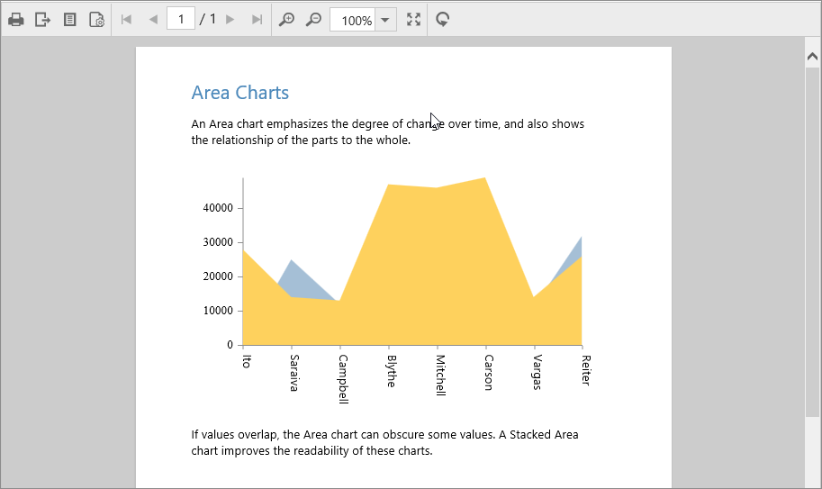

# Getting Started with React JS ReportViewer

This section explains briefly about how to create a ReportViewer in React JS.

## Script and CSS Reference

Create a **HTML** page and add the script and CSS references in the order mentioned in the following code example.



<!DOCTYPE html>
<html>
    <head>
        <!-- Essential Studio for JavaScript  theme reference -->
        <link rel="stylesheet" href="http://cdn.syncfusion.com/14.3.0.49/js/web/bootstrap-theme/ej.web.all.min.css" />           
        <!--  react script  -->
        
        
        
        <!--  jquery script  -->
        
        <!-- Essential JS UI widget -->    
        
        

        <!--Add custom scripts here -->
    </head>
    <body>
    </body>
</html>



N> In the above code, `ej.web.all.min.js` script reference has been added for demonstration purpose. It is not recommended to use this for deployment purpose, as its file size is larger since it contains all the widgets. Instead, you can use [CSG](http://csg.syncfusion.com/# "") utility to generate a custom script file with the required widgets for deployment purpose.

* `react.js` and `react-dom.js` are the core files needed to create react elements.
* `browser.min.js` file is required for code transform.
* `ej.web.react.min.js`  is a react-syncfusion bridge to render Syncfusion components.

## Initialize and configure the control

Control can be initialized in two ways.

 * Using jsx Template
 * Without using jsx Template
 
### Using jsx Template

While making use of jsx template, we have to create both the html and jsx files. The `.jsx` file should be converted into `.js` file using [gulp](/reactjs/overview#converting-jsx-to-javascript-with-react) command and then needs to be added as a reference in the html page.
 
#### Control Initialization

Add a `div` container to render the ReportViewer.



<!DOCTYPE html>
<html>    
     <body>
         

         
     </body>
</html>



Initialize the ReportViewer by using the ` EjReportViewer` tag.



"use strict";
ReactDOM.render(  
    <EJ.ReportViewer
		id = "groupingReportViewer"
		reportServiceUrl = {'http://js.syncfusion.com/ejservices/api/ReportViewer'}
		processingMode = {"remote"}
		reportPath = {'GroupingAgg.rdl'}>
	</EJ.ReportViewer>,
	document.getElementById('groupingAggregate')
);



N> Default RDL Report will be rendered, which is used in the online service. You can obtain sample rdl/rdlc files from Syncfusion installed location (%userprofile%\AppData\Local\Syncfusion\EssentialStudio\{{ site.releaseversion }}\Common\Data\ejReportTemplate).

N> The above jsx template needs to be converted from `.jsx` to `.js` extension by using `gulp` nuget package (refer [here](/reactjs/overview#converting-jsx-to-javascript-with-react)) and then it must be referred in the html page.

#### Run the Application

Run the sample application and you can see the ReportViewer on the page as displayed in the following screenshot.

 

ReportViewer with Grouping Aggregate Report
{:.caption}

### Using without jsx Template

ReportViewer can be created from a HTML `DIV` element with the HTML `id` attribute set to it. Refer to the following code example.



<body>
	

</body>



Initialize the ReportViewer control by adding the following script code to the body section of the HTML document.



    

    



Run the application and you can see the ReportViewer on the page as displayed in the following screenshot.

 

ReportViewer with Grouping Aggregate Report
{:.caption}

## Load SSRS Server Reports

### Using jsx Template

ReportViewer supports to load RDL/RDLC files from SSRS Server. The following steps help you to load reports from SSRS Server.

Set the `reportPath` from SSRS and SSRS `reportServerUrl` in the ReportViewer properties.



    "use strict";
    ReactDOM.render(
    <ej.reportviewer id="territoryReportViewer"
                     reportserviceurl={ 'http://js.syncfusion.com/ejservices/api/ReportViewer' }
                     reportserverurl={'http://mvc.syncfusion.com/reportserver'}
                     processingmode={"remote"}
                     reportpath={"/SSRSSamples2/Territory sales new"}>
    </ej.reportviewer>,
    document.getElementById('territorysales')
    );



Run the application and you can see the ReportViewer on the page as displayed in the following screenshot.

    
   
   Report from SSRS
   {:.caption}
   
### Using without jsx Template

ReportViewer can be created from a HTML `DIV` element with the HTML `id` attribute set to it. Refer to the following code example.



<body>
	

</body>



Initialize the ReportViewer control by adding the following script code to the body section of the HTML document.



    

    



Run the application and you can see the ReportViewer on the page as displayed in the following screenshot.

    
   
   Report from SSRS
   {:.caption}   

## Load RDLC Reports

### Using jsx Template

The ReportViewer has data binding support to visualize the RDLC reports. The following code example helps you to bind data to ReportViewer.

Assign the RDLC report path to ReportViewer’s `reportPath` property and set the data sources to the ReportViewer’s `dataSources` property and specify the `processingMode` as local.



    "use strict";
    ReactDOM.render(
    <ej.reportviewer id="areaReportViewer"
                     reportserviceurl={ 'http://js.syncfusion.com/ejservices/api/ReportViewer' }
                     processingmode={"local"}
                     reportpath={'AreaCharts.rdlc'}
                     datasources={[{value: [{ salespersonid 281, fullname 'Ito' , title 'Sales Representative' , salesterritory 'South West' , y2002 0, y2003 28000, y2004 3018725 },
                     { salespersonid 282, fullname 'Saraiva' , title 'Sales Representative' , salesterritory 'Canada' , y2002 25000, y2003 14000, y2004 3189356 },
                     { salespersonid 283, fullname 'Cambell' , title 'Sales Representative' , salesterritory 'North West' , y2002 12000, y2003 13000, y2004 1930885 },
                     { salespersonid 275, fullname 'Blythe' , title 'Sales Representative' , salesterritory 'North East' , y2002 19000, y2003 47000, y2004 4557045 },
                     { salespersonid 276, fullname 'Mitchell' , title 'Sales Representative' , salesterritory 'South West' , y2002 28000, y2003 46000, y2004 5240075 },
                     { salespersonid 277, fullname 'Carson' , title 'Sales Representative' , salesterritory 'Central' , y2002 33000, y2003 49000, y2004 3857163 },
                     { salespersonid 278, fullname 'Vargas' , title 'Sales Representative' , salesterritory 'Canada' , y2002 11000, y2003 14000, y2004 1764938 },
                     { salespersonid 279, fullname 'Reiter' , title 'Sales Representative' , salesterritory 'South East' , y2002 32000, y2003 26000, y2004 2811012 }],
                     name 'AdventureWorksXMLDataSet' }]}>
    </ej.reportviewer>,
    document.getElementById('areachart')
    );



> Default RDLC Report will be rendered, which is used in the online service.

Run the application and you can see the ReportViewer on the page as displayed in the following screenshot.

    
   
   Area Chart RDLC Report
   {:.caption}
   
### Using without jsx Template

ReportViewer can be created from a HTML `DIV` element with the HTML `id` attribute set to it. Refer to the following code example.



<body>
	

</body>



Initialize the ReportViewer control by adding the following script code to the body section of the HTML document.



    

    



Run the application and you can see the ReportViewer on the page as displayed in the following screenshot.

    
   
   Area Chart RDLC Report
   {:.caption}
  