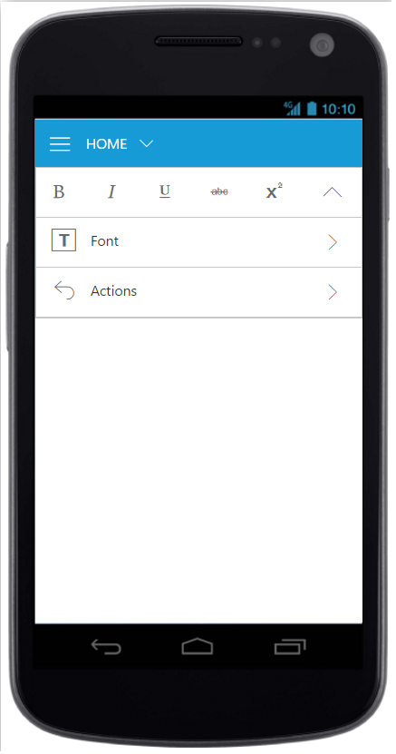

# Resize 

Ribbon control dynamically resizes to display possible number of controls in the optimal layout as the application window size changes.

As the window is narrowed, controls in the Ribbon will be combined as group button with dropdown arrow, in which controls can be expanded with dropdown arrow.

## Tablet Layout 

Set `isResponsive` as true to enable responsive layout in Ribbon.If client width is above  420px or control content exceeds the page then, the ribbon will render in Tablet mode.



    

    
    <ul id="ribbonmenu1">
    <li><a>FILE</a>
       <ul>
         <li><a>New</a></li>
         <li><a>Open</a></li>
         <li><a>Save</a></li>
         <li><a>Save As</a></li>
         <li><a>Print</a></li>
	   </ul>
     </li>
    </ul>





    ReactDOM.render(
    <EJ.Ribbon width="40%" isResponsive={true} applicationTab-type="menu" applicationTab-menuItemID="ribbonmenu1" applicationTab-menuSettings-openOnClick={false}>
      <tabs>
        <tab id="home" text="HOME">
           <groups>
			  <group text="Clipboard" alignType="rows">
                <content>
                    <content defaults-type="button" defaults-width={60} defaults-height={70}>
                       <groups>
                          <group id="cut" text="Cut" buttonSettings-prefixIcon="e-icon e-ribbon e-ribboncut" buttonSettings-click="executeAction">
                              </group>
                              <group id="copy" text="Copy" buttonSettings-prefixIcon="e-icon e-ribbon e-ribboncopy" buttonSettings-click="executeAction">
                              </group>
                        </groups>
                      </content>
                        </content>
                     </group>
                     <group text="Font" alignType="rows">
                        <content>
						
                          <content defaults-width={60} defaults-height={70} defaults-isBig={false}>
                             <groups>
                                <group id="bold" text="bold" type="togglebutton" toggleButtonSettings-defaultText="Bold" toggleButtonsettings-activeText="Bold" toggleButtonSettings-defaultPrefixIcon="e-icon e-ribbon e-resbold" toggleButtonSettings-activePrefixIcon="e-icon e-ribbon e-resbold" toggleButtonSettings-click="executeAction"></group>
                                <group id="italic" type="togglebutton" toggleButtonSettings-defaultText="Italic" toggleButtonSettings-activeText="Italic" toggleButtonSettings-defaultPrefixIcon="e-icon e-ribbon e-resitalic" toggleButtonsettings-activePrefixIcon="e-icon e-ribbon e-resitalic" toggleButtonSettings-click="executeAction"></group>
                    
                             </groups>
                          </content>
					    </content>
                     </group>
					 <group text="Alignment" alignType="rows">
                        <content>
                           <content defaults-width={60} defaults-height={70} defaults-isBig={false}>
                             <groups>
                                <group id="left" text="Left" type="togglebutton" toggleButtonSettings-defaultText="Left" toggleButtonsettings-activeText="Left" toggleButtonSettings-defaultPrefixIcon="e-icon e-ribbon e-resbold" toggleButtonSettings-activePrefixIcon="e-icon e-ribbon e-resbold" toggleButtonSettings-click="executeAction"></group>
                                <group id="right" text="Right" type="togglebutton" toggleButtonSettings-defaultText="Right" toggleButtonSettings-activeText="Right" toggleButtonSettings-defaultPrefixIcon="e-icon e-ribbon e-resitalic" toggleButtonsettings-activePrefixIcon="e-icon e-ribbon e-resitalic" toggleButtonSettings-click="executeAction"></group>
                    
                             </groups>
                       
                          </content>
                                        </content>
                                    </group>		
				</groups>  
        </tab>
      </tabs>
     </EJ.Ribbon>,
    document.getElementById('ribbon-resize')
    );
    


## Mobile Layout

If client width is less than 420px, the ribbon will render in mobile mode. In which, you can see that ribbon user interface is customized and redesigned for best view in small screens.
The customized features includes responsive tab & group rendering, backstage, gallery and button controls.

### Responsive Tab and group

Set `isResponsive` as true to enable responsive mode in Ribbon.
   


    

    
    <ul id="ribbonmenu1">
    <li><a>FILE</a>
       <ul>
         <li><a>New</a></li>
         <li><a>Open</a></li>
         <li><a>Save</a></li>
         <li><a>Save As</a></li>
         <li><a>Print</a></li>
	   </ul>
    </li>
    </ul>





    "use strict"; 
    ReactDOM.render(
    <EJ.Ribbon width="100%" isResponsive={true} applicationTab-type="menu" applicationTab-menuItemID="ribbonmenu1" applicationTab-menuSettings-openOnClick={false}>
      <tabs>
        <tab id="home" text="HOME">
           <groups>
                     <group text="Font" alignType="rows">
                        <content>
                          <content defaults-isBig={false}>
                             <groups>
                                   <group id="bold" text="bold" isMobileOnly="true" type="togglebutton" toggleButtonSettings-contentType="imageonly" toggleButtonSettings-defaultText="Bold" toggleButtonsettings-activeText="Bold" toggleButtonSettings-defaultPrefixIcon="e-icon e-ribbon e-resbold" toggleButtonSettings-activePrefixIcon="e-icon e-ribbon e-resbold" toggleButtonSettings-click="executeAction"></group>
                                <group id="italic" type="togglebutton" isMobileOnly="true" toggleButtonSettings-contentType="imageonly" toggleButtonSettings-defaultText="Italic" toggleButtonSettings-activeText="Italic" toggleButtonSettings-defaultPrefixIcon="e-icon e-ribbon e-resitalic" toggleButtonsettings-activePrefixIcon="e-icon e-ribbon e-resitalic" toggleButtonSettings-click="executeAction"></group>
                                <group id="underline" isMobileOnly="true" text="underline" type="togglebutton" toggleButtonSettings-contentType="imageonly" toggleButtonSettings-defaultText="Underline" toggleButtonSettings-activeText="Underline" toggleButtonSettings-defaultPrefixIcon="e-icon e-ribbon e-resunderline" toggleButtonSettings-activePrefixIcon="e-icon e-ribbon e-resunderline" toggleButtonSettings-click="executeAction"></group>
                                <group id="strikethrough" isMobileOnly="true" text="Strikethrough" type="togglebutton" toggleButtonSettings-contentType="imageonly" toggleButtonSettings-defaultText="Strikethrough" toggleButtonSettings-activeText="Strikethrough" toggleButtonSettings-defaultPrefixIcon="e-icon e-ribbon strikethrough" toggleButtonSettings-activePrefixIcon="e-icon e-ribbon strikethrough" toggleButtonSettings-click="executeAction"></group>
                                <group id="superscript" text="Superscript" isMobileOnly="true" buttonSettings-contentType="imageonly" buttonSettings-prefixIcon="e-icon e-ribbon e-superscripticon" buttonSettings-click="executeAction"></group>
                             </groups>
                          </content>
					    </content>
                     </group>
					
				</groups>  
        </tab>   
      </tabs>
     </EJ.Ribbon>,
    document.getElementById('ribbon-resize')
    );



{:caption}
Ribbon Responsive with tab content 

N> To make the Ribbon control to react as responsive in mobile devices, it is necessary to refer the additional `ej.responsive.css` file in the application.
