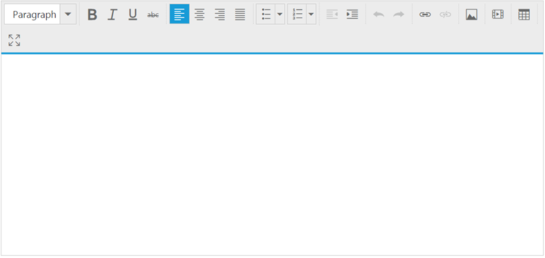
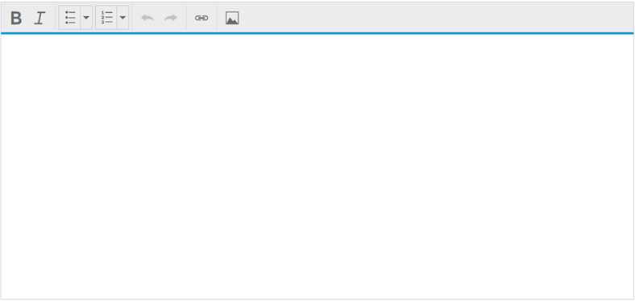
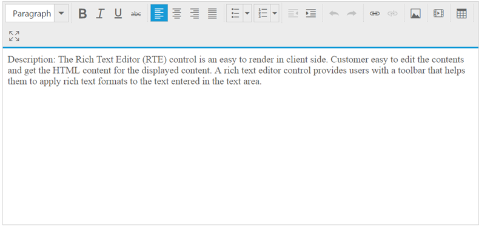

# Getting Started 

This section helps to understand the getting started of RTE control with the step-by-step instruction.

## Create RTE Control in React JS

You can create a React application and add necessary scripts and styles with the help of the given [React Getting Started Documentation.](https://help.syncfusion.com/reactjs/overview)

Create a JSX file for rendering RichTextEditor component using &lt;EJ.RTE&gt; syntax. Add required properties to it in &lt;EJ.RTE&gt; tag element



"use strict";

ReactDOM.render(
    <EJ.RTE width="100%" minWidth="150px" isResponsive={true}>
    </EJ.RTE>,
document.getElementById('rte-default')
);



Define an HTML element for adding RichTextEditor in the application and refer the JSX file.





The following screenshot displays a RTE widget.

## Toolbar–Configuration

You can configure a toolbar with the tools as your application requires.







"use strict";
var tool=["style", "lists", "doAction", "links", "images"];
var tools={style: ["bold", "italic"], lists: ["unorderedList", "orderedList"],doAction: ["undo", "redo"],links: ["createLink"],images: ["image"] };
ReactDOM.render(
    <EJ.RTE width="100%" minWidth="150px" isResponsive={true} toolsList={tool} tools={tools}>
    </EJ.RTE>,
document.getElementById('rte-default')
);



The following screenshot displays a RTE widget.

## Setting and Getting Content

You can set the content of the editor as follows.







"use strict";

ReactDOM.render(
    <EJ.RTE width="100%" minWidth="150px" isResponsive={true} >
        &lt;p&gt;&lt;b&gt;Description:&lt;/b&gt;&lt;/p&gt;
        &lt;p&gt;The Rich Text Editor (RTE) control is an easy to render in
        client side. Customer easy to edit the contents and get the HTML content for
        the displayed content. A rich text editor control provides users with a toolbar
        that helps them to apply rich text formats to the text entered in the text
        area. &lt;/p&gt;
        &lt;p&gt;&lt;b&gt;Functional
        Specifications/Requirements:&lt;/b&gt;&lt;/p&gt;
        &lt;ol&gt;&lt;li&gt;&lt;p&gt;Provide
        the tool bar support, it’s also customizable.&lt;/p&gt;&lt;/li&gt;&lt;li&gt;&lt;p&gt;Options
        to get the HTML elements with styles.&lt;/p&gt;&lt;/li&gt;&lt;li&gt;&lt;p&gt;Support
        to insert image from a defined path.&lt;/p&gt;&lt;/li&gt;&lt;li&gt;&lt;p&gt;Footer
        elements and styles(tag / Element information , Action button (Upload, Cancel))&lt;/p&gt;&lt;/li&gt;&lt;li&gt;&lt;p&gt;Re-size
        the editor support. &lt;/p&gt;&lt;/li&gt;&lt;li&gt;&lt;p&gt;Provide
        efficient public methods and client side events.&lt;/p&gt;&lt;/li&gt;&lt;li&gt;&lt;p&gt;Keyboard
        navigation support.&lt;/p&gt;&lt;/li&gt;&lt;/ol&gt;
    </EJ.RTE>,
document.getElementById('rte-default')
);



The following screenshot displays a RTE widget.

You can also set the content of the editor using value property as follows.







"use strict";   
var RTEDefault = React.createClass({   
getInitialState: function()   
  {   
      return ({   
          data: 'This is RTE Content'   
      });   
  },   
    render: function () {   
        return (      
            
   
                <EJ.RTE width="100%" minWidth="150px" isResponsive={true} value={this.state.data} >   
                </EJ.RTE>   
            
   
        );   
    }   
});     
  
ReactDOM.render(<RTEDefault />, document.getElementById('rte-default'));   



The value that is set to the RTE is added in this.state. Hence, the value is accessible in componentDidMount() 
