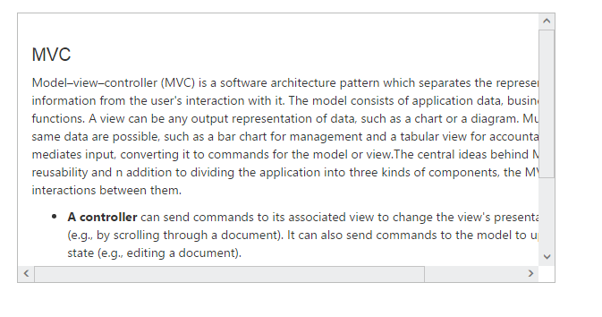

# Getting Started

This section helps to get started of the Scroller component in a ReactJS application 

## Create a Scroller

Refer the common ReactJS Getting Started Documentation to create an application and add necessary scripts and styles for rendering our ReactJS components.

Create a JSX file and use &lt;EJ.Scroller&gt; syntax to render ReactJS Scroller component. Add required properties to &lt;EJ.Scroller&gt; tag element. 



    ReactDOM.render(   
        <EJ.Scroller id="scrollcontent" height={300} width="100%" >
						    

								

									<h3 style={{fontsize: 20 + "px"}}>MVC</h3>
									

										

											Model–view–controller (MVC) is a software architecture pattern which separates the
										representation of information from the user's interaction with it.
										The model consists of application data, business rules, logic, and functions. A view can be any
										output representation of data, such as a chart or a diagram. Multiple views of the same data 
										are possible, such as a bar chart for management and a tabular view for accountants. 
										The controller mediates input, converting it to commands for the model or view.The central 
										ideas behind MVC are code reusability and n addition to dividing the application into three 
										kinds of components, the MVC design defines the interactions between them.
										

										<ul>
											<li>
												<b>A controller </b>can send commands to its associated view to change the view's presentation of the model (e.g., by scrolling through a document). 
													 It can also send commands to the model to update the model's state (e.g., editing a document).
											</li>
											<li>
												<b>A model</b> notifies its associated views and controllers when there has been a change in its state. This notification allows the views to produce updated output, and the controllers to change the available set of commands. 
													A passive implementation of MVC omits these notifications, because the application does not require them or the software platform does not support them.
											</li>
											<li>
												<b>A view</b> requests from the model the information that it needs to generate an output representation to the user.
											</li>
										</ul>
									

								

                            

                        </EJ.Scroller>,
        document.getElementById('scrollbar')  
    );



Define an HTML element for adding Scroller in the application and refer the JSX file created.



    

    <script type="text/babel" src="sample.jsx"> 



This will render scroller component on executing.

Run the above code to render the following output,

> _Note:_ _You can find the Scroller properties from the_ [API reference](https://help.syncfusion.com/api/js/ejscroller) _document._

