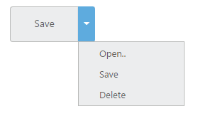

# Getting Started

This section explains briefly about how to create a SplitButton in your application with ReactJS.

## Create a SplitButton

Refer the common ReactJS getting started documentation to create an application and add necessary scripts and styles for rendering our ReactJS components.

Create a JSX file and use &lt;EJ.SplitButton&gt; syntax to render ReactJS SplitButton component. Add required properties to &lt;EJ.SplitButton&gt; tag element. 



    ReactDOM.render(   
        <EJ.SplitButton id="spltbutton21" targetID="Ul21" >login</EJ.SplitButton>
                                    <ul id="Ul21">
                                        <li>User</li>
                                        <li>Guest</li>
                                        <li>Admin</li>
                                    </ul>
       document.getElementById('button-splitbutton')  
    );



Define an HTML element for adding SplitButton in the application and refer the JSX file created.



    

	



This will render SplitButton component on executing.

## Configure Properties

In the JSX, need to declare the SplitButton properties. Refer to the following code,.



    ReactDOM.render(   
        <EJ.SplitButton id="spltbutton21" showRoundedCorner={true} targetID="Ul21" >login</EJ.SplitButton>
                                    <ul id="Ul21">
                                        <li>User</li>
                                        <li>Guest</li>
                                        <li>Admin</li>
                                    </ul>
         document.getElementById('button-splitbutton')
    );



Run the above code to render the following output,

> _Note:_ _You can find the SplitButton properties from the_ [API reference](https://help.syncfusion.com/api/js/ejsplitbutton) _document._
