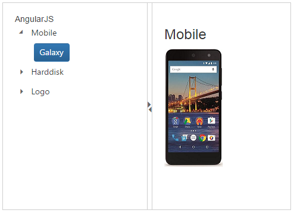

# Getting Started

This section helps to get started of the Splitter component in a React application.

## Create a Splitter

Refer the common React JS [Getting Started Documentation](https://help.syncfusion.com/reactjs/overview#getting-started-with-react) to create an application and add necessary scripts and styles for rendering our React JS components.

Create a JSX file for rendering Splitter component using &lt;EJ.Splitter&gt; syntax. Add required properties to it in &lt;EJ.Splitter&gt; tag element.



    "use strict";
    ReactDOM.render(
    <EJ.Splitter id="default_outerSplitter" width= "100%" height="100%" isResponsive={true}      orientation={ej.Orientation.Vertical}>
    </EJ.Splitter>,
    document.getElementById(splitter-default')
    );



Define an HTML element for adding Rotator in the application and refer the JSX file created.



    

    <script type="text/babel" src="sample.jsx"> 



This will render an empty Splitter component on executing.

> _Note:_ _You can find the Splitter properties from the_ [API reference](https://help.syncfusion.com/api/js/ejsplitter) _document___

## Configure Splitter Panes

To configure properties for Splitter component, define properties in the JSX.



    <EJ.Splitter id="integration_outterSplitter" width= "100%" height="100%" isResponsive={true}>

    </EJ.Splitter>



Configure the Splitter panes with images. Save the images in the corresponding location.



    

        <EJ.Splitter id="integration_outterSplitter" width= "100%" height="100%" isResponsive={true}>
            

                

                    <h3 className="h3">React JS</h3>                               
                

            

            

            

                
Select any product from the tree to show the description.

                

                    <h3>Mobile</h3>
                    
                

                

                    <h3>Harddisk</h3>
                    
                

                

                    <h3>Logo</h3>
                
                

            

            

         </EJ.Splitter>
    



## Configure Tree View 

For adding Treeview component, you have to use &lt;EJ.TreeView&gt; syntax to corresponding element. You need to use “nodeSelect” event handler to perform any action while selection the node in Tree view.

Add the following code example in JSX to configure Tree View.



    <EJ.TreeView id="treeView" className="visibleHide" nodeSelect={this.treeClicked}>
        <li>Mobile
            <ul>
                <li id="mobile" className="_child">Galaxy</li>
            </ul>
        </li>
        <li>Harddisk
            <ul>
                <li id="harddisk" className="_child">Segate </li>
            </ul>
        </li>
        <li>Logo
            <ul>
                <li id="logo" className="_child">Amazon</li>
            </ul>
        </li>
    </EJ.TreeView>



## Set Actions

Add the nodeSelect event in JSX to set the action to view the images for “li” content of the Tree view.



    treeClicked: function(e){
            if (e.currentElement.hasClass('_child')) {
                var content = $('.' + e.currentElement[0].id).html();
                $('._content').html(content);
            }
        }



You can render Splitter with Tree View using React JS, Please refer the below code in JSX.



    ReactDOM.render(document.getElementById(splitter-default'));



