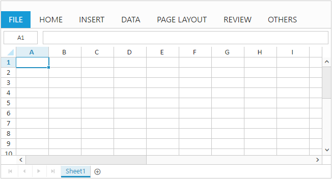

# Getting started

This section explains you the steps required to populate the Spreadsheet with data, format, and export it as excel file. This section covers only the minimal features that you need to know to get started with the Spreadsheet.

## Adding Script Reference

To get more information about react refer [React Getting Started Documentation.](https://help.syncfusion.com/reactjs/overview)

Create an **HTML** page and add the scripts references in the order mentioned in the following code example.



<!DOCTYPE html>
<html>
    <head>
        <!-- Essential Studio for JavaScript  theme reference -->
        <link rel="stylesheet" href="http://cdn.syncfusion.com/{{ site.releaseversion }}/js/web/bootstrap-theme/ej.web.all.min.css" />           
        <!--  react script  -->
        
        
        
        <!--  jquery script  -->
        
        
        
        <!--  jsrender script  -->
        
        <!-- Essential JS UI widget -->    
        
        

        <!--Add custom scripts here -->
    </head>
    <body>
    </body>
</html>



In the above code, `ej.web.all.min.js` script reference has been added for demonstration purpose. It is not recommended to use this for deployment purpose, as its file size is larger since it contains all the widgets. Instead, you can use [CSG](http://csg.syncfusion.com/) utility to generate a custom script file with the required widgets for deployment purpose.

**Note:**

* For details about Spreadsheet internal and external dependencies refer following [`link`](http://help.syncfusion.com/js/spreadsheet/dependencies "link")
* `react.js` and `react-dom.js` are the core files needed to create react elements.
* `browser.min.js` file is required for code transform.
* `ej.web.react.min.js` is a react-syncfusion bridge to render Syncfusion components.

## Initialize Spreadsheet

Create a JSX file for rendering Spreadsheet component using the `<EJ.Spreadsheet>` tag. The Spreadsheet is rendered based on default width and height. You can also customize the Spreadsheet dimension by setting the `width` and `height` property in `scrollSettings`.



"use strict";

ReactDOM.render(
        <EJ.Spreadsheet></EJ.Spreadsheet>,
document.getElementById('spreadsheet')
);



Add a `div` container to render the Spreadsheet in HTML file.To translate JSX to plain JavaScript **&lt;script type=”text/babel”&gt;** is used.



<!DOCTYPE html>
<html>    
    <body>
        

        <script type="text/babel" src="spreadsheet.jsx">
    </body>
</html>



Now, the Spreadsheet is rendered with default row and column count.

## Populate Spreadsheet with data

Now, this section explains how to populate JSON data to the Spreadsheet. You can set `dataSource` property in `sheet` settings to populate JSON data in 
Spreadsheet.



"use strict";
var sheets = [
        {
            rangeSettings: [{
                dataSource: [
                    { "Item Name": "Casual Shoes", Date: "02/14/2014", Time: "11:34:32 AM", Quantity: 10, Price: 20, Amount: 200, Discount: 1, Profit: 10 },
                    { "Item Name": "Sports Shoes", Date: "06/11/2014", Time: "05:56:32 AM", Quantity: 20, Price: 30, Amount: 600, Discount: 5, Profit: 50 },
                    { "Item Name": "Formal Shoes", Date: "07/27/2014", Time: "03:32:44 AM", Quantity: 20, Price: 15, Amount: 300, Discount: 7, Profit: 27 },
                    { "Item Name": "Sandals & Floaters", Date: "11/21/2014", Time: "06:23:54 AM", Quantity: 15, Price: 20, Amount: 300, Discount: 11, Profit: 67 },
                    { "Item Name": "Flip- Flops & Slippers", Date: "06/23/2014", Time: "12:43:59 AM", Quantity: 30, Price: 10, Amount: 300, Discount: 10, Profit: 70 },
                    { "Item Name": "Sneakers", Date: "07/22/2014", Time: "10:55:53 AM", Quantity: 40, Price: 20, Amount: 800, Discount: 13, Profit: 66 },
                    { "Item Name": "Running Shoes", Date: "02/04/2014", Time: "03:44:34 AM", Quantity: 20, Price: 10, Amount: 200, Discount: 3, Profit: 14 },
                    { "Item Name": "Loafers", Date: "11/30/2014", Time: "03:12:52 AM", Quantity: 31, Price: 10, Amount: 310, Discount: 6, Profit: 29 },
                    { "Item Name": "Cricket Shoes", Date: "07/09/2014", Time: "11:32:14 AM", Quantity: 41, Price: 30, Amount: 1210, Discount: 12, Profit: 166 },
                    { "Item Name": "T-Shirts", Date: "10/31/2014", Time: "12:01:44 AM", Quantity: 50, Price: 10, Amount: 500, Discount: 9, Profit: 55 },
                ]
            }]
        }
];
ReactDOM.render(
        <EJ.Spreadsheet sheets={sheets}></EJ.Spreadsheet>,
document.getElementById('spreadsheet')
);



## Apply Conditional Formatting

Conditional formatting helps you to apply formats to a cell or range with certain color based on the cells values. You can use `allowConditionalFormats` attribute to enable/disable Conditional formats.
To apply conditional formats for a range use `cFormatRule` property . The following code example illustrates this behavior,



"use strict";
var sheets = [
        {
            rangeSettings: [{
                dataSource: [
                    { "Item Name": "Casual Shoes", Date: "02/14/2014", Time: "11:34:32 AM", Quantity: 10, Price: 20, Amount: 200, Discount: 1, Profit: 10 },
                    { "Item Name": "Sports Shoes", Date: "06/11/2014", Time: "05:56:32 AM", Quantity: 20, Price: 30, Amount: 600, Discount: 5, Profit: 50 },
                    { "Item Name": "Formal Shoes", Date: "07/27/2014", Time: "03:32:44 AM", Quantity: 20, Price: 15, Amount: 300, Discount: 7, Profit: 27 },
                    { "Item Name": "Sandals & Floaters", Date: "11/21/2014", Time: "06:23:54 AM", Quantity: 15, Price: 20, Amount: 300, Discount: 11, Profit: 67 },
                    { "Item Name": "Flip- Flops & Slippers", Date: "06/23/2014", Time: "12:43:59 AM", Quantity: 30, Price: 10, Amount: 300, Discount: 10, Profit: 70 },
                    { "Item Name": "Sneakers", Date: "07/22/2014", Time: "10:55:53 AM", Quantity: 40, Price: 20, Amount: 800, Discount: 13, Profit: 66 },
                    { "Item Name": "Running Shoes", Date: "02/04/2014", Time: "03:44:34 AM", Quantity: 20, Price: 10, Amount: 200, Discount: 3, Profit: 14 },
                    { "Item Name": "Loafers", Date: "11/30/2014", Time: "03:12:52 AM", Quantity: 31, Price: 10, Amount: 310, Discount: 6, Profit: 29 },
                    { "Item Name": "Cricket Shoes", Date: "07/09/2014", Time: "11:32:14 AM", Quantity: 41, Price: 30, Amount: 1210, Discount: 12, Profit: 166 },
                    { "Item Name": "T-Shirts", Date: "10/31/2014", Time: "12:01:44 AM", Quantity: 50, Price: 10, Amount: 500, Discount: 9, Profit: 55 },
                ]
            }],
            cFormatRule: [{ action: ej.Spreadsheet.CFormatRule.GreaterThan, inputs: ["10"], color: ej.Spreadsheet.CFormatHighlightColor.RedFill, range: "D2:D8" }]
        }
];

ReactDOM.render(
        <EJ.Spreadsheet sheets={sheets}></EJ.Spreadsheet>,
document.getElementById('spreadsheet')
);



## Export Spreadsheet as Excel File

The Spreadsheet can save its data, style, format into an excel file. To enable save option in Spreadsheet set `allowExporting` option in `exportSettings` as `true`. Since Spreadsheet uses server side helper to save documents set `excelUrl` in `exportSettings` option. The following code example illustrates this behavior,



"use strict";
var sheets = [
        {
            rangeSettings: [{
                dataSource: [
                    { "Item Name": "Casual Shoes", Date: "02/14/2014", Time: "11:34:32 AM", Quantity: 10, Price: 20, Amount: 200, Discount: 1, Profit: 10 },
                    { "Item Name": "Sports Shoes", Date: "06/11/2014", Time: "05:56:32 AM", Quantity: 20, Price: 30, Amount: 600, Discount: 5, Profit: 50 },
                    { "Item Name": "Formal Shoes", Date: "07/27/2014", Time: "03:32:44 AM", Quantity: 20, Price: 15, Amount: 300, Discount: 7, Profit: 27 },
                    { "Item Name": "Sandals & Floaters", Date: "11/21/2014", Time: "06:23:54 AM", Quantity: 15, Price: 20, Amount: 300, Discount: 11, Profit: 67 },
                    { "Item Name": "Flip- Flops & Slippers", Date: "06/23/2014", Time: "12:43:59 AM", Quantity: 30, Price: 10, Amount: 300, Discount: 10, Profit: 70 },
                    { "Item Name": "Sneakers", Date: "07/22/2014", Time: "10:55:53 AM", Quantity: 40, Price: 20, Amount: 800, Discount: 13, Profit: 66 },
                    { "Item Name": "Running Shoes", Date: "02/04/2014", Time: "03:44:34 AM", Quantity: 20, Price: 10, Amount: 200, Discount: 3, Profit: 14 },
                    { "Item Name": "Loafers", Date: "11/30/2014", Time: "03:12:52 AM", Quantity: 31, Price: 10, Amount: 310, Discount: 6, Profit: 29 },
                    { "Item Name": "Cricket Shoes", Date: "07/09/2014", Time: "11:32:14 AM", Quantity: 41, Price: 30, Amount: 1210, Discount: 12, Profit: 166 },
                    { "Item Name": "T-Shirts", Date: "10/31/2014", Time: "12:01:44 AM", Quantity: 50, Price: 10, Amount: 500, Discount: 9, Profit: 55 },
                ]
            }],
            cFormatRule: [{ action: ej.Spreadsheet.CFormatRule.GreaterThan, inputs: ["10"], color: ej.Spreadsheet.CFormatHighlightColor.RedFill, range: "D2:D8" }]
        }
];
var exportSettings = {
    excelUrl: "http://js.syncfusion.com/demos/ejservices/api/Spreadsheet/ExcelExport"
};
ReactDOM.render(
        <EJ.Spreadsheet sheets={sheets} exportSettings={exportSettings}></EJ.Spreadsheet>,
document.getElementById('spreadsheet')
);



Use shortcut `Ctrl + S` to save Spreadsheet as excel file.
