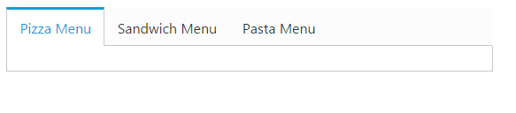

# Getting Started 

This section explains briefly about how to create a **Tab** Control in your application with **JavaScript**. The **Essential JavaScript Tab** control is an interface that displays the content in multiple sections. Each **TabPanel** consists of **HeaderText** or **HeaderTemplate** as well as a **ContentTemplate**. **Tab** is useful for a dashboard that is having limited space. The following section guides you to on-demand customize the **Tab** for displaying Hotel menu items, its rating details and ingredients.

 

## Create Tab Control in React JS

**Essential JavaScript Tab** widget basically builds a dynamic interactive menu-driven interface from your content. The content can be text, graphics or HTML. You can create the **Tab** headers using &lt;UL&gt; and &lt;LI&gt; tags and content panels using &lt;div&gt; tags. 

You can create a React application and add necessary scripts and styles with the help of the given [React Getting Started Documentation.](https://help.syncfusion.com/reactjs/overview)

Create a JSX file for rendering Tab component using &lt;EJ.Tab&gt; syntax. Add required properties to it in &lt;EJ.Tab&gt; tag element



var DefaultTab = React.createClass({
    render: function () {
        return (
            

                <EJ.Tab width="100%">
                <ul>
						<li><a href="#pizza">Pizza Menu</a></li>
						<li><a href="#sandwich">Sandwich Menu</a></li>
						<li><a href="#pasta">Pasta Menu</a></li>
                </ul>
            </EJ.Tab>
        

        );
    }
});

ReactDOM.render(<DefaultTab />, document.getElementById('tab-default'));



Define an HTML element for adding Tab in the application and refer the JSX file.



<script src="app/tab/default.js">



The following screen shot illustrates the **Tab** control with Header.

 

## Configure Content

In this application a detailed description is provided to each item. You can specify the contents in the **Tab** section within the &lt;div&gt; element. 



     <!--Food item description-->
     
Pizza cooked to perfection tossed with milk, vegetables, potatoes, poultry, 100% pure mutton, and cheese - and in creating nutritious and tasty meals to maintain good health.



You can provide more customization to the **Tab** with **rating** control as content in it for describing the item rating value. 

## Create the Rating 

The **Essential JavaScript Rating** control provides you an intuitive rating experience that allows you to select the number of stars that represents the rating. For more information about the rating please refer the following link: 

<http://help.syncfusion.com/js/rating/getting-started>

The following code example explains you the **rating** control creation. The input element is used to create the **rating** control. Render the input element as **rating** control using the input element id. The code example can be placed within the content description &lt;div&gt; element to declare the rating control and description in the **Tab** section and it can be appended with the header initialization code section &lt;div&gt; element.



var DefaultTab = React.createClass({
    render: function () {
        return (
            

                <EJ.Tab width="100%">
                <ul>
						<li><a href="#pizza">Pizza Menu</a></li>
						<li><a href="#sandwich">Sandwich Menu</a></li>
						<li><a href="#pasta">Pasta Menu</a></li>
                </ul>
                

                
Rating:

                <!--Rating control declaration-->
                

                <EJ.Rating value={3}></EJ.Rating>
                

            <!--Food item description-->
            
Pizza cooked to perfection tossed with milk, vegetables, potatoes, poultry, 100% pure mutton, and cheese - and in creating nutritious and tasty meals to maintain good health.

        

            </EJ.Tab>
        

        );
    }
});



To render the **rating** controls in the first **Tab** element refer the styles mentioned in the following code example.





The following screenshot illustrates the **Tab** content with rating control. 

 

## Ajax Content Load (Load On Demand) 

You can change the contents in sub **Tab** element periodically and you are provided with a support to change the contents without any problems. To achieve the content load, use the Load on Demand concept.

In Load On-Demand, the external HTML file with the necessary details is referred in &lt;href&gt; section during **Tab** header declaration section. When you click the **Tab** header, the Ajax automatically calls the content from the external files and displays in a **Tab** content section.

### Sub Tab with Ajax Content

Each item is having a variety of options and these options are also specified in the limited space. So you can choose the **Tab** control that is used within the root **Tab** to specify more details.

The following code example illustrates to create the **Tab** control within the root **Tab** element. This HTML code is appended within the previous HTML code section. To render the child **Tab** with its header, add this code example within the first **Tab** &lt;div&gt; element.



var DefaultTab = React.createClass({
    render: function () {
        return (
            

                <EJ.Tab width="100%">
                <ul>
						<li>
                        <a href="http://js.syncfusion.com/UG/Web/Tab-Content/cornSpainach.html">Corn & Spinach</a></li>
						<li>
                        <a href="http://js.syncfusion.com/UG/Web/Tab-Content/ChickenDelite.html">Chicken Delite</a></li>
                </ul>
            </EJ.Tab>
        

        );
    }
});


The Load On-Demand supported **HTML** file content (cornSpinach.html)



<!DOCTYPE html>
<html xmlns="http://www.w3.org/1999/xhtml">
    <body>
        

            
            

                Rate    : $70 
                Ingredients : cheese, sweet corn &amp; green capsicums. 
                     
                Description: Small pizza bases are topped with spinach and paneer and fresh cream, a nice layer of mozzarella cheese. This is baked until the cheese is all hot and gooey.                   
            

        

    </body>
</html>



The Load On Demand supported html file content (chickenDelite.html)



<!DOCTYPE html>
<html xmlns="http://www.w3.org/1999/xhtml">
    <body>
        

            
            

                Rate    : $100 
                Ingredients : cheese, chicken chunks, onions &amp; pineapple chunks.  
                 
                Description: This is a tasty, elegant chicken dish that is easy to prepare. 
            

        

    </body>
</html>



N> In Load On Demand, when the external files are referred from local the following error occurs.

XMLHttpRequest cannot load [http://js.syncfusion.com/UG/Web/Tab-Content/cornSpainach.html?_=1399883825133](http://js.syncfusion.com/UG/Web/Tab-Content/cornSpainach.html?_=1399883825133). No 'Access-Control-Allow-Origin' header is present on the requested resource. 

To avoid these errors, the external files are hosted in the server to run this application.

The following code example is used to position the image and content in Load On Demand.





At the time of Ajax call, the content fetched from external file referenced location is illustrated in the following screenshot.

 

The following screenshot illustrates the First **Tab** with the sub **Tab** control using Load on Demand.

 

## Orientation Change

In this application, the sub **Tab** orientation needs to be vertical. By default, **Tab** control renders in horizontal orientation. Change the orientation to vertical using the “**headerPosition**” property. The **Tab** header orientation is set as “**left**”.

The following code example is used to render the sub **Tab** element in the vertical orientation.



var DefaultTab = React.createClass({
    render: function () {
        return (
            

                <EJ.Tab width="100%">
                <ul>
						<li><a href="#pizza">Pizza Menu</a></li>
						<li><a href="#sandwich">Sandwich Menu</a></li>
						<li><a href="#pasta">Pasta Menu</a></li>
                </ul>
                

                
Rating:

                <!--Rating control declaration-->
                

                <EJ.Rating value={3}></EJ.Rating>
                

            <!--Food item description-->
            
Pizza cooked to perfection tossed with milk, vegetables, potatoes, poultry, 100% pure mutton, and cheese - and in creating nutritious and tasty meals to maintain good health.

            <EJ.Tab headerPosition="left" height={200} heightAdjustMode="fill">
                <ul>
                 <li>
                    <a href="http://js.syncfusion.com/UG/Web/Tab-Content/cornSpainach.html">Corn & Spinach </a></li>
                <li>
                    <a href="http://js.syncfusion.com/UG/Web/Tab-Content/ChickenDelite.html">Chicken Delite </a></li>
                </ul>
            </EJ.Tab>
            

            </EJ.Tab>
        

        );
    }
});



The following screenshot illustrates the sub **Tab** with vertical orientation.

 

## Header Image Customization

In this application, you have to set the **Tab** header image for each Tab item to specify image in &lt;span&gt; tag element during the **Tab** header declaration time.	

The following code example is used for customizing the header image.





The following code example is used to add the header image for the root **Tab** header element.



  <ul>
     <li><a href="#pizza">Pizza Menu</a></li>  
     <!-- reuse the remaining tab header -->       
   </ul>
   <!-- reuse the previously defined first tab html content section-->



The following screenshot illustrates the **Tab** with the customized header image.

 

## Configuring Contents to remaining Tab items

The second and third **Tab** contents are declared in the same method as of the first **Tab** content declaration. These **Tabs** also consist of rating and sub **Tab** controls. The sub **Tab** control contents are loaded in Load On Demand support.

The following code example can be placed within the previous image customization **HTML** code section.



 <!--reuse the first tab header defined in previous image customization -->
 <li><a href="#sandwich">Sandwich Menu</a></li>
 <li><a href="#pasta">Pasta Menu</a></li>



Add the second **Tab** contents in &lt;div&gt; element during initialization.



        

            
Rating:

            <!--Rating control declaration-->
            
 
                 <EJ.Rating value={3}></EJ.Rating>
            

            <!--dish description-->
            
Sandwich cooked to perfection tossed with bread, milk, vegetables, potatoes, poultry, 100% pure mutton, and cheese - and in creating nutritious and tasty meals to maintain good health.

            <!--sub Tab control, the contents loaded with load on demand-->
            <EJ.Tab id="sandwichType">
                <ul>
                    <li>
                        <a href="http://js.syncfusion.com/UG/Web/Tab-Content/gardenVeggie.html">Garden Veggie </a></li>
                    <li>
                        <a href="http://js.syncfusion.com/UG/Web/Tab-Content/chickenTikka.html">Chicken Tikka </a></li>
                    <li>
                        <a href="http://js.syncfusion.com/UG/Web/Tab-Content/paneerTikka.html">Paneer Tikka </a></li>
                </ul>
                </EJ.Tab>
            
 



Add third **Tab** contents in &lt;div&gt; element during initialization.



        

            
Rating:

            <!--Rating control declaration-->
            

                <EJ.Rating value={3}></EJ.Rating>
            

            <!--dish description-->
            
Pasta cooked to perfection tossed with milk, vegetables, potatoes, poultry, 100% pure mutton, and cheese - and in creating nutritious and tasty meals to maintain good health.

            <!--sub Tab control, the contents loaded with load on demand-->
            <EJ.Tab id="pastaType">
                <ul>
                    <li>
                        <a href="http://js.syncfusion.com/UG/Web/Tab-Content/khemmaPasta.html">Kheema Pasta </a></li>
                    <li>
                        <a href="http://js.syncfusion.com/UG/Web/Tab-Content/tunaPasta.html">Tuna Pasta</a></li>
                    <li>
                        <a href="http://js.syncfusion.com/UG/Web/Tab-Content/channaPasta.html">Channa Pasta
                        </a></li>
                </ul>
            </EJ.Tab>
        



Apply the following styles to the **Tab**.





The following screenshot illustrates you the second **Tab** contents in **Tab** and the final hotel menu with rating, description and ingredients of the item in the Tab interface.

 
