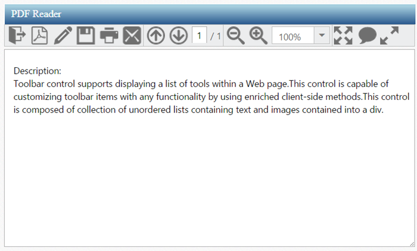
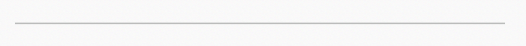
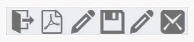
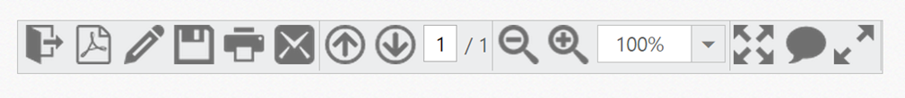
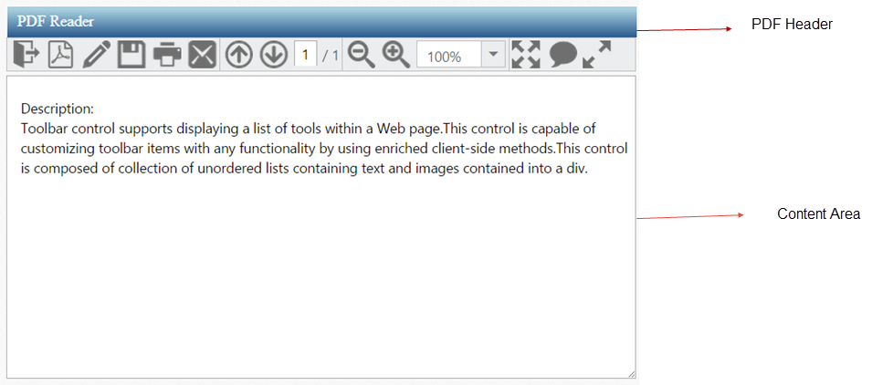

# Getting Started

This section explains briefly about how to create a **Toolbar** in your application with **JavaScript.**

## Create Toolbar for PDF Reader

**Toolbar** control supports displaying a list of tools in a Web page. This control is capable of customizing toolbar items with any functionality by using enriched **client-side** methods. This control consists of a collection of **unordered lists** contains text and images into a **&lt;div&gt;.** From the following section, you can learn how to customize **toolbar** control for a **PDF reader** scenario. The following screen shot shows the appearance of **toolbar** in **PDF reader** simulator application.

 

## Create Toolbar control in React JS

You can create a React application and add necessary scripts and styles with the help of the given [React Getting Started Documentation.](https://help.syncfusion.com/reactjs/overview)

Create a JSX file for rendering Toolbar component using &lt;EJ.Toolbar&gt; syntax. Add required properties to it in &lt;EJ.Toolbar&gt; tag element



"use strict";

ReactDOM.render(
    <EJ.Toolbar width="100%">
 </EJ.Toolbar>,
document.getElementById('toolbar-default')
);



Define an HTML element for adding Toolbar in the application and refer the JSX file.



<script src="app/toolbar/default.js">



Output of the above steps

## Initialize Toolbar Items

**Toolbar** consists of a list of items. From the following section, you can learn how to initialize the toolbar items with **UL LI** template. 							

Initialize the Toolbar items with **UL LI** template as follows. 



"use strict";

ReactDOM.render(
    <EJ.Toolbar width="100%">
    <ul>
         <li id="OtherFormat" title="Convert PDF files to Word or Excel Online..">
            

         </li>
         <li id="PDFOnline" title="Convert files to PDF Online">
            

         </li>
         <li id="Signature" title="Sign, add text or send a document for signature">
            

         </li>
         <li id="Save" title="Save file ( Ctrl+S )">
            

         </li>
         <li id="Print" title="Print file ( Ctrl+P ) ">
            

         </li>
         <li id="Message" title="Message">
            

         </li>
      </ul>
    </EJ.Toolbar>,
document.getElementById('toolbar-default')
);



Apply the given styles in the code table to show the **toolbar items** as follows. You can refer images from any location. In the following code sample, the images are referred from the given location.

[http://js.syncfusion.com/UG/Web/Content/](http://js.syncfusion.com/UG/Web/Content/)





After updating the **Toolbar** **items** with their **CSS** styles, you can render the toolbar inside **&lt;script&gt;** tag.

Execute the code to render a toolbar with a list of **toolbar items**.

Toolbar with list of toolbar items
{:.caption}

## Render remaining Toolbar items

In the above output only few **toolbar items** are rendered, but you need to render all the **toolbar items** to achieve the requirements. You can separate or group the toolbar items. The separation or grouping of toolbar items is achieved when you give toolbar items as a list of **UL LI** values inside the toolbar **&lt;div&gt;** or **span** element. From the following section, you can learn how to initialize the remaining toolbar items with **UL LI** template and how to group the toolbar items. 

Initialize the Toolbar items with **UL LI** template as follows.



"use strict";
var percentList = ["10%", "25%", "50%", "100%", "400%", "800%", "1600%", "3200%", "6400%"];
ReactDOM.render(
    <EJ.Toolbar width="100%" height="33px" enableSeparator={true}>
   <!--Initializes toolbar items from above code example -->
   <!-- Separator is added at the end of each ul inside the toolbar element-->
   <!-- list of Remaining toolbar items with item separator -->
   <ul>
      <li id="Previous" title="Show previous page ( Left Arrow )">
         

      </li>
      <li id="Next" title="Show next page ( Right Arrow )">
         

      </li>
      <li id="page">
         

            <input type="text" value="1" />
         

      </li>
      <li id="count">
         / 1
      </li>
   </ul>
   <ul>
      <li id="ZoomOut" title="Zoom Out">
         

      </li>
      <li id="ZoomIn" title="Zoom In">
         

      </li>
      <li id="ZoomValue">
         

            <!-- input element for rendering Zoom value dropdown  -->
            <EJ.DropDownList id="selectPercent" dataSource={percentList} value="100%" width="90px" height="27px"></EJ.DropDownList>
         

      </li>
   </ul>
   <ul>
      <li id="FitFull" title="Fit one full page to window">
         

      </li>
      <li id="StickyNote" title="Add stick note ( Ctrl+6 ) ">
         

      </li>
      <li id="ReadMode" title="View File in Read Mode">
         

      </li>
   </ul>
</EJ.Toolbar>,
document.getElementById('toolbar-default')
);



Add the following styles in the code table to display the toolbar items as follows. 



 


After updating the Toolbar items with their **CSS** styles, you can render the toolbar inside the **&lt;script&gt;** tag and also need to render the drop down list control for **select zoom value**. Basically, dropdown list control is rendered with input element. **Set Zoom value** is one of the items in the toolbar. The following code example shows how to render and initialize **drop down control** with list of **zoom values**.

Execute the code to render a **toolbar items** with separator.

## Add Actions to Toolbar Items

Now the **toolbar** is rendered so you need to render the header and content area to create a **PDF reader**. From the following section, you can learn how to render the **header** (Toolbar), **content****section** (PDF viewer area) and how to set the action to toolbar items.

You are not going to deal with PDF reading or rendering task here. You will only simulate the PDF Reader app to demonstrate the Toolbar control usage and will completely ignore the PDF rendering area.

Initialize the content area and header as specified in the code table.



  <!-- control class used for aligns the pdf reader in center of a page. -->

 

   <!-- Here Initialize the Toolbar items as like above code sample -->    
   

      <textarea id="content" rows="10" cols="30"> 
      Description:
      Toolbar control supports displaying a list of tools within a Web page.This control is capable of 
      customizing toolbar items with any functionality by using enriched client-side methods.This control 
      is composed of collection of unordered lists containing text and images contained into a div.
      </textarea>
   



You can apply the following styles with the above styles to design the **PDF header** and **content area**. The desired output is shown as follows.





Execute the given code to render a **PDF reader** as follows.

 

So far, you have added the required toolbar items and configured its appearance. When you click on **toolbar items**, the operation is performed through **client slide click event**. The following code example explains how to perform operations when you click on the **toolbar items**.



"use strict";
var percentList = ["10%", "25%", "50%", "100%", "400%", "800%", "1600%", "3200%", "6400%"];
function onClick(args) {     
        switch (option) {
            case "OtherFormat":
                //writes a code for Convert pdf files to Other format.
            case "PDFOnline":
                //writes a code for Convert files to Pdf online.
            case "Signature":
                //writes a code for Send a document for signature.
            case "Save":
                //writes a code for Save content.
            case "Print":
                //writes a code for Print content.
            case "Message":
                //writes a code for Send a Message.
            case "Previous":
                //writes a code for Show previous page.
            case "Next":
                //writes a code for Show Next page.
            case "ZoomOut":
                //writes a code for Zoom out the page.
            case "ZoomIn":
                //writes a code for Zoom In the page.
            case "FitFull":
                //writes a code for Fit one full page to window.
            case "StickyNote":
                //writes a code for Add Sticky Note.
            case "ReadMode":
                //writes a code for view file in read mode.
        }
   }    
ReactDOM.render(
    <EJ.Toolbar width="100%" height="33px" enableSeparator={true} click={onClick}>
   <!--Initializes toolbar items from above code example -->
   <!-- Separator is added at the end of each ul inside the toolbar element-->
   <!-- list of Remaining toolbar items with item separator -->
   <ul>
      <li id="Previous" title="Show previous page ( Left Arrow )">
         

      </li>
      <li id="Next" title="Show next page ( Right Arrow )">
         

      </li>
      <li id="page">
         

            <input type="text" value="1" />
         

      </li>
      <li id="count">
         / 1
      </li>
   </ul>
   <ul>
      <li id="ZoomOut" title="Zoom Out">
         

      </li>
      <li id="ZoomIn" title="Zoom In">
         

      </li>
      <li id="ZoomValue">
         

            <!-- input element for rendering Zoom value dropdown  -->
            <EJ.DropDownList id="selectPercent" dataSource={percentList} value="100%" width="90px" height="27px"></EJ.DropDownList>
         

      </li>
   </ul>
   <ul>
      <li id="FitFull" title="Fit one full page to window">
         

      </li>
      <li id="StickyNote" title="Add stick note ( Ctrl+6 ) ">
         

      </li>
      <li id="ReadMode" title="View File in Read Mode">
         

      </li>
   </ul>
</EJ.Toolbar>,
document.getElementById('toolbar-default')
);
 
