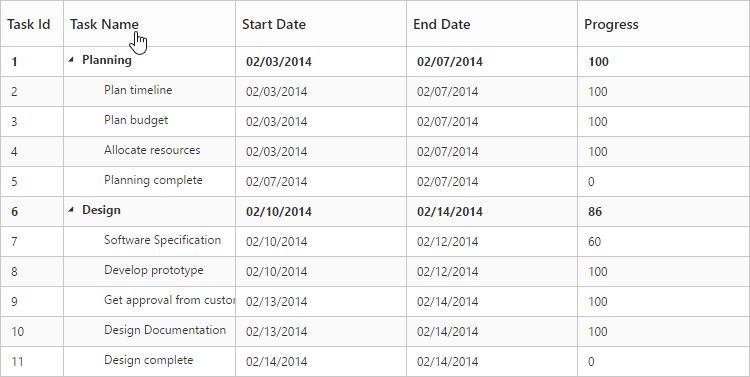
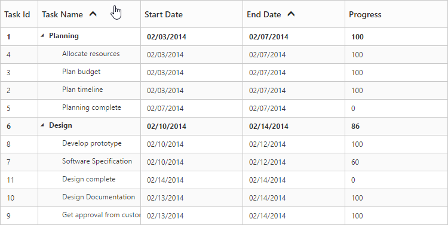
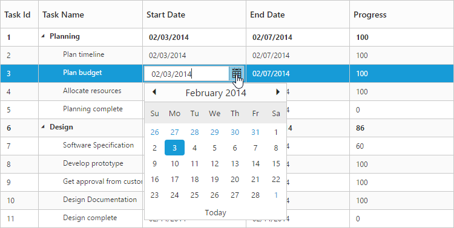

# Getting Started
This section helps to understand the getting started of the React JS TreeGrid with the step-by-step instructions.

## Create your first TreeGrid in React JS

To get started Syncfusion React JS application refer [`this`](https://help.syncfusion.com/reactjs/overview) page for basic control integration and script references.

The **Essential React JS TreeGrid** has been designed to represent and edit the hierarchical data. 

This section explains how to create a TreeGrid widget in your application with hierarchical data source and enable sorting and editing. The following screenshot displays the output.

The required ReactJS script dependencies as follows. And you can also refer [React](https://facebook.github.io/react/docs/getting-started.html) to know more about react js.

* `react.min.js` - [http://cdn.syncfusion.com/js/assets/external/react.min.js](http://cdn.syncfusion.com/js/assets/external/react.min.js)
* `react-dom.min.js` - [http://cdn.syncfusion.com/js/assets/external/react-dom.min.js](http://cdn.syncfusion.com/js/assets/external/react-dom.min.js)
* `browser.min.js` - [http://cdnjs.cloudflare.com/ajax/libs/babel-core/5.8.34/browser.min.js](http://cdnjs.cloudflare.com/ajax/libs/babel-core/5.8.34/browser.min.js)
* `ej.web.react.min.js` - [http://cdn.syncfusion.com/{{ site.releaseversion }}/js/common/ej.web.react.min.js](http://cdn.syncfusion.com/14.3.0.49/js/common/ej.web.react.min.js)

1.Create HTML file and add the following necessary script and css files to the HTML file.



    <!DOCTYPE html>
    <html xmlns="http://www.w3.org/1999/xhtml">
        <head>
            <meta name="viewport"content="width=device-width, initial-scale=1.0"/>
            <meta charset="utf-8" />
            <link href=" http://cdn.syncfusion.com/{{ site.releaseversion }}/js/web/flat-azure/ej.web.all.min.css" rel="stylesheet"/>
                    
                    
            
            
            
            
            
            
            
        </head>
        <body>
        <!--Add TreeGrid control here -->
        </body>
    </html>



## Create a TreeGrid

Control can be initialized in two ways.

 * Using jsx Template
 * Without using jsx Template
 
## Using jsx Template

By using the jsx template, we can create the html file and jsx file. The `.jsx` file can be convert to `.js` file and it can be referred in html page.

Please refer to the code of HTML file.



       

       



Create an app.JSX file and paste the following content



        var ProjectData = [{
    taskID: 2,
    taskName: "Planning",
    startDate: "02/03/2014",
    endDate: "02/07/2014",
    duration: 10,
    progress: 56,
    subtasks: [{
        taskID: 3,
        taskName: "Plan timeline",
        startDate: "02/03/2014",
        endDate: "02/07/2014",
        duration: 5,
        progress: "100"
    }, 
    //...
}]
var columns = [{ field: 'taskID', headerText: 'Task Id', width: '45'}, 
                { field: 'taskName', headerText: 'Task Name'},
                { field: 'startDate', headerText: 'Start Date'},
                { field: 'endDate', headerText: 'End Date'},
                { field: 'duration', headerText: 'Duration'},
                { field: 'progress', headerText: 'Progress'}
               ];
		ReactDOM.render(
<EJ.TreeGrid dataSource={projectData} childMapping="subtasks" columns={columns} treeColumnIndex={1}>
   
</EJ.TreeGrid>,
   document.getElementById('TreeGrid-default')
);



TreeGrid widget is displayed as the output in the following screenshot.

### Enable Sorting

The TreeGrid control has sorting functionality, to arrange the data in ascending or descending order based on a particular column.

#### Multicolumn Sorting

Enable the multicolumn sorting in TreeGrid by setting [`allowMultiSorting`](http://help.syncfusion.com/js/api/ejtreegrid#allowmultisorting "allowMultiSorting") as `true`. You can sort multiple columns in TreeGrid, by selecting the desired column header while holding the `Ctrl` key.



ReactDOM.render(
<EJ.TreeGrid allowSorting={true} allowMultiSorting={true}>
   
</EJ.TreeGrid>,
   document.getElementById('TreeGrid-default')
);



### Enable Editing

You can enable Editing in TreeGrid by using the [`editSettings`](http://help.syncfusion.com/js/api/ejtreegrid#editsettings "editSettings") property as follows.



var editSettings = {
            allowAdding: true,
            allowEditing: true,
            allowDeleting: true,
            editMode: 'cellEditing',
            rowPosition: 'belowSelectedRow'
        };
		ReactDOM.render(
<EJ.TreeGrid editSettings={editSettings} >
   
</EJ.TreeGrid>,
   document.getElementById('TreeGrid-default')
);



And also, the following editors are provided for editing support in TreeGrid control.

* string
* boolean
* numeric
* dropdown
* datepicker
* datetimepicker

You can set the editor type for a particular column as follows.



        var ProjectData = [{
    taskID: 2,
    taskName: "Planning",
    startDate: "02/03/2014",
    endDate: "02/07/2014",
    duration: 10,
    progress: 56,
    subtasks: [{
        taskID: 3,
        taskName: "Plan timeline",
        startDate: "02/03/2014",
        endDate: "02/07/2014",
        duration: 5,
        progress: "100"
    }, 
    //...
}]
var columns = [{ field: 'taskID', headerText: 'Task Id', width: '45', editType: 'numericedit' },
                    { field: 'taskName', headerText: 'Task Name', editType: 'stringedit' },
                    { field: 'startDate', headerText: 'Start Date', editType: 'datepicker' },
                    { field: 'endDate', headerText: 'End Date', editType: 'datepicker'},
                    { field: 'duration', headerText: 'Duration', editType: 'numericedit' },
                    { field: 'progress', headerText: 'Progress', editType: 'numericedit' }
               ];
		ReactDOM.render(
<EJ.TreeGrid columns={columns}>
   
</EJ.TreeGrid>,
   document.getElementById('TreeGrid-default')
);



The output of the DateTimePicker editor in TreeGrid control is as follows.

