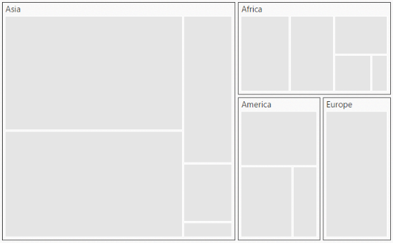
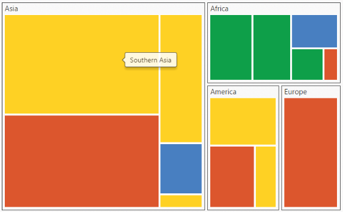

# Getting Started

* This section explains briefly about how to create a TreeMap in your application with ReactJS.
* Here you can learn how to configure a TreeMap control in a real-time scenario where it is used to visually represent the percentage of growth in population in each continent. 
* It also provides a walk-through on some of the customization features available in TreeMap control.

## Create a TreeMap 

You can easily create the TreeMap widget by  following  the below steps.

## Adding Script Reference

Create an **HTML** page and add the scripts references in the order mentioned in the following code example.

* [`jQuery`](http://jquery.com) 1.10.2 and later versions
* [jsRender](https://github.com/borismoore/jsrender) - to render the templates

The required ReactJS script dependencies as follows. And you can also refer [React](https://facebook.github.io/react/docs/getting-started.html) to know more about react js.

* `react.min.js` - [http://cdn.syncfusion.com/js/assets/external/react.min.js](http://cdn.syncfusion.com/js/assets/external/react.min.js)
* `react-dom.min.js` - [http://cdn.syncfusion.com/js/assets/external/react-dom.min.js](http://cdn.syncfusion.com/js/assets/external/react-dom.min.js)
* `ej.web.react.min.js` - [http://cdn.syncfusion.com/{{ site.releaseversion }}/js/common/ej.web.react.min.js](http://cdn.syncfusion.com/14.3.0.49/js/common/ej.web.react.min.js)

To get started, you can use the `ej.web.all.min.js` file that encapsulates all the `ej` controls and frameworks in one single file.


<!DOCTYPE html>
   <html>
     <head>
        <meta name="viewport" content="width=device-width, initial-scale=1.0">
        <meta name="description" content="Essential Studio for React JS">
        <meta name="author" content="Syncfusion">
        <title>Getting Started for Ribbon React JS</title>
        <!-- Essential Studio for JavaScript  theme reference -->
        <link href="http://cdn.syncfusion.com/{{ site.releaseversion }}/js/web/flat-azure/ej.web.all.min.css" rel="stylesheet" />
        <!-- Essential Studio for JavaScript  script references -->
        
         
        
        
        
        <!-- Add your custom scripts here -->
    </head>
        <body>
        </body>
   </html>



N> 1. In production, we highly recommend you to use our [`custom script generator`](http://help.syncfusion.com/js/custom-script-generator) to create custom script file with required controls and its dependencies only. Also to reduce the file size further please use [`GZip compression`](https://developers.google.com/web/fundamentals/performance/optimizing-content-efficiency/optimize-encoding-and-transfer?hl=en) in your server.
N> 2. For themes, you can use the `ej.web.all.min.css` CDN link from the code snippet given. To add the themes in your application, please refer to [`this link`](http://help.syncfusion.com/js/theming-in-essential-javascript-components).

## Control Initialization

Control can be initialized in two ways.

 * Using jsx Template
 * Without using jsx Template
 
## Using jsx Template

By using the jsx template, we can create the html file and jsx file. The `.jsx` file can be convert to `.js` file and it can be referred in html page.

## Initialize TreeMap 

1.Create a 
 tag with specific id
	
    

<!DOCTYPE html>
<html>    
    <body>
	

                
    </body>
</html>


  
2.The dataSource property of the TreeMap accepts the collection values as input.Populate the datasource of the  TreeMap data as JSON object. For example, you can use population data of countries to generate TreeMap data as illustrated in the following code sample.
  
   

var population_data = [
                   { Continent: "Asia", Region: "Southern Asia", Growth: 1.32, Population: 1749046000 },
                   { Continent: "Asia", Region: "Eastern Asia", Growth: 0.57, Population: 1620807000 },
                   { Continent: "Asia", Region: "South-Eastern Asia", Growth: 1.20, Population: 618793000 },
                   { Continent: "Asia", Region: "Western Asia", Growth: 1.98, Population: 245707000 },
                   { Continent: "Asia", Region: "Central Asia", Growth: 1.43, Population: 64370000 },
                   { Continent: "Europe", Region: "Europe", Growth: 0.10, Population: 742452000 },
                   { Continent: "America", Region: "South America", Growth: 1.06, Population: 406740000 },
                   { Continent: "America", Region: "Northern America", Growth: 0.85, Population: 355361000 },
                   { Continent: "America", Region: "Central America", Growth: 1.40, Population: 167387000 },
                   { Continent: "Africa", Region: "Eastern Africa", Growth: 2.89, Population: 373202000 },
                   { Continent: "Africa", Region: "Western Africa", Growth: 2.78, Population: 331255000 },
                   { Continent: "Africa", Region: "Northern Africa", Growth: 1.70, Population: 210002000 },
                   { Continent: "Africa", Region: "Middle Africa", Growth: 2.79, Population: 135750000 },
                   { Continent: "Africa", Region: "Southern Africa", Growth: 0.91, Population: 60425000 }
        ];

     

   N> Population data is referred from [List of continents by population](http://en.wikipedia.org/wiki/List_of_continents_by_population)
 
3.The size of an object can be calculated by using the **WeightValuePath** of TreeMap
 
4.Initialize the TreeMap  by using the `EJ.TreeMap` tag. 



    </body>
</html>



The following image displays a TreeMap with default properties using the above code. 

## GroupTreeMap Items using Levels

You can group TreeMap Items using levels in TreeMap.

### Group Path

You can use `groupPath` property for every flat level of the TreeMap control. It is a path to a field on the source object that serves as the “group” for the level specified. You can group the data based on the `groupPath` in the TreeMap control. When the `groupPath` is not specified, then the items are not grouped and the data is displayed in the order specified in the `dataSource`.

### Group Gap

You can use `groupGap` property to separate the items from every flat level and to differentiate the levels mentioned in the TreeMap control.

The following code sample explains how to group TreeMap Items using ‘Levels’


 
    </body>
</html>


The following screenshot displays grouping of TreeMapItems using Levels.

## Customize TreeMap Appearance by Range

You can differentiate the nodes based on its value and color ranges using Range color. You can also define the color value range using From and To properties. 

### Color Value Path

The `colorValuePath` of TreeMap is a path to a field on the source object. You can determine the color for the object using `colorValuePath` of TreeMap.

The following code sample explains how to customize TreeMap Appearance by Range.



 
    </body>
</html>



The following screenshot displays customized TreeMap Appearance by Range

## Enable Tooltip

You can enable the tooltip by setting `showTooltip` property to ‘true’. By default, it takes the property of the bound object that is referred in the `weightValuePath` and displays its content when the corresponding node is hovered. You can customize the template for tooltip using `tooltipTemplate` property.

### Leaf Item Settings

You can customize the Leaf level TreeMap items using `leafItemSettings`. The Label and tooltip values take the property of bound object that is referred in the `labelPath` when defined.

The following code sample displays how the tooltip is enabled.



    </body>
</html>



The following screenshot displays the TreeMap when the Tooltip is enabled.

## Legend

You can set the color value of leaf nodes using TreeMap Legend. This legend is appropriate only for the TreeMap whose leaf nodes are colored using `rangeColorMapping`.

You can set ShowLegend property value to ‘_true_’ to make a Legend visible.

### Label for Legend

You can customize the labels of the legend item using `legendLabel` property of `rangeColorMapping`. 

The following code sample displays how to add labels for legend in a TreeMap.



 
    </body>
</html>



The following screenshot displays the TreeMap when Labels are enabled.

## Without using jsx Template

The TreeMap can be created from a HTML `DIV` element with the HTML `id` attribute set to it. Refer to the following code example.



           




 
 
On running the above code the TreeMap will rendered along with labels

  