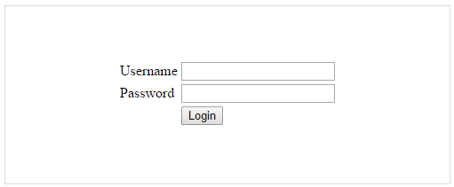
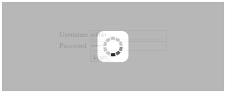

# Getting Started

This section explains briefly about how to create a **WaitingPopup** in your application with **JavaScript**.
**Essential JavaScript WaitingPopup** provides support to display a **WaitingPopup** within your web page. From the following guidelines, you can learn how to create a **WaitingPopup** in a real-time login page authentication scenario. 

The following screenshot illustrates the functionality of a **WaitingPopup** with login page scenario.

 

You can give the Username and Password in the **login page**. When you click the **Login** button, you get the **WaitingPopup**. After loading, the alert box pops up with the message “Signed in successfully”.

## Create Username and Password

**Essential JavaScript WaitingPopup** widget basically renders built-in features like blocking the other actions until the page is loaded. You can easily create the **WaitingPopup** widget by using simple **&lt;div&gt;** element as follows.

 You can create a React application and add necessary scripts and styles with the help of the given [React Getting Started Documentation.](https://help.syncfusion.com/reactjs/overview)

Create a JSX file for rendering WaitingPopup component using &lt;EJ.WaitingPopup&gt; syntax. Add required properties to it in &lt;EJ.WaitingPopup&gt; tag element



var Defaultwait = React.createClass({
  componentDidMount: function () {   
  },
  render: function () {
    return (  
        <EJ.WaitingPopup></EJ.WaitingPopup>
	   );
	  }
    });
ReactDOM.render(<Defaultwait />, document.getElementById('waitingpopup-default'));



Define an HTML element for adding WaitingPopup in the application and refer the JSX file.



   <table class="loginTable">
      <tr>
         <td>Username</td>
         <td><input type="text"/></td>
      </tr>
      <tr>
         <td>Password</td>
         <td><input type="password"/></td>
      </tr>
      <tr>
         <td></td>
         <td><button id="target">Login</button></td>
      </tr>
   </table>
   



 Initialize **Click function** using the following code example.



    $(document).ready(function () {
        $("#target").click(function () {
            /*Add waiting popup*/
        });
    });



 Apply the following styles to show the **WaitingPopup**.





The following screenshot displays a **User** **login**.

 

## Add WaitingPopup Widget

 In a real-time login page scenario, when you click the Login button, the WaitingPopup is displayed. 



var Defaultwait = React.createClass({
   componentDidMount: function () { 
   $("#target").click(function () {
   $("#popup").ejWaitingPopup({
        showOnInit: true,
        target: "#targetElement"
   }); 
   function success() {
        var obj = $("#popup").data("ejWaitingPopup");
        alert("Signed in successfully");
        obj.hide();
        }
        setTimeout(success, 5000);
   });
},
render: function () {
return (  
    <EJ.WaitingPopup></EJ.WaitingPopup>
	   );
	}
});
ReactDOM.render(<Defaultwait />, document.getElementById('waitingpopup-default'));



 The following screenshot shows the output of the above code example.

 

